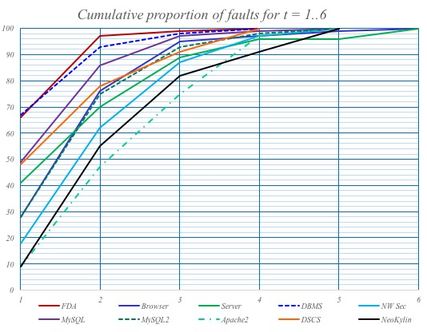
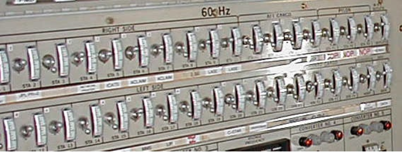

# Combinatorial Testing

<br/><br/>

### One Paragraph Explainer

* [Combinatorial Testing](http://csrc.nist.gov/Projects/automated-combinatorial-testing-for-software) is a proven method for more effective software testing at a lower cost.
* The key insight underlying this form of testing is that not every parameter contributes to every failure and most failures are caused by interactions between relatively few parameters.
* Testing parameter combinations can provide more efficient fault detection than conventional methods.


A series of studies by [NIST](https://www.nist.gov/) from 1999 to 2004 showed that most software bugs and failures are caused by one or two parameters, with
progressively fewer by three or more. This finding, referred to as the Interaction Rule, has important implications for software testing because it means that testing parameter combinations can provide more efficient fault detection than conventional methods. The data gathered by NIST and others suggest that software failures are triggered by only a few variables interacting (six or fewer). Pairwise (2-way combinations) testing is sometimes used to obtain reasonably good results at low cost, generally not less than 60% fault coverage, but this may not be sufficient for mission-critical software.

<br/><br/>

### (1) Code Example – product owner question

A product owner once asked:
> "From a best practice standpoint or maybe a practical standpoint, are you supposed to test a system in every possible configuration?
For example, say you have features A, B, C, D, E and customer 1 has features A/B, customer 2 has A/B/C, and customer 3 has A/D, customer 4 has B/D, and customer 5 has A/B/C/D/E....
Are you supposed to test every possible combination of features or do you test each of the individual features and if they work independently you trust them to work as a whole?"


5 customers and 5 features. This would be 25 tests exhaustively.
With the constraints described, it would be 14 tests.
For the purpose of having a code sample, we will use a [CTWedge](https://foselab.unibg.it/ctwedge/) scripted combinatorial model of the described spec. There are many other CT tools listed at [pairwise.org](http://pairwise.org/). Some of the other tools we (at Siemens) have used are [ACTs](https://csrc.nist.gov/projects/automated-combinatorial-testing-for-software) and [CAgen](https://matris.sba-research.org/tools/cagen/#/workspaces).

```
Model POquestion
 Parameters:
   features : {A, B, C, D, E}
   customer:  {1, 2, 3, 4, 5}

 Constraints:
   # customer = 1 => features = A || features = B #
   # customer = 2 => features = A || features = B || features = C #
   # customer = 3 => features = A || features = D #
   # customer = 4 => features = B || features = D #
   # customer = 5 => features = A || features = B || features = C || features = D || features = E #
```

Paste the script in here to generate results [here](http://foselab.unibg.it/ctwedge/).

The goal is to test 2-way (or more) interactions between parameters. When you have only 2 parameters, there is not much profit, because it is exhaustive.

If you have more than 2 parameters, 2-way interaction coverage between them will guarantee to find 60-99% of all possible defects that can arise from that area. 3-way 90%, 4-way 95% , 5-way 97%, 6-way guarantees 100%.



In this example you would profit from adding another *parameter*. Let us name it `configuration` and assume 5 possible configurations / *parameter values*. This would make the exhaustive suite of 125 tests.

```
Model POquestion
 Parameters:
   features : {A, B, C, D, E}
   customer:  {1, 2, 3, 4, 5}
   configuration: {config1, config2, config3, config4, config5}

 Constraints:
   # customer = 1 => features = A || features = B #
   # customer = 2 => features = A || features = B || features = C #
   # customer = 3 => features = A || features = D #
   # customer = 4 => features = B || features = D #
   # customer = 5 => features = A || features = B || features = C || features = D || features = E #
```

Pasting to [CTWedge](https://foselab.unibg.it/ctwedge/) this gives a test suite with 31 tests. If you add some constraints, saying some feature is not supposed to work with some config, you can even lean it further.

Mind that modeling Combinatorial Testing can and does incorporate equivalence partitions, boundary value analysis and other techniques. The more accurate the model is, the higher fault-detecting capabilities the test suite will have.


<br/><br/>

### (2) Code Example – NASA Switchboard with 34 switches

Consider an example of 34 switches at NASA, each switch can be on or off.
There are 17 billion ways to cover the entirety of exhaustive tests.



You do not need to test all 2^34. Modeling with Combinatorial Testing you can make a calculated decision, depending on risk

```
Model NASAswitches

Parameters:
    switch1: Boolean
    switch2: Boolean
    switch3: Boolean
    switch4: Boolean
    switch5: Boolean
    switch6: Boolean
    switch7: Boolean
    switch8: Boolean
    switch9: Boolean
    switch10: Boolean
    switch11: Boolean
    switch12: Boolean
    switch13: Boolean
    switch14: Boolean
    switch15: Boolean
    switch16: Boolean
    switch17: Boolean
    switch18: Boolean
    switch19: Boolean
    switch20: Boolean
    switch21: Boolean
    switch22: Boolean
    switch23: Boolean
    switch24: Boolean
    switch25: Boolean
    switch26: Boolean
    switch27: Boolean
    switch28: Boolean
    switch29: Boolean
    switch30: Boolean
    switch31: Boolean
    switch32: Boolean
    switch33: Boolean
    switch34: Boolean
```
Switch the number of interactions to test using the dropdown in [CTWedge](https://foselab.unibg.it/ctwedge/).
* 14tests : failures from 2-way interactions between switches - will find 60-99% of all possible failures depending on product
* 33tests : failures from 3-way interactions between switches - will find 90-99% of all possible failures depending on product
* 85 tests : failures from 4-way interactions between switches - will find 95-99% of all possible failures depending on product
* 220 tests: failures from 5-way interactions between switches - will find above 99% of all possible failures
* 538 tests: failures from 6-way interactions between switches - will find 100% of all possible failures

<br/><br/>

### (2) Code Example - [Siemens Building Operator CI configuration](https://cypress.slides.com/cypress-io/siemens-case-study#/16)

Refer to the slides link above or the [webcast](https://www.youtube.com/watch?v=aMPkaLOpyns&t=1624s) for a detailed explanation on how to measure combinatorial coverage with [CAMetrics](https://matris.sba-research.org/tools/cametrics/#/new). Essentially, you generate a CSV file with any Combinatorial Testing tool and drag&drop it to CAMetrics. After that, CAMetrics can give you various combinatorial coverage reports.

> Mind that it is trivial to [convert csv to JSON](https://www.csvjson.com/csv2json), then use the JSON file for data-driven testing in any test framework of choice.

```
Model CI
 Parameters:
   deployment_UI : { branch, development, staging }
   deployment_API:  { development, staging }
   spec_suite: { ui_services_stubbed, ui_services, ui_services_hardware, spot_check}
   browser: { chrome, electron, firefox }

 Constraints:
   // one extra constraint for firefox spot checks
   # browser=firefox <=> spec_suite=spot_check #
   // on staging, run all tests
   # spec_suite=ui_services_hardware <=> deployment_API=staging #
   // match dev vs dev, staging vs staging, and when on staging use Chrome
   # deployment_UI=development => deployment_API=development #
   # deployment_UI=staging => deployment_API=staging #
   # deployment_UI=staging && deployment_API=staging => browser=chrome #
   // when on branch, stub the services
   # deployment_UI=branch => spec_suite=ui_services_stubbed #
   // do not stub the services when on UI development
   # deployment_UI=development => spec_suite!=ui_services_stubbed #
```

## References & Further reading

[Automated Combinatorial Testing for Software](https://csrc.nist.gov/Projects/automated-combinatorial-testing-for-software)

[Slides 16-50 : Utilization of Automation and Combinatorial Disciplines In Aid of Exploratory Testing](https://prezi.com/tpffqit1yn87/utilization-of-automation-and-combinatorial-disciplines-in-aid-of-exploratory-testing/)

[Applications of Practical Combinatorial Testing Methods at Siemens Industry Inc., Building Technologies Division](https://ieeexplore.ieee.org/document/7899057?section=abstract)

[An Industrial Study on Applications of Combinatorial Testing in Modern Web Development](https://ieeexplore.ieee.org/document/8728910)

[Introducing Combinatorial Testing In a Large Organization](https://ieeexplore.ieee.org/document/7085645/)

[Input Parameter Modeling for Combination Strategies](http://barbie.uta.edu/~mehra/1%20INPUT%20PARAMETER%20MODELING%20FOR%20COMBINATION%20STRATEGIES.pdf)

[Common Patterns in Combinatorial Models](http://barbie.uta.edu/~mehra/62_Common%20Patterns%20in%20Combinatorial%20Models.pdf)

[Efficient Verification of Equivalence Classes and Simultaneous Testing Using Two-layer Covering Arrays](https://tsapps.nist.gov/publication/get_pdf.cfm?pub_id=917899)
