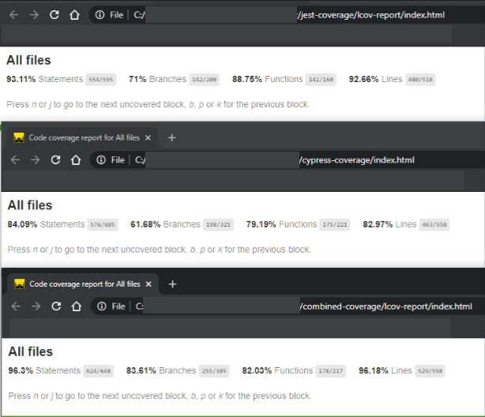

# Combined Unit & E2E Code Coverage: case study on a real life system using Angular, Jest, Cypress & GitLab

<br/><br/>

### One Paragraph Explainer

There are a variety of metrics to evaluate to have high confidence in quality. Unit test coverage gives us high confidence at source code level. For example using Angular CLI, a placeholder spec file is auto-generated for a given component. In contrast E2E tests can cover an interaction of components; whether these are state transitions -think of state machines-, feature use cases, application workflows or any combination of using multiple components at a time. This is where they provide the most value. Once we have a decent amount of unit test coverage, we cover our cases with ui-e2e tests, with green pipelines we can have high confidence in quality.

The web has evolved and now we can also gain source-code code coverage from ui-e2e tests, filling any gaps in source-code coverage through a guided process.

<br/>

## Foreword

By now there are a plethora of examples and resources on combined code coverage. We wanted to study a CI agnostic, real life example with a particular stack, without reliance on external services, and explain the why behind the decisions that are being made.

The real life system under test stack is **Angular, Jest, Cypress & GitLab**.

> Jest can be replaced with Karma; all we need from unit tests is the default *coverage* folder to be generated.
>
> The sample bash commands can be used with any CI provider.
> 
> Baseline assumption: unit tests are able to generate a **coverage** folder when executed. This is the default folder that unit test frameworks use.


The npm packages that will be used in this guide are:

```bash
npm install -D / yarn add --dev

ngx-build-plus 

istanbul-instrumenter-loader 

@cypress/code-coverage 

check-code-coverage
```


<br/><br/>

## (1) Prerequisite: Instrumenting the code </a>

Cypress does not instrument the code for you out of the box. This is the first hurdle to overcome.

If your development framework is not Angular, Cypress [docs](https://docs.cypress.io/guides/tooling/code-coverage.html#Instrumenting-code) guide you towards `nyc` or `babel-plugin-istanbul`. 

To instrument the code using Angular, things are not very straightforward. Check out [Cory Rylan's](https://coryrylan.com/blog/enforcing-code-coverage-in-angular-cli-projects) and [Jonas Bandi's](https://medium.jonasbandi.net/my-concerns-with-the-angular-cli-9002bdf36975) blog posts. 

<br/>

Thankfully there is a way to extend Angular CLI's build process to instrument the code, with a bit of reliance on webpack. We need to install a few packages and configure them.

* `ngx-build-plus`: extends Angular CLI's default build behavior, so that we can add a webpack config to `angular.json`.
  
```json
// angular.json
"serve": {
          "builder": "ngx-build-plus:dev-server",
          "options": {
            "browserTarget": "your-app-name:build",
            "extraWebpackConfig": "./cypress/coverage.webpack.js"
          },
```

* `istanbul-instrumenter-loader`: while using webpack, helps instrument and report code coverage. We configure `cypress/coverage.webpack.js` for this.

```javascript
// cypress/coverage.webpack.js
module.exports = {
  module: {
    rules: [
      {
        test: /\.(js|ts)$/,
        loader: 'istanbul-instrumenter-loader',
        options: { esModules: true },
        enforce: 'post',
        include: require('path').join(__dirname, '..', 'src'),
        // NOTE: if you are excluding any files from unit tests, you might want to do the same under `exclude` property here.
        exclude: [ 
          /\.(e2e|spec)\.ts$/,
          /node_modules/,
          /(ngfactory|ngstyle)\.js/
        ]
      }
    ]
  }
};
```

<br/><br/>

## (2) Collect coverage while running e2e tests

Our code has been instrumented. Now we want to execute one or many e2e tests and collect the generated coverage.

> Note: to collect coverage from e2e tests, your application must be served locally and tests be running against localhost as opposed to a live url.


* `@cypress/code-coverage`: used to [merge coverage from each test save the combined result](https://docs.cypress.io/guides/tooling/code-coverage.html#Install-the-plugin). We need to configure the support and plugin index.js files to use it.

  ```javascript
  // cypress/support/index.js
  import '@cypress/code-coverage/support'
  ```
  A complex `cypress/plugins/index.js` example:

  ```javascript
  // cypress/plugins/index.js

  // multiple tasks are being used 
  const cyExtendsTask = require('@bahmutov/cypress-extends');
  const cyCodeCoverageTask = require('@cypress/code-coverage/task');

  module.exports = (on, config) => {
    // `on` is used to hook into various events Cypress emits. `config` is the resolved Cypress config

    // there may be multiple events that increase complexity. We have to return from each. What do we do with multiple returns?

    on('before:browser:launch', (browser = {}, launchOptions) => {
      // some complex before:browser:launch configuration. There can be multiples of this, but at the end launchOptions need to be returned.
      return launchOptions;
    });

    // let's say we have multiple tasks are being used. This is a pattern to combine the tasks into an object and return them collectively
    const allTasks = Object.assign({},
      cyCodeCoverageTask(on, config),
      cyExtendsTask(config.configFile)
    );

    return allTasks;
  }

  ```

* Where do we store the e2e coverage? We left the unit test default folder *coverage* as is. If we execute cypress tests now, it overwrites that folder. Thankfully we can configure the coverage folder for the e2e tests. Cypress uses nyc under the hood, we can customize the folder in `package.json`. Let's name it `coverage-e2e`.
  ```json
  // package.json
  {
    ...
    "nyc": {
      "report-dir": "coverage-e2e"
    }
  }


At this point, when executing e2e tests we should see additional before and after blocks.


<br/><br/>


## (3) Combine the unit and e2e coverage (local machine execution)

We execute the unit test suite and get a report under `coverage` folder. Similarly, we execute e2e tests and get a report under `coverage-e2e` folder.

Now we have to extract certain files from `coverage` & `coverage-e2e` folders and combine them into a single report.

> Note the examples are with yarn. For npm, you can replace yarn with `npm run` or `npx`

1. Create a temp folder `reports`. We use `|| true` so that there are no errors on repeated script executions: `(mkdir reports || true)`. Save the two `coverage-final.json` files from the 2 folders `coverage` & `coverage-e2e`. Rename them so that they do not overwrite each other. `cp coverage-e2e/coverage-final.json reports/from-cypress.json && cp coverage/coverage-final.json reports/from-jest.json`. (or `from-karma.json`, as long file names are not duplicated).

    We will save this as a script in `package.json`. This will be used in local or single machine coverage evaluations.
    
    ```json
    "copy:reports": "(mkdir reports || true) && cp coverage-e2e/coverage-final.json reports/from-cypress.json && cp coverage/coverage-final.json reports/from-jest.json",
    ```

2. Combine the reports using nyc. Nyc has a utility to specify the folder location for the reports to be merged. Our files are under `reports` folder. After merging, by default, nyc generates a file named `coverage.json` at project root. We rename it and overwrite the `.nyc/` folder - note that `.nyc` folder gets populated as we run e2e tests because Cypress uses it under the hood. There is no harm overwriting it now because we want the combined coverage.

    We will save this as a script as well. This can be used locally, single machine or in multi-machine parallel executions in CI.

    ```json
    "combine:reports": "npx nyc merge reports && mv coverage.json .nyc_output/out.json"
    ```


3. Finalize the report. Nyc has a command to generate the report using `npx nyc report`. (Do not confuse this with our temporary `reports` folder we used to combine the reports). We can specify multiple report types and also the output directory. We will save the final report in a folder called `combined-coverage`.
    We will save this as a script as well. This can be used locally, single machine or in multi-machine parallel executions in CI.

    ```json
    "finalize:combined-report": "npx nyc report --reporter html --reporter text --reporter json-summary --report-dir combined-coverage"
    ```

We wrap up by combining the 3 scripts. Here is the full list with some additional utilities to clean up coverage folders and evaluate combined coverage. We will elaborated on `coverage:check` script in the next section

```json
    "coverage:combined": "yarn copy:reports && yarn combine:reports && yarn finalize:combined-report",
    "copy:reports": "(mkdir reports || true) && cp coverage-e2e/coverage-final.json reports/from-cypress.json && cp coverage/coverage-final.json reports/from-jest.json",
    "combine:reports": "npx nyc merge reports && mv coverage.json .nyc_output/out.json",
    "finalize:combined-report": "npx nyc report --reporter html --reporter text --reporter json-summary --report-dir combined-coverage",
    "coverage:reset": "rm -rf .nyc_output && rm -rf reports && rm -rf coverage && rm -rf coverage-e2e && rm -rf combined-coverage",
    "coverage:check": "npx check-total --from combined-coverage/coverage-summary.json --min 95"
```

The local workflow is as such:

* Clean up previous coverage (optional): `yarn coverage:reset`
* Execute unit test suite to generate the coverage. Serve the app locally and execute e2e test suite to generate e2e coverage. (For example `yarn test` and `yarn cypress:run`)
* Generate combined report (automates the 3 ordered steps in this section): `yarn coverage:combined`


> Note: if you reset the coverage using `coverage:reset`, you will need to re-generate unit test coverage by executing the unit tests, and re-generate e2e coverage by running the entirety of e2e tests. You can use cypress run or cypress open.

<br/><br/>

## (4) Combine the unit and e2e coverage in CI (parallel e2e execution)

We are confident in the newly acquired knowledge on local machine combined coverage. How do we use them in CI in a stateless, lightweight fashion that is not intrusive and supports parallel e2e jobs?

1. In the CI test coverage workflow, we are going to be creating 2 folders `coverage-part` and `coverage-e2e`. Before the e2e test execution, reset the configuration so that back to back e2e jobs are stateless. Let's make sure to clean up anything that may have been generated previously: `rm -rf coverage-part && rm -rf coverage-e2e`  

2. Insert an intermediate step to collect unique/parallel e2e job coverage files. We are going to mirror the local `copy:reports` script (step 1 in local workflow), but insert an intermediate step to collect the e2e job coverages under the `coverage-part` folder. All we have to ensure is that the parallel e2e job files do not overwrite each other and are in a temp folder. We save this temporary `coverage-part` folder as an artifact, so that in the next stage we can run an evaluation job. `(mkdir coverage-part || true) && cp coverage-e2e/coverage-final.json coverage-part/parallel-job-${CI_JOB_ID}.json`

Here is the full GitLab yml. The bash should be CI agnostic.

```yml
# this can be a single job or a template for Cypress parallel jobs. Makes no difference for code-coverage.
.test-e2e_template: &local-test: 
  stage: e2e-test # could be any stage name
  script:
    # usual cypress test execution
  before_script:
    # reset state so that new coverage can be generated
    - rm -rf coverage-part && rm -rf coverage-e2e
  after_script:
    # after the job, copy the e2e coverage for the parallel job to coverage-part folder
    # for the file name, use unique job id to avoid overwriting the e2e coverage file
    - (mkdir coverage-part || true) && cp coverage-e2e/coverage-final.json coverage-part/parallel-job-${CI_JOB_ID}.json
  artifacts:
    paths:
      - coverage-part/

# the parallel jobs using the template
local-1:
  <<: *local-test
local-2:
  <<: *local-test
```

At this point We have our e2e job coverage collection folder as an artifact. It will be available in subsequent stages. All we need is a new stage to do the chore of combining the coverage and evaluating it.
  

3. Copy all `coverage-part/*.json` files into reports folder; if you have 2 parallel jobs there will be 2 json files here with unique names. This mirrors the local `copy:reports` script in package.json (step 1 of local workflow), but instead collects coverage from the parallel e2e jobs: `mkdir reports && cp -r coverage-part/. reports && cp coverage/coverage-final.json reports/from-jest.json`.

4. Now we have the e2e job json coverage files and the unit test coverage json files under `reports` folder. We can combine the reports, the same way as the local script in package.json (step 2 in local workflow): `"combine:reports": "npx nyc merge reports && mv coverage.json .nyc_output/out.json",`

5. Finalize the combined report, again same as the local script in package.json (step 3 in local workflow) : `  "finalize:combined-report": "npx nyc report --reporter html --reporter text --reporter `

6. Evaluate the combined coverage from the unit test and parallel e2e jobs, fail the CI job if the coverage is below a defined threshold. We will utilize Gleb's `check-code-coverage` [npm package](https://github.com/bahmutov/check-code-coverage) . Note that we can set a threshold for the unit test framework (Jest or Karma have their own coverage threshold settings) as well as a cypress e2e job by configuring the nyc test coverage threshold. The challenge here is to evaluate the combined coverage of all files, and (optionally) enforce failure when coverage drops. `check-total` can specify the coverage folder location and the threshold: `npx check-total --from combined-coverage/coverage-summary.json --min 95`. The job exits with a non-zero code if the coverage is below the set minimum (ex: 95), breaking the CI job. Doing this check is is optional. With GitLab there is also the option to have the job to allow failure so that there is a warning instead of a failure.

```yml
collect-combined-coverage:
  stage: combined-coverage-report
  before_script:
    # reset state so that new coverage can be generated and any previously generated files are cleaned up
    - rm -rf reports
  script:
    - |
      mkdir reports && cp -r coverage-part/. reports && cp coverage/coverage-final.json reports/from-jest.json
      yarn combine:reports
      yarn finalize:combined-report
      yarn coverage:check
  artifacts:
    paths:
      - combined-coverage/
  allow_failure: true # this way the job will give a warning and not prevent merge
```

<br/><br/>

## Results & Conclusion

In the figure we have unit, e2e and combined coverage. 

In this new application, with ~70 tests, the unit test coverage is pretty high at 93%. We have 5 e2e tests in this suite, and the coverage they provide is pretty significant at 84%. Mind that the e2e coverage also factors in multiple internal 3rd party modules that is not a part of the source code, but a part of the application. 

The combined coverage is at 96%. Using this as a guide we can visualize where the gaps are and supplement them using either e2e or unit tests. 

With Jest, the time to execute the 70 unit tests locally is under 50 seconds. With Cypress, the time to execute the e2e tests locally is under 45 seconds. Of note is Jest being parallelized in CI or local environments, and Cypress having parallelization capability in CI. The lines of code comparison between unit and e2e is 7:1 ; there are 7 times as much loc in unit tests compared to e2e.

The main value of e2e tests is not source-code coverage. Like we stated in the beginning they give us value for an interaction of components, state transitions, feature use cases, application workflows or any combination of using multiple components at a time. Albeit, if they also provide source-code coverage, they can help in filling the gaps in source code coverage and guide us towards measurable progress in order to have higher confidence in quality.



## Note about [full stack coverage](https://docs.cypress.io/guides/tooling/code-coverage.html#Full-stack-code-coverage) and future work 

We were able to follow Cypress guide to instrument our Node API and combine coverage when both the UI and the API are being run locally. In our world, these are in different repositories. This can work in CI if the two are in the same repository. We consulted Gleb from Cypress on a recommendation. The verdict is that *"If the server is on another machine and not controlled by you during E2E tests, then I do not see how we can instrument it "on the fly" or get code coverage"* . In the future we plan to investigate [codecov](https://about.codecov.io/) service on this matter. 

Another topic we want to build upon is mutation analysis. If mutation analysis can create multiple mutants (artificial versions of our source code with bugs) and execute unit tests against it to evaluate the quality of our unit tests, we think it may be possible to do the same with e2e tests. We will be in touch with [Stryker](https://stryker-mutator.io/) and Cypress friends on this!

<br/><br/>

### Resources & References

* https://docs.cypress.io/guides/tooling/code-coverage.html#Introduction
* https://github.com/skylock/cypress-angular-coverage-example
* https://github.com/bahmutov/cypress-and-jest 
* https://github.com/bahmutov/check-code-coverage
* https://github.com/cypress-io/cypress-example-conduit-app

