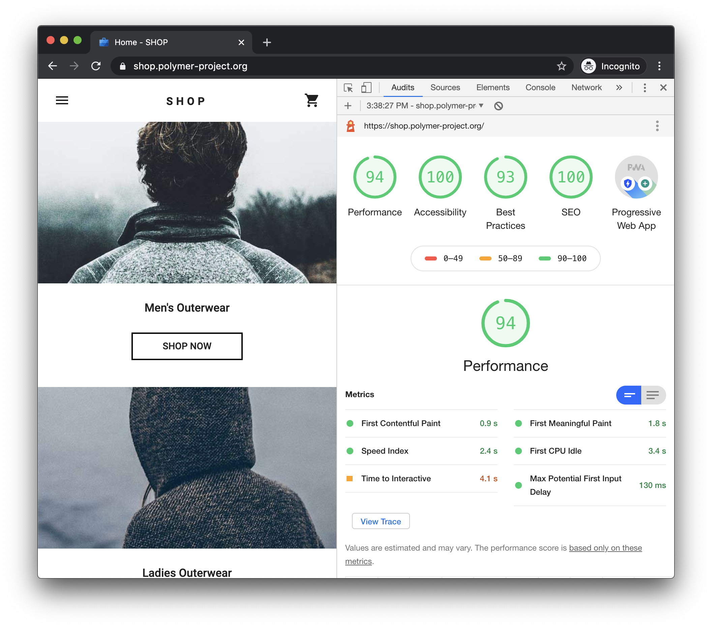
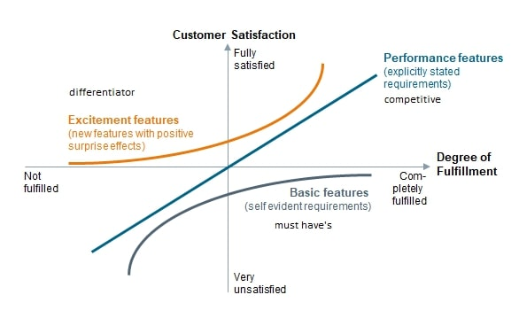
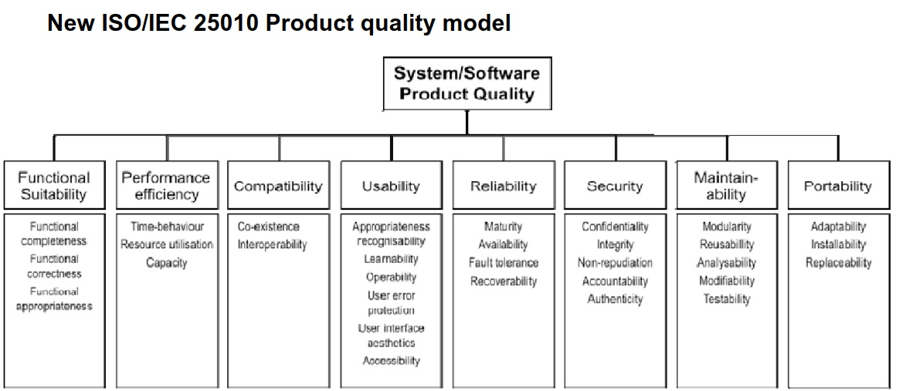
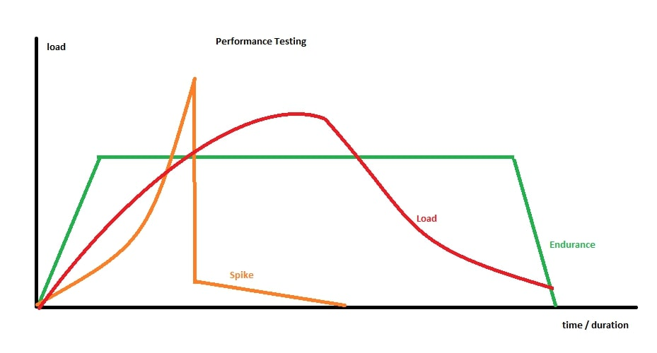
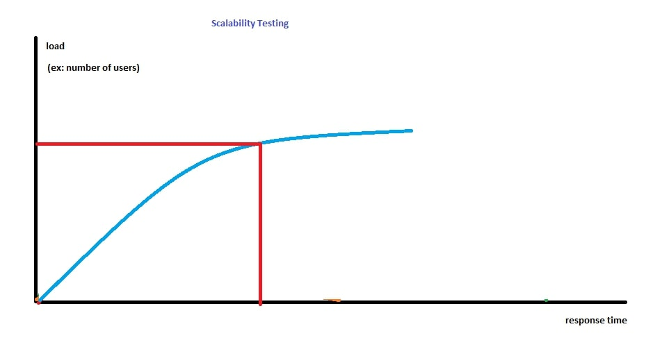
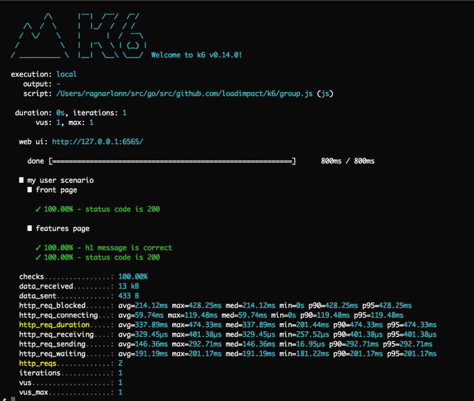
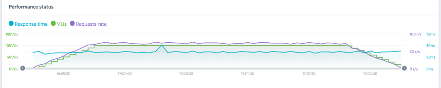

# Performance Testing

<br/><br/>

### One Paragraph Explainer

Although performance testing is a vast topic, as Web Developers we can quickly benefit from some of its core principles to improve user experience, satisfy functional and non-functional requirements (NFRs) and detect ambiguous system issues that may leak into production.

<br/><br/>

### (1) Ensuring user experience with Lighthouse

As web developers, our foremost concern is the user perception of performance. Thankfully, Google has made it easy and provided us with a 3rd-party authority evaluation of our web application with [Lighthouse](https://developers.google.com/web/tools/lighthouse).

> *"Lighthouse is an open-source, automated tool for improving the quality of web pages. You can run it against any web page, public or requiring authentication. It has audits for performance, accessibility, progressive web apps, SEO and more."*

For this topic, we will only focus on Performance, but you should consider also benefiting from **Progressive Web App**, **Accessibility**, **Search Engine Optimization** and **Best practices** evaluations of Lighthouse.

Getting started is easy: Chrome > DevTools > Audits > Lighthouse. Then, generate the report. It will look as such and give you precise pointers on what you can do to improve the user experience.



Once the improvements are made and a baseline rating is agreed on, you can prevent regression by incorporating Lighthouse into your CI.
  * Add Lighthouse as a node_module; `npm i -D lighthouse` or `yarn add --dev lighthouse`.
  * Follow the workflow example at [Lighthouse Git repo](https://github.com/GoogleChrome/lighthouse/blob/master/docs/readme.md#using-programmatically).
  * Prevent the performance rating (and/or other ratings) from regressing upon developer commits!

#### Lighthouse with Cypress

If you are a Cypress user, with [cypress-audit](https://github.com/mfrachet/cypress-audit) you can execute Lighthouse audits in Cypress tests as well as [Pa11y](https://www.npmjs.com/package/pa11y) for automated accessibility testing. 

> In addition to the [usual plugin setup](https://github.com/mfrachet/cypress-audit#preparation), you may need to [workaround cross-origin](https://github.com/cypress-io/cypress/issues/944#issuecomment-788373384) needs of your application until Cypress has official support for it.

Here is a sample test with in-line explanations.

```typescript

// Pass in optional configuration parameters for the Cypress test:
// you may need to increase default timeout for the overall task, if you have a slow app. Mind that Lighthouse is only for Chromium based browsers
describe('Lighthouse audit ', { taskTimeout: 90000, browser: 'chrome' }, () => {
  before(() => {
    // if you are using programmatic login, you might not need to use the cy.forceVisit('/') workaround for cross-origin (linked above)
    cy.login(Cypress.env('USERNAME'), Cypress.env('PASSWORD'));
  });

  // thresholds is the first argument to cy.lighthouse(), most of the performance configuration is done here.
  // a complete list of Lighthouse parameters to use as thresholds can be found at https://github.com/mfrachet/cypress-audit/blob/master/docs/lighthouse.md
  // for an explanation of the parameters, refer to https://web.dev/lighthouse-performance/
  const thresholds = {
    'first-contentful-paint': 20000,
    'largest-contentful-paint': 35000,
    'first-meaningful-paint': 20000,
    'speed-index': 25000,
    interactive: 40000,
    performance: 5,
    accessibility: 50,
    'best-practices': 50,
    seo: 50,
    pwa: 20
  };

  // the 2nd, and optional argument to cy.lighthouse() replicates Lighthouse CLI commands https://github.com/GoogleChrome/lighthouse#cli-options
  const desktopConfig = {
    formFactor: 'desktop',
    screenEmulation: { disabled: true }
  };

  // your app may need this beforeEach and afterEach workaround for cross-origin (linked above)
  beforeEach(() => {
    cy.restoreLocalStorage();
    // Preserve Cookies between tests
    Cypress.Cookies.defaults({
      preserve: /[\s\S]*/
    });
  });

  afterEach(() => {
    cy.saveLocalStorage();
  });

  it('should pass audit for main page ', () => {
    cy.lighthouse(thresholds, desktopConfig);
  });

  it('should pass audit for another page', () => {
    cy.forceVisit('anotherUrl');
    cy.lighthouse(thresholds, desktopConfig);
  });
});

// Commands for working around cross origin, if needed

// -- Save localStorage between tests
let LOCAL_STORAGE_MEMORY = {};
Cypress.Commands.add('saveLocalStorage', () => {
  Object.keys(localStorage).forEach(key => {
    LOCAL_STORAGE_MEMORY[key] = localStorage[key];
  });
});

Cypress.Commands.add('restoreLocalStorage', () => {
  Object.keys(LOCAL_STORAGE_MEMORY).forEach(key => {
    localStorage.setItem(key, LOCAL_STORAGE_MEMORY[key]);
  });
});

// -- Visit multiple domains in one test
Cypress.Commands.add('forceVisit', url => {
  cy.window().then(win => win.open(url, '_self'));
});
```


<br/><br/>

### (2) Performance as a Non-functional Requirement and the Kano model

We can start building our understanding of performance requirements with the [Kano model](https://en.wikipedia.org/wiki/Kano_model).

> *"The Kano model is a theory for product development and customer satisfaction developed in the 1980s by Professor Noriaki Kano, which classifies customer preferences into five categories."*

At a high-level, the Kano model summarizes that performance features are standard requirements that are expected of any competitive product. This overlaps with our usage of Lighthouse; with it we ensure tha we satisfy customer preferences and that we do not regress from it.



At this point, we have fulfilled explicitly stated performance requirements. However, in complex applications, we need to be aware of non-functional requirements (NFRs) as well. But, what are NFRs? Below is a high-level view of them at a glance - from the double standard [ISO/IEC 25010 Product Quality Model](https://www.iso.org/standard/35733.html).



In the next section, let's focus on how NFRs can help us approach non-function performance testing.

<br/><br/>

### (3) Types of Performance Testing

For practical purposes, we can reduce non-functional performance testing into 3 categories

* Load
* Spike
* Endurance

This graph summarizes their context:



***Side note about Benchmarking and Stress Testing**: Essentially, benchmarking boils down to the step-wise approach as we get a feel for our system which becomes a part of the initial work-flow with automated tools; *"Does my system break yet? No? Let me increase it"*. Stress testing on the other hand is, in short, overdoing it.*

What is the distinction of **Scalability Testing**? It is related; the distinction is an evaluation of when exactly the system starts not responding in a satisfactory fashion. Usually, the approach with an automated tool is close enough and can be realized while analyzing graphs in a load test.

Here is a high-level picture of the intent with Scalability Testing:




<br/><br/>

### (4) Practical applications of Performance Testing with k6-loadImpact

There are two qualities that set [k6-loadImpact](https://docs.k6.io/docs) apart for web developers.

  * Uses JS (ES6)
  * Is built for CI

Side bonus: if you hooked on Postman, you can convert those tests to k6 easily.
K6 *can* do DOM testing, however, we believe Lighthouse takes care of that. The true power of k6 comes out when testing APIs.

You can find [quickstart examples with k6 here](https://github.com/muratkeremozcan/k6-loadImpact).
The examples start very simple and are meant to build up the understanding quickly. They are ready to be run out of the box and tinkered with. We will not duplicate that knowledge here.

Instead, in this section, we will cover the overview of a k6 test, and later show a code sample on how k6 can be configured to accommodate different types of performance testing.


```javascript
// k6 lifecycle overview:

// 1. init code -> runs once
// this is where we configure the type of performance testing (there are also
// additional options we do not cover here)
export let options = {
  // there will be 1 virtual user
  vus: 1,

  // default function() will execute 1 time. This simple config
  // is best when trying to get things to work
  iterations: 1,
}

// 2. (optional) setup code -> runs once
export function setup() {
  // for example getting a token so you can run API tests in the default
  // function that comes in (3) virtual user code

  // what gets returned from this function is passed as an argument to the next
  // function. For example: `token`
  return getTokenForUser();
}

// 3. virtual user code -> runs once or many times based on
// `export let options = { ... } `
export default function(token) {
  // http.get is a k6 function that hits a URL with optional test parameters
  // note that  we do not need a token for this url
  http.get("http://test.loadimpact.com");
}

// 4. (optional) teardown code -> runs once
export function teardown(data) {
  // this is in case you need to clean up, for instance if failed test may
  // leave residue an impact state
}
```

Endurance test configuration:
```javascript
export let options = {
  // endurance test for 30 seconds with 50 virtual users. Adds users immediately
  vus: 50,
  duration: "30s",

  // alternative to duration, you can  specify the exact number of iterations
  // the test will run
  // iterations: 500,
}
```

Load test configuration:
```javascript
export let options = {
  // for 15 seconds ramps up 10 users, adds users gradually
  // adds a total of 40 users in the next 15 seconds, and up to 50 in the next
  // 30 seconds..
  // lowers down the users to 10 and 5 in the next 15 second iterations
  stages: [
    { duration: "15s", target: 10 },
    { duration: "15s", target: 40 },
    { duration: "30s", target: 50 },
    { duration: "15s", target: 10 },
    { duration: "15s", target: 5 },
  ]
}
```

Spike test configuration:
```javascript
export let options = {
  // starts slow and builds up the load rapidly, and then drops the load
  stages: [
    { duration: "5s", target: 1 },
    { duration: "5s", target: 5 },
    { duration: "5s", target: 25 },
    { duration: "3s", target: 200 },
    { duration: "3s", target: 20 },
    { duration: "3s", target: 10 },
    { duration: "3s", target: 5 },
    { duration: "3s", target: 1 },
  ]
}
```
As you can see, the `stages` are the utility to configure your performance test type.

#### How do we analyze the results?

K6 provides a simple [CLI output](https://docs.k6.io/docs/results-output). We believe the most important 2 high-level values here are `http_req_duration` which details response duration and `http_req` which shows the number of requests sent. If these are looking at acceptable values, CLI fulfills its purpose.



In case of a need for further diagnosis, the graphical [insights](https://docs.k6.io/docs/load-impact-insights) is valuable. The key in a graph like this is for *Response time* and *Request rate* to follow the trend of *Virtual Users*. Any variances in the trend may signal to underlying issues.



<br/><br/>

### (5) Using performance testing to prevent ambiguous issues leaking into production

Refer to [Test Flake > Step (3): Identifying sporadic system issues - system flake](./test-flake.md)

<br/><br/><br/><br/>

## References & Further reading

[Lighthouse documentation](https://developers.google.com/web/tools/lighthouse)

[Lighthouse repo](https://github.com/GoogleChrome/lighthouse)

[Kano model](https://en.wikipedia.org/wiki/Kano_model)

[ISO/IEC 25010 Product Quality Model](https://www.iso.org/standard/35733.html)

[k6-loadImpact documentation](https://docs.k6.io/docs)

[Quick start examples with k6](https://github.com/muratkeremozcan/k6-loadImpact)
