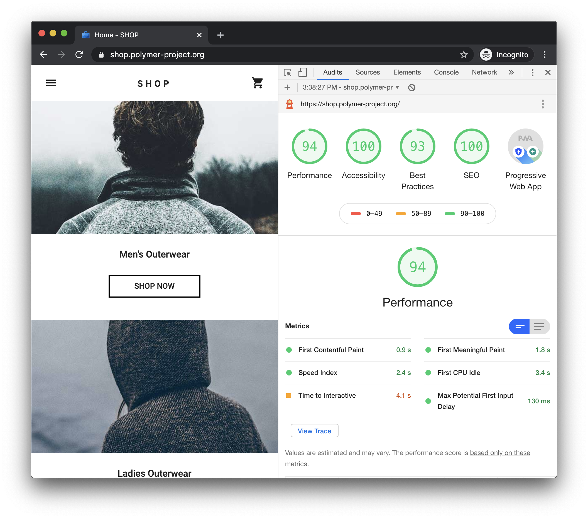
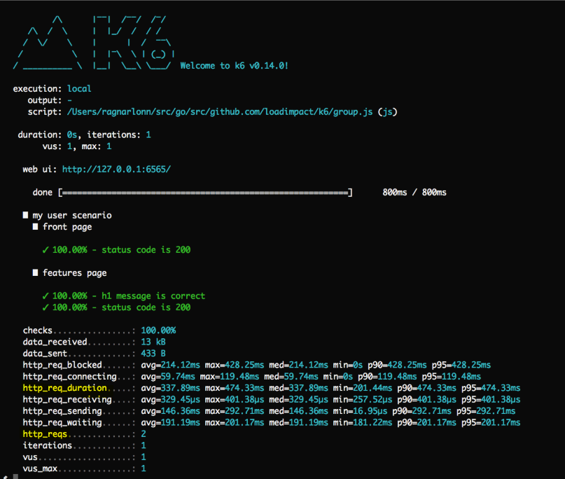

# 性能测试

<br/><br/>

## 一段简要说明

虽然性能测试是一个庞大的话题，但作为 Web 开发者，我们可以迅速从其核心原则中获益，以提升用户体验、满足功能和非功能需求（NFRs），并检测可能泄漏到生产环境中的不明确系统问题。

<br/><br/>

## (1) 通过 Lighthouse 确保用户体验

作为 Web 开发者，我们最关心的是用户对性能的感知。谢天谢地，Google 已经让这变得简单，并为我们提供了一个第三方权威评估我们 Web 应用程序的工具 - [Lighthouse](https://developers.google.com/web/tools/lighthouse)。

> *"Lighthouse 是一个用于提高网页质量的开源自动化工具。你可以对任何网页运行它，无论是公开的还是需要身份验证的。它可以进行性能、可访问性、渐进式 Web 应用、SEO 等方面的审计。"*

在这个话题中，我们只关注性能，但你也应该考虑从 Lighthouse 的审计中获得关于**渐进式 Web 应用**、**可访问性**、**搜索引擎优化**和**最佳实践**的评估。

入门很简单：Chrome > 开发者工具 > 审计 > Lighthouse。然后，生成报告。它会显示如下，并为你提供有关如何改善用户体验的详细指南。



一旦进行了改进并达成了基线评级，您可以通过将 Lighthouse 纳入您的 CI 来防止回归。

* 将 Lighthouse 添加为 node_module；`npm i -D lighthouse` 或 `yarn add --dev lighthouse`。
* 参考 [Lighthouse Git 存储库](https://github.com/GoogleChrome/lighthouse/blob/master/docs/readme.md#using-programmatically) 上的工作流示例。
* 防止性能评级（和/或其他评级）在开发人员提交代码时出现回归！

### 使用 Cypress 集成 Lighthouse

如果你是 Cypress 用户，通过 [cypress-audit](https://github.com/mfrachet/cypress-audit) 插件，你可以在 Cypress 测试中执行 Lighthouse 审计，以及 [Pa11y](https://www.npmjs.com/package/pa11y) 进行自动化的可访问性测试。

> 除了[通常的插件设置](https://github.com/mfrachet/cypress-audit#preparation)之外，你可能需要解决你的应用程序的[跨域问题](https://github.com/cypress-io/cypress/issues/944#issuecomment-788373384)，直到 Cypress 官方支持它。

以下是一个带有内联说明的示例测试。

```typescript

// Pass in optional configuration parameters for the Cypress test:
// you may need to increase default timeout for the overall task, if you have a slow app. Mind that Lighthouse is only for Chromium based browsers
describe('Lighthouse audit ', { taskTimeout: 90000, browser: 'chrome' }, () => {
  before(() => {
    // if you are using programmatic login, you might not need to use the cy.forceVisit('/') workaround for cross-origin (linked above)
    cy.login(Cypress.env('USERNAME'), Cypress.env('PASSWORD'));
  });

  // thresholds is the first argument to cy.lighthouse(), most of the performance configuration is done here.
  // a complete list of Lighthouse parameters to use as thresholds can be found at https://github.com/mfrachet/cypress-audit/blob/master/docs/lighthouse.md
  // for an explanation of the parameters, refer to https://web.dev/lighthouse-performance/
  const thresholds = {
    'first-contentful-paint': 20000,
    'largest-contentful-paint': 35000,
    'first-meaningful-paint': 20000,
    'speed-index': 25000,
    interactive: 40000,
    performance: 5,
    accessibility: 50,
    'best-practices': 50,
    seo: 50,
    pwa: 20
  };

  // the 2nd, and optional argument to cy.lighthouse() replicates Lighthouse CLI commands https://github.com/GoogleChrome/lighthouse#cli-options
  const desktopConfig = {
    formFactor: 'desktop',
    screenEmulation: { disabled: true }
  };

  // your app may need this beforeEach and afterEach workaround for cross-origin (linked above)
  beforeEach(() => {
    cy.restoreLocalStorage();
    // Preserve Cookies between tests
    Cypress.Cookies.defaults({
      preserve: /[\s\S]*/
    });
  });

  afterEach(() => {
    cy.saveLocalStorage();
  });

  it('should pass audit for main page ', () => {
    cy.lighthouse(thresholds, desktopConfig);
  });

  it('should pass audit for another page', () => {
    cy.forceVisit('anotherUrl');
    cy.lighthouse(thresholds, desktopConfig);
  });
});

// Commands for working around cross origin, if needed

// -- Save localStorage between tests
let LOCAL_STORAGE_MEMORY = {};
Cypress.Commands.add('saveLocalStorage', () => {
  Object.keys(localStorage).forEach(key => {
    LOCAL_STORAGE_MEMORY[key] = localStorage[key];
  });
});

Cypress.Commands.add('restoreLocalStorage', () => {
  Object.keys(LOCAL_STORAGE_MEMORY).forEach(key => {
    localStorage.setItem(key, LOCAL_STORAGE_MEMORY[key]);
  });
});

// -- Visit multiple domains in one test
Cypress.Commands.add('forceVisit', url => {
  cy.window().then(win => win.open(url, '_self'));
});
```

<br/><br/>

## (2) 性能作为一种非功能性需求和 Kano 模型

我们可以通过[Kano 模型](https://en.wikipedia.org/wiki/Kano_model)开始建立对性能需求的理解。

> *"Kano 模型是在 1980 年代由日本学者狩野纪明教授开发的产品开发和客户满意度理论，将客户偏好分为五类。"*

从高层次上看，卡诺模型总结了性能特性是标准要求，是任何竞争性产品所期望的。这与我们使用 Lighthouse 的方式重叠；通过它，我们确保满足客户偏好，并确保我们不会回退。


在这一点上，我们已经满足了明确说明的性能要求。然而，在复杂的应用程序中，我们还需要注意非功能性需求（NFRs）。但是，什么是 NFRs 呢？下面是它们在一瞥之下的高层次视图 - 来自双重标准的[ISO/IEC 25010 产品质量模型](https://www.iso.org/standard/35733.html)。


在下一节中，让我们专注于 NFRs 如何帮助我们进行非功能性能测试的方法。

<br/><br/>

## (3) 性能测试的类型

为了实际应用，我们可以将非功能性能测试分为 3 个类别

* Load 负载测试
* Spike 尖峰测试
* Endurance 耐久测试

这张图总结了它们的上下文：


***关于基准测试和压力测试的额外说明**: 本质上，基准测试归结为逐步的步骤，因为我们逐渐了解我们的系统，这成为了初始工作流程的一部分，其中使用自动化工具；*"我的系统已经崩溃了吗？没有？那我再增加一点"。*而压力测试，简而言之，就是做得过火了。*

那么**可扩展性测试**的区别是什么？它是相关的；区别在于系统何时开始以不令人满意的方式不响应的评估。通常情况下，使用自动化工具的方法足够接近，并且可以在负载测试中分析图表时实现。

这是可扩展性测试意图的高层次图：


<br/><br/>

### (4) 使用 k6-loadImpact 进行性能测试的实际应用

[k6-loadImpact](https://docs.k6.io/docs)在 Web 开发领域有两个显著的特点。

* 使用 JS（ES6）
* 专为 CI 构建

额外的好处：如果你习惯使用 Postman，你可以轻松地将这些测试转换为 k6。
K6 *可以* 进行 DOM 测试，但我们认为 Lighthouse 已经处理了这方面的问题。K6 真正强大的地方在于测试 API 时。

你可以在[这里找到使用 k6 的快速入门示例](https://github.com/muratkeremozcan/k6-loadImpact)。
这些示例从非常简单的开始，旨在快速建立理解。它们已经准备好直接运行和调整。我们将不会在这里重复这些知识。

相反，在本节中，我们将概述 k6 测试的概览，并稍后展示一个代码示例，演示如何配置 k6 以适应不同类型的性能测试。

```javascript
// k6 lifecycle overview:

// 1. init code -> runs once
// this is where we configure the type of performance testing (there are also
// additional options we do not cover here)
export let options = {
  // there will be 1 virtual user
  vus: 1,

  // default function() will execute 1 time. This simple config
  // is best when trying to get things to work
  iterations: 1,
}

// 2. (optional) setup code -> runs once
export function setup() {
  // for example getting a token so you can run API tests in the default
  // function that comes in (3) virtual user code

  // what gets returned from this function is passed as an argument to the next
  // function. For example: `token`
  return getTokenForUser();
}

// 3. virtual user code -> runs once or many times based on
// `export let options = { ... } `
export default function(token) {
  // http.get is a k6 function that hits a URL with optional test parameters
  // note that  we do not need a token for this url
  http.get("http://test.loadimpact.com");
}

// 4. (optional) teardown code -> runs once
export function teardown(data) {
  // this is in case you need to clean up, for instance if failed test may
  // leave residue an impact state
}
```

耐久测试配置：

```javascript
export let options = {
  // endurance test for 30 seconds with 50 virtual users. Adds users immediately
  vus: 50,
  duration: "30s",

  // alternative to duration, you can  specify the exact number of iterations
  // the test will run
  // iterations: 500,
}
```

负载测试配置：

```javascript
export let options = {
  // for 15 seconds ramps up 10 users, adds users gradually
  // adds a total of 40 users in the next 15 seconds, and up to 50 in the next
  // 30 seconds..
  // lowers down the users to 10 and 5 in the next 15 second iterations
  stages: [
    { duration: "15s", target: 10 },
    { duration: "15s", target: 40 },
    { duration: "30s", target: 50 },
    { duration: "15s", target: 10 },
    { duration: "15s", target: 5 },
  ]
}
```

尖锋测试配置：

```javascript
export let options = {
  // starts slow and builds up the load rapidly, and then drops the load
  stages: [
    { duration: "5s", target: 1 },
    { duration: "5s", target: 5 },
    { duration: "5s", target: 25 },
    { duration: "3s", target: 200 },
    { duration: "3s", target: 20 },
    { duration: "3s", target: 10 },
    { duration: "3s", target: 5 },
    { duration: "3s", target: 1 },
  ]
}
```

正如你所看到的，`stages` 是配置性能测试类型的实用工具。

### 我们如何分析测试结果？

K6 提供了一个简单的[CLI 输出](https://docs.k6.io/docs/results-output)。我们认为这里最重要的两个高级数值是 `http_req_duration`，它详细说明了响应持续时间，以及 `http_req`，它显示发送的请求数量。如果这些数值在可接受的范围内，CLI 就达到了其目的。



如果需要进行更深入的诊断，图形化的[insights](https://docs.k6.io/docs/load-impact-insights)非常有价值。在这样的图表中，关键是 *响应时间* 和 *请求速率* 跟随 *虚拟用户* 的趋势。任何趋势上的变化都可能提示潜在问题。

<br/><br/>

## (5) 通过性能测试来防止不稳定的问题进入生产环境

可参考章节 [不稳定的测试 > 第三步：识别零星的系统问题 - *不稳定的系统*](./test-flake.zh.md)

<br/><br/><br/><br/>

## 参考资料和延伸阅读

[Lighthouse 文档](https://developers.google.com/web/tools/lighthouse)

[Lighthouse 代码库](https://github.com/GoogleChrome/lighthouse)

[Kano 模型](https://en.wikipedia.org/wiki/Kano_model)

[ISO/IEC 25010 产品质量模型](https://www.iso.org/standard/35733.html)

[k6-loadImpact 文档](https://docs.k6.io/docs)

[使用 K6 的快速启动示例](https://github.com/muratkeremozcan/k6-loadImpact)
