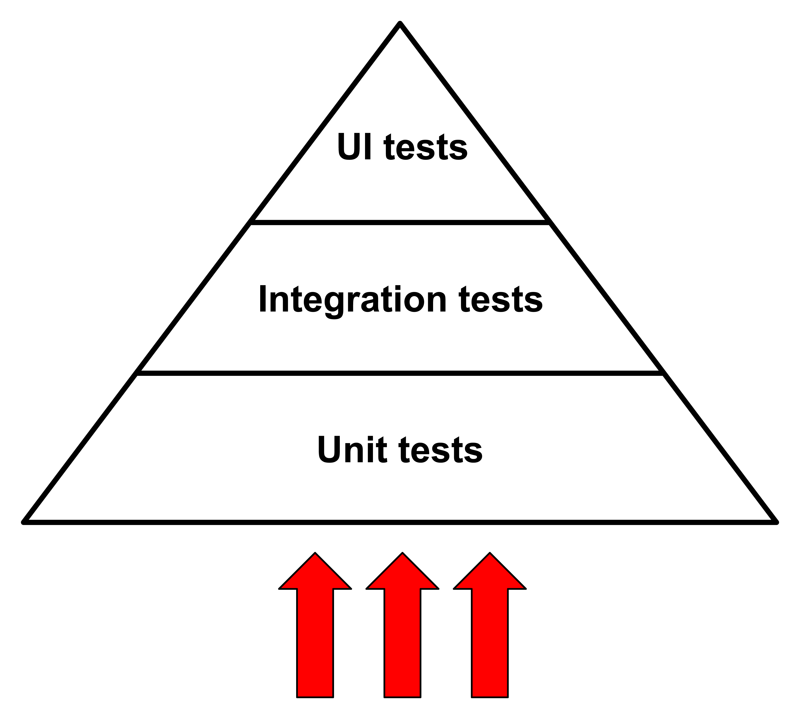
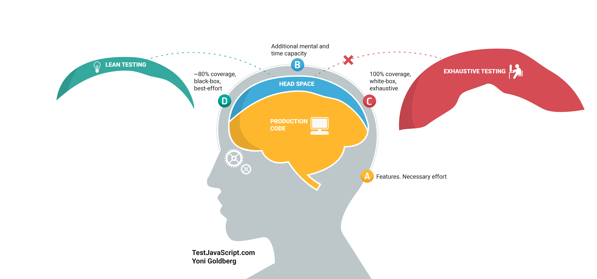
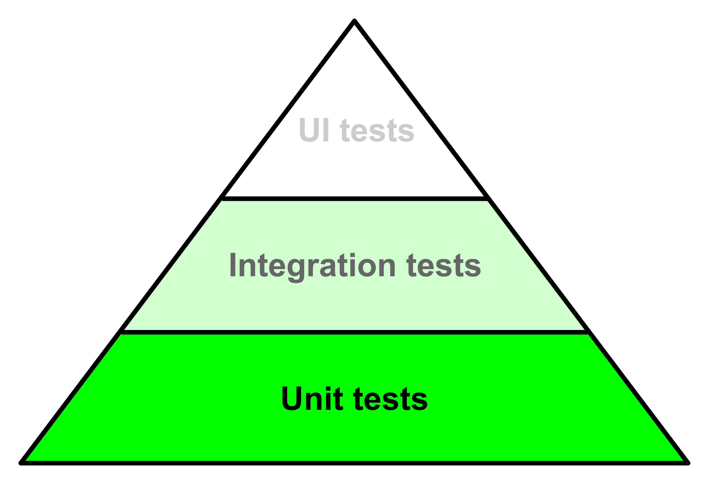
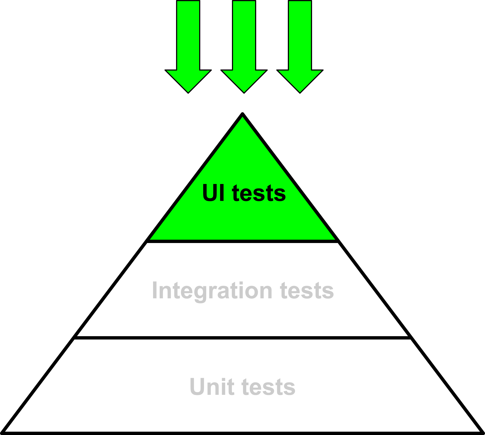

# Approach the testing pyramid from the top!

 

### One Paragraph Explainer

When you are an experienced tester, approaching a test suite is an easy road.
But learning how to test properly, what to test and what to avoid, which kind of
tests choosing etc. is not so easy.

**Testing is expensive at the beginning**. Everything is new, the examples you
try to implement do not work, you do not understand clearly why the tests fail,
how it’s related to your code, etc.

We all know the Testing Pyramid and commonly, we approach it from the bottom

_The standard Testing Pyramid approach: bottom to top._

Approaching the pyramid from the bottom makes sense. Starting with the Unit
Tests is easier because they're fast, they do not require complex contexts or
tools, a "unit" (whatever you mean with "unit": a function, a component, etc.)
contains just a few lines of code and usually it has a few dependencies (or not
at all), etc.

What's the biggest **downside of this approach**? Essentially, its
**confidence**.

Testing is all about confidence and the tradeoff between high-confidence, yet
slow, tests and low-confidence, yet fast, tests.

If you're new to the testing field the term "confidence" could not be clear in
your mind, so: how can you be sure that the **application** you're working on
**works if the tests pass**? This is the **testing confidence**.

Why the Unit Tests give so little confidence? Some examples:

- if the `isValidEmail` function passes the tests, are you sure that the
  registration form of your front-end application works?
- if the `Input` React component passes the tests, are you sure that the
  registration form works too?
- if the whole `RegisterForm` component passes the tests, are you sure that the
  user can register?

The answer is No. A whole application is made of a lot of units integrated each
other, without counting some presentational (CSS) problems that could prevent
the user from registering because of an image with a higherz-index that covers
the submit button.

Speaking again about the missing experience of testing newbies (like I was, two
years ago): **everything new requires a big cognitive load** and you cannot face
too much new stuff at the same time. It's hard to face the usual development of
your app, the new Testing topic, the Unit Tests world and the UI tests one (the
latter two require different tools and efforts).

Take a look at this exhaustive image from the
[JavaScript & Node.js testing best practices](https://github.com/goldbergyoni/javascript-testing-best-practices)
project:

_Courtesy of [Yoni Goldberg](https://goldbergyoni.com/), visit
[testjavascript.com](https://testjavascript.com/) and add a star to the
[JavaScript & Node.js testing best practices](https://github.com/goldbergyoni/javascript-testing-best-practices)
repository._

This is true for experienced developers, and when you first approach the testing
world things are worse.

## Bottom to top approach results

You inevitably put the most of your attention to the base of the pyramid, the
Unit Tests. The bunch of tests you are going to write allow you becoming
familiar with the testing world, but without confidence. You could find yourself
asking

- "What is the advantage of the tests I wrote?"
- "I spent some time fighting with Unit Tests, but the application breaks like
  before, do the tests end with themselves?"
- "Honestly, I've more doubts now than before starting with tests…"

_The bottom to top approach inevitably makes you concentrate on the Unit Tests._

The problem is not with you but with the wrong kind of tests for a beginner!

What's my suggested solution? **Starting from the top and concentrating on UI
tests firstly!**

First of all, what's a UI Test (also called Functional Test, E2E Test, etc.)?
It's essentially a script that opens a real browser and interacts with the DOM
elements, the same way the real end-user does. Some videos could tell more than
hundreds of words: take a look at [an E2E test running against
Conduit - the RealWorld project](https://www.youtube.com/watch?v=gdly-oU72X0&feature=youtu.be) and [some UI tests of the Conio Backoffice](https://www.youtube.com/watch?v=lNEMKeTYEPI&feature=youtu.be).

In the above videos, you can see a real browser that loads the whole front-end
application and interacts with it. The pros are:

- your application is tested in the same context of the end-user (the browser),
  which means **higher confidence**. Even if you write just one UI Test, it
  gives you more confidence that a hundred Unit Tests
- the path under test (the steps the user does, like "registering", "creating a
  new post", etc.) is the same that the end-user must perform, that means
  **lower cognitive load** (for you) to understand what you are really testing
- honestly, you have more fun automating a browser than automating the terminal
  😁
- **UI Testing best fits** the little-to-medium size of most of **the projects
  you work on a daily basis**. From a landing page to a little CMS: all of them
  require at least some UI tests, yet you could overfly on the Unit Tests based
  on the testing confidence and the deliveries you have to respect. Just a few
  of you work at Facebook, Spotify, Netflix, etc., products that require strict
  testing strategies, code coverage requisites, etc. More in general: if you
  work for medium-to-large product companies, you probably do not need this post
  because Testing is at the core of your company's culture 🎉

There are cons too, but I'm going to list them later. That's the approach I
suggest:

_A top to bottom approach._

### Does the top to bottom approach enforce testing bad practices?

This post is not about best or bad practices (take a look at the end of the post
for a long list of resources), this post is about engaging new front-end
developers profitably in the testing world. My goal is to provide a more
practical approach, an approach that allows the developer to **enjoy the testing
advantages** and do not leave him with more doubts than before.

### If UI Testing is so magical, why other kinds of tests exist?

That's the point! And please, note that I'm not against Unit Testing! Every kind
of test is important and **different tests provide different feedback**! A
developer that approaches the pyramid from the top is enough happy to love the
whole testing world.

Then, you are going to discover the limitations of the high-level **UI tests**:

- they **are slow**: I know that the above videos give you the idea that they're
  super fast but they are not. They are fast when you have five, ten, twenty of
  them, but when you have hundreds of UI tests and they need minutes, you start
  asking yourself how you can improve the situation
- they give you mostly **high-level feedback**: if the submit button of the form
  does not work, what's the bug? There are a ton of possible causes but the UI
  Test does not allow to exclude some of them
- they render the whole app and it could be cumbersome if you just want to test
  something smaller. Some corner cases that you need to test are not replicable
  at all through the whole app

The solution to all the above problems is: **going down with the Testing
Pyramid**! And if you reach the need for lower tests, well done! It's the goal
of this post!

Consider the result of both approaches:

- bottom to top: **you have doubts** about the usefulness of the unit tests you
  write and you do not understand how these tests could help you improve the
  testing confidence
- top to bottom: you have a **few, confident, tests** and you end up with the
  need to get down the Testing Pyramid. And if you do not need to get it down,
  it means that your project is small and it does not need any more tests

Then, start from the [root of this project](../../README.md) and explore the various best practices to follow to start with UI Testing successfully since the very beginning.
