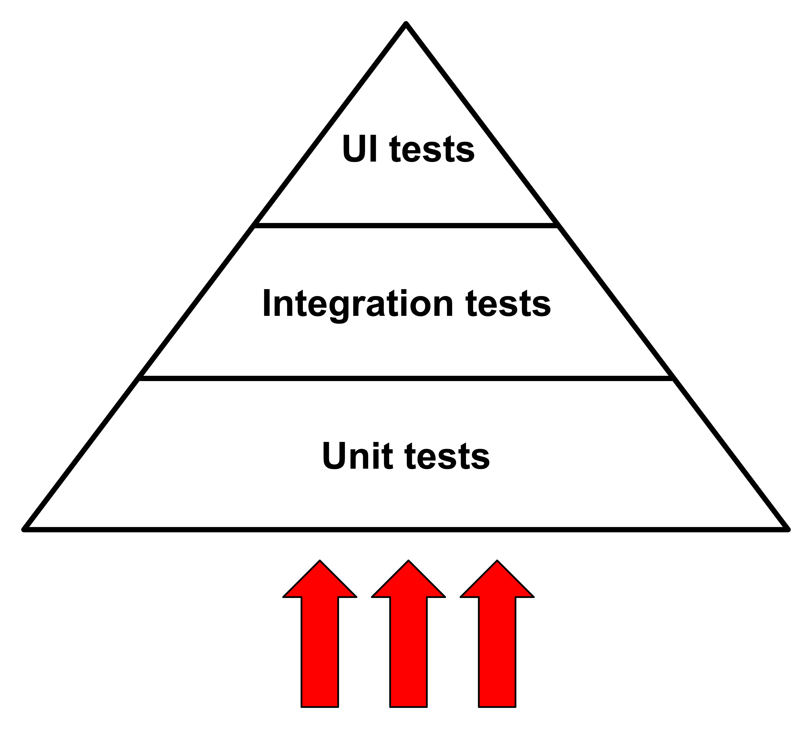
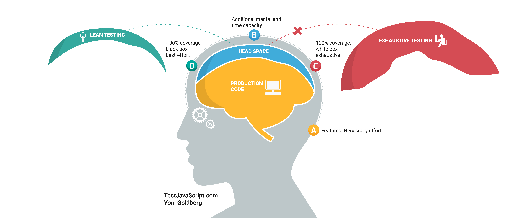
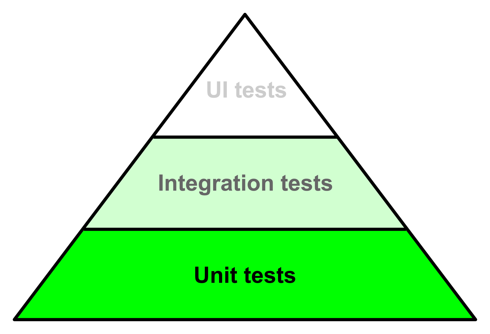
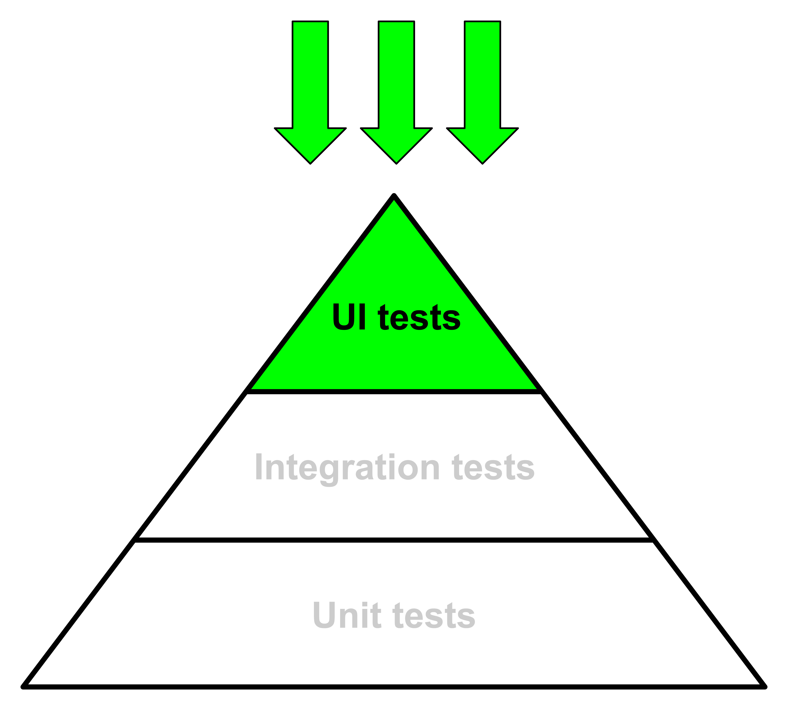

# 从金字塔顶层入手测试

 

## 一段简要说明

当你是一位经验丰富的测试员时，处理测试套件是一件轻松的事情。但学习如何正确地测试，要测试什么、避免什么，选择哪种类型的测试等等，并不那么容易。

**测试在一开始是昂贵的**。一切都是新的，你尝试实现的例子不起作用，你不清楚为什么测试失败，它与你的代码有什么关系，等等。

我们都熟知测试金字塔，通常，我们从底部开始构建。

_标准测试金字塔方法：从下到上。_

从底部开始构建金字塔是有道理的。从单元测试入手更容易，因为它们运行快速，不需要复杂的上下文或工具。一个“单元”（无论你用“单元”表示什么：一个函数、一个组件等）仅包含几行代码，通常几乎没有依赖项（或根本没有依赖项）等等。

这种方法的最大**缺陷**是什么？基本上是**信心**。

测试关乎信心，以及在高信心但较慢的测试与低信心但较快的测试之间的权衡。

如果你是测试领域的新手，术语“信心”可能不太清晰，那么你如何确保你正在开发的**应用程序**在测试通过时**是有效的**？这就是**测试信心**。

为什么单元测试提供的信心如此之少？一些例子：

- 如果`isValidEmail`函数通过了测试，你能确定你的前端应用程序的注册表单有效吗？
- 如果`Input` React 组件通过了测试，你能确定注册表单也有效吗？
- 如果整个`RegisterForm`组件通过了测试，你能确定用户可以注册吗？

答案是否定的。整个应用程序由许多单元相互集成而成，还不包括一些呈现（CSS）问题，这可能会因为一个 z-index 较高的图像遮挡了提交按钮而阻止用户注册。

再次谈论测试新手的经验缺失（就像我两年前一样）：**每一项新事物都需要大量认知负担**，而你不能同时面对太多的新事物。同时处理应用程序的常规开发、新的测试主题、单元测试世界和 UI 测试（后两者需要不同的工具和努力）是很困难的。

看看这张详尽的图片，它来自
[JavaScript 和 Node.js 测试最佳实践](https://github.com/goldbergyoni/javascript-testing-best-practices)
项目：

_由 [Yoni Goldberg](https://goldbergyoni.com/) 提供，请访问
[testjavascript.com](https://testjavascript.com/)，并在
[JavaScript 和 Node.js 测试最佳实践](https://github.com/goldbergyoni/javascript-testing-best-practices)
资源库。_

对于经验丰富的开发人员来说是如此，而当你第一次接触测试领域时，情况更糟。

## 自底向上的方法的结果

你不可避免地将大部分注意力放在金字塔的基础——单元测试上。你即将编写的一堆测试让你熟悉了测试的世界，但缺乏信心。你可能会发现自己在问：

- "我写的测试有什么好处呢？"
- "我花了一些时间与单元测试战斗，但应用程序仍然像以前一样崩溃，测试是否只是自娱自乐？"
- "老实说，我现在比开始测试之前更加疑惑了…"

_从下到上的方法不可避免地会让你把精力集中在单元测试上。_

问题并不出在你身上，而是在于对于初学者来说，采用了错误的测试方法！

那么，我的建议是什么呢？**从金字塔的顶部开始，首先关注 UI 测试！**

首先，什么是 UI 测试（也称为功能测试、端到端测试等）？本质上，它是一种打开真实浏览器并与 DOM 元素交互的脚本，与真实最终用户的操作方式相同。有时候视频能够更生动地说明问题：看一看[对 Conduit - RealWorld 项目运行的端到端测试](https://www.youtube.com/watch?v=gdly-oU72X0&feature=youtu.be)和[Conio 后台的一些 UI 测试](https://www.youtube.com/watch?v=lNEMKeTYEPI&feature=youtu.be)。

在上述视频中，你会看到一个真实的浏览器加载整个前端应用并与其进行交互。这种方法的优点包括：

- 你的应用在与最终用户相同的环境（即浏览器）中进行测试，这意味着**更高的信心**。即使只编写一个 UI 测试，它也比一百个单元测试给你更多的信心。
- 受测路径（用户执行的步骤，如“注册”、“创建新

帖”等）与最终用户执行的路径相同，这意味着（对你而言）**更低的认知负担**，以了解你真正在测试什么。

- 老实说，与自动化终端相比，自动化浏览器更有趣 😁
- **UI 测试最适用于**你日常工作中**大多数项目的小到中等规模**。从落地页到小型 CMS：所有这些都至少需要一些 UI 测试，然而基于测试信心和你必须遵守的交付要求，你可能会对基于单元测试的测试信心和交付要求有所超越。只有少数人在 Facebook、Spotify、Netflix 等公司工作，这些公司需要严格的测试策略、代码覆盖要求等。总的来说：如果你为中型到大型产品公司工作，你可能不需要这篇文章，因为测试已经成为公司文化的核心🎉。

当然，这种方法也有一些缺点，但我稍后会列举出来。下面是我建议的方法：

_自上而下的方法_

### 从上到下的方法是否强制执行测试的不良实践？

本文不讨论最佳实践或不良实践（请查看文章末尾的一长串资源），而是关注如何让新的前端开发人员在测试领域有益地参与。我的目标是提供一种更实际的方法，一种使开发人员能够**享受测试的优势**而不至于留下比以前更多的疑问的方法。

### 如果 UI 测试如此神奇，为什么还有其他类型的测试存在？

这正是关键！请注意，我并不反对单元测试！每种测试都很重要，**不同的测试提供不同的反馈**！从上到下的方法足够让开发人员喜欢整个测试世界。

然后，您将发现高级别 **UI 测试** 的局限性：

- 它们**很慢**：我知道上面的视频让您觉得它们运行得很快，但实际上并非如此。当您有五、十、二十个时，它们很快，但是当您有数百个 UI 测试并且它们需要几分钟时，您会开始思考如何改善情况
- 它们主要提供**高层次的反馈**：如果表单的提交按钮不起作用，那么问题是什么？有大量可能的原因，但是 UI 测试不能排除其中一些原因
- 它们呈现整个应用程序，如果您只想测试一些较小的东西，这可能会很麻烦。通过整个应用程序无法复制一些您需要测试的边缘情况

解决上述所有问题的方法是：**降低测试金字塔**！如果您需要更低级别的测试，那么做得好！这是本文的目标。

考虑两种方法的结果：

- 从下到上：对于您编写的单元测试的效用存在**疑虑**，并且您不理解这些测试如何帮助您提高测试信心
- 从上到下：您拥有**一些有信心的测试**，并最终需要深入测试金字塔。如果您不需要深入，这意味着您的项目很小，不需要更多的测试

然后，请从[该项目的根目录](../../README.md)开始，探索各种最佳实践，以便从一开始就成功地进行 UI 测试。
