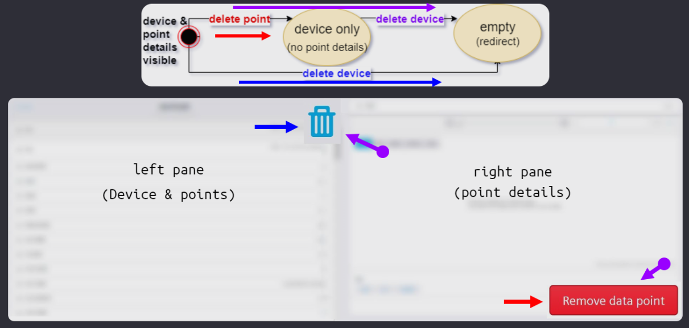
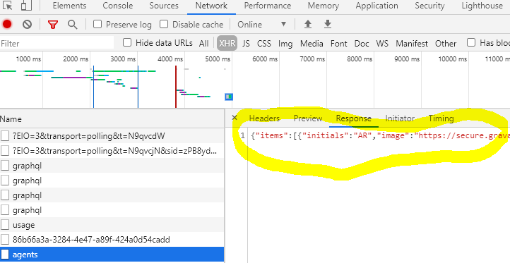

# Reaching UI state for tests without using the UI

<br/><br/>

### One Paragraph Explainer

It adds value to cover a UI scenario *once*, and it provides little value to duplicate any parts of it in other tests; tests which may require a relevant state of the system. Suppose in a new test you require a state, and that state -partially or in full- duplicates testing from a UI test. Scenarios like this are excellent for utilizing certain techniques:

* Direct navigation
* Network stub record & play
* Application actions
* Seeding the database

> Disclaimer: applications of the whole package of these techniques are only possible in Cypress (as far as we know), consequently the code samples below are are in Cypress context.

<br/><br/>

### Direct navigation

This is the easiest technique and is applicable in any framework. Suppose the intent of the test is concerned with a certain page in your application. Instead of click navigating, directly visit the URL. Upon landing you can either wait for a UI element (any test framework) or network calls (some test frameworks), or both.

```javascript
// Test A covers click-navigation to a certain page.
// This is Test B, and navigating to that page is the prerequisite step.

// assuming baseUrl is set in cypress.json or config file
// directly navigate to the page.
cy.visit('/endpoint');

// to ensure stability, wait for network (preferred), ui elements, or both

// note: checking the endpoint you are at is entirely optional, only for sanity that you are at the right page
cy.url().should('contain', 'endpoint');
// cy.url().should('match', /endpoint/); // there are many, some more complex, ways of doing it


// network wait: this is in addition to the sanity url check, and it is more important
// because you want the page to "settle" before you start running assertions on it

// usually a GET request. Is aliased so we can wait for it.
cy.intercept('some-xhr-call-that-happens-upon-landing').as('crutcXHR');
// The default Cypress timeout is 4 seconds. 15 seconds here is arbitrary.
// Most pages load faster, but if you need more time then increase the timeout.
// The only caveat to increasing timeout is that the tests will take longer to fail, but still run as fast as possible when things work.
cy.wait('@crutchXHR', {timeout: 15000});

// ui-element wait is straightforward, and may be optional, as well as less stable)
cy.get('element-on-page').should('exist').and('be.visible');

```

#### Pro vs Con

Pro: not having to click-navigate saves time in tests and saves effort in test maintenance.

Con: this technique ignores the user E2E way of clicking through the application. Make sure you have at least one workflow in any other test that covers the same workflow of click-navigation to ensure that click-navigation functionality is regression-proof. Usually click-navigation could be a test of its own; and when setting up state in other tests, you do not repeat the UI-test that is already covered elsewhere. The thought pattern is analogous to login; if you do UI-login in one test, in the others you can implement programmatic login which is both fast and cost effective.

<br/><br/>

### Application actions

Cypress gives you complete control of your application. You can bypass the page object abstraction layer (which is detached from your application), access the UI directly via `cy.get()`, have access to the API, database, and even access the source code.

Application actions are shortcuts that allow you to access internal utilities in order to save time. A simple example could be a `cy.signup()` custom command that goes to the registration form and invokes the callback of the registration form instead of filling the form and clicking the registration button.

Here is a quick example of how you would allow source code access to Cypress in an Angular application.
```javascript
// Angular Component file example
/* setup:
 1. Identify the component in the DOM;
  inspect and find the corresponding <app.. tag,

 2. Right in the constructor of your component, insert conditional */
constructor(
  /* ... */
) {
  /* if running inside Cypress tests, set the component
  may need // @ts-ignore initially */
  if (window.Cypress) {
    window.yourComponent = this;
  }
}

// at ../../support/app-actions.ts helper file:

/** yields  window.yourComponent */
export const yourComponent = () =>
  cy.window().should('have.property', 'yourComponent');

/** yields the data property on your component */
export const getSomeListData = () =>
 yourComponent().should('have.property', 'data');
```
After this at DevTools see what that component allows for properties, or in the component code see what functions you can .invoke()

Check out [the presentation slide](https://cypress.slides.com/cypress-io/siemens-case-study#/12/3/4) for a code sample utilizing app actions with visual testing.

#### Another example on app actions utilizing states, using [Building Operator](https://new.siemens.com/us/en/products/buildingtechnologies/automation/talon/software/building-operator.html?stc=ussi100451&sp_source=ussi100451&&s_kwcid=AL!464!3!435315652461!b!!g!!%2Bbuilding%20%2Boperator&ef_id=CjwKCAjw8df2BRA3EiwAvfZWaAsQmgot5Ph-nGBB8rW1QLLr870q2HW-qzMKhqtQb1QvlPBVJxho5BoCmtMQAvD_BwE:G:s) building control product of Siemens.

In the below state diagram there are 3 states. We begin where both left and right panes exist. If the right pane is deleted (delete point / red flow), only the left pane exists. If the left pane is deleted (delete device - blue flow), both panes go away and the UI is redirected.



Testing the UI, you might chose to delete the right pane (red flow) and then in another test you might choose to delete the left pane (blue flow). This leaves out 1 final path through the state diagram where right pane and then left pane are deleted one at a time.

We already covered deleting the right pane in a UI test (red path). Why not avoid repeating this test and utilize app actions, getting access to the delete function in the source code and using `cy.invoke()` to call it?

```javascript
it('Component test: delete right pane and then left', () => {
  /* tests a SEQUENCE not covered with UI tests
   * tests a COMBINATION of components */
  appAction.deleteRightPane();
  cy.window().should('not.have.property', 'rightPaneComponent');
  cy.window().should('have.property', 'leftPaneComponent');

  appAction.deleteLeftPane();
  cy.window().should('not.have.property', 'leftPaneComponent');
  cy.window().should('not.have.property', 'rightPaneComponent');
  cy.url().should('match', redirectRoute);
});
```

#### Pro vs Con

Using applications actions / having component access is fast! The tests are less prone to changes. Generally this is the benefit of testing at lower level. Alas, it can get addictive to engineers and testing the user interface starts getting neglected; the pro can become a con.

There are a few counter arguments against application it. Developers may be opinionated that Cypress' access to the source code isn't ideal. There is a not a counter argument to this until Cypress has official component testing support.

The real power of application actions comes out when combining application actions with other techniques; not duplicating the UI workflow to setup a state, combining component testing with visual testing, combining component testing with network manipulation are where this approach shines.


<br/><br/>


### Network stub record & play
This is an advanced technique that strongly relates to UI-integration tests. Recall UI-integration references [1](../testing-strategy/component-vs-integration-vs-e2e-testing.md), [2](../real-life-examples/test-front-end-with-integration-back-end-with-e2e.md).

Cypress allows you to stub all network traffic. We can record the network data from an endpoint, and stub that response every time the UI makes a call to an arbitrary server.

Start by copying the network data from devTools to a json file. Place it in `cypress/fixtures` folder. This folder is made for this purpose, and any reference to it will default to the root of the folder.



```javascript
// prerequisite: the data has been copied to a file `cypress/fixtures/agents.json`

// this is a shorthand for cy.fixture(). More at https://docs.cypress.io/api/commands/fixture.html#Accessing-Fixture-Data
cy.intercept('some-xhr-call-that-happens-upon-landing', { fixture: 'agents.json'} ).as('crutcXHR');
// all calls to the network route will be stubbed by the data in agents.json file
```

#### What if there are so many network requests happening?
Where do we get all our mocks for fixtures? We do not want to manually copy and save them. We want to record them as the test runs against a real API

There are at least 2 Cypress plugins you can utilize for this [1](https://github.com/Nanciee/cypress-autorecord) & [2](https://github.com/scottschafer/cypressautomocker).

If these do not work for you, you can easily create record and playback utilities yourself with these 3 functions.

```javascript
function stubRecorder(pathToJson) {
  const xhrData = []; // an empty array to hold the data
  cy.server({ // if recording, save the response data in the array
    onResponse: (response) => {
      const url = response.url;
      const method = response.method;
      const data = response.response.body;
      // We push a new entry into the xhrData array
      xhrData.push({ url, method, data });
    }
  });

  // cy.intercept() specification below is used as a selector for the data you want to record.
  // In this example, all GET requests from any url will be selected
  // You can specify the methods and routes that are recorded
  cy.log('recording!');
  cy.intercept({
    method: 'GET',
    url: '*',
  });

  // if recording, after the test runs, create a fixture file with the recorded data
  after(function () {
    cy.writeFile(`./cypress/fixtures/${pathToJson}.json`, xhrData);
    cy.log(`Wrote ${xhrData.length} XHR responses to local file ${pathToJson}.json`);
  });
}

/** Plays recorded fixture with all required network data as json*/
function playStubbedFixture(stateFixture) {
  cy.log(`playing fixture from ${stateFixture}`);
  cy.fixture(stateFixture, { timeout: 15000 }) // the fixture file may be large and take time in CI
    .each(({method, url, data}) => {
      cy.intercept(method, url, data);
    }).as(`stateFixture_stub`);
}

/** Visits the stubbed state */
function visitStubbedState(stubFile, url, wait: boolean = true) {
  playStubbedFixture(stubFile);
  cy.visit(url);
  if (wait) { // sometimes you do not want to wait for network, this gives you the option
    cy.wait('@stateFixture_stub', { timeout: 15000 });
  }
}

//////////
// usage

// recording network
it('should run your test', function () {
  stubrecorder('jsonfileNameForNetworkData');

  // your original test

  cy.wait(5000); // one-time wait so that the after() step records all the network without missing anything

  // the rest of your original test
});

// playing the stubbed network
it('should run your test', function () {
  // every time we visit this endpoint, all network will be stubbed
  // double check this by observing (XHR stubbed) network responses in the test runner
  visitStubbedState('jsonfileNameForNetworkData', '/endpoint');

  // the rest of your original test
});
```

#### Pro vs Con

UI integration tests are the bread and butter of UI testing. They run the whole app in a real browser without hitting a real server. They are blazing fast and less exposed to random failures in the network or false negatives.

The engineers have to realize that the strength can be a curse if misused. The UI application is isolated, but network failures, if there are any, are ignored. It is great for feature branch testing, but in further deployments one should ensure that the back-end is also operational. Refer to [test-front-end-with-integration-back-end-with-e2e](../real-life-examples/test-front-end-with-integration-back-end-with-e2e.md) for when to use which technique.

<br/><br/>


### Seeding the database

Cypress [`cy.task()`](https://docs.cypress.io/api/commands/task.html#Requirements) is very powerful. Effectively, it allows you to use NodeJs within the context of Cypress. This can be anything from NodeJs code, to using an npm package to manipulating the database. If you use Node.js for your app, you can re-use your app code to help set up and manipulate data for your tests.

There is a [Cypress recipe](https://github.com/cypress-io/cypress-example-recipes/tree/master/examples/server-communication__seeding-database-in-node) on this topic and we will end with that reference.


<br/><br/>
