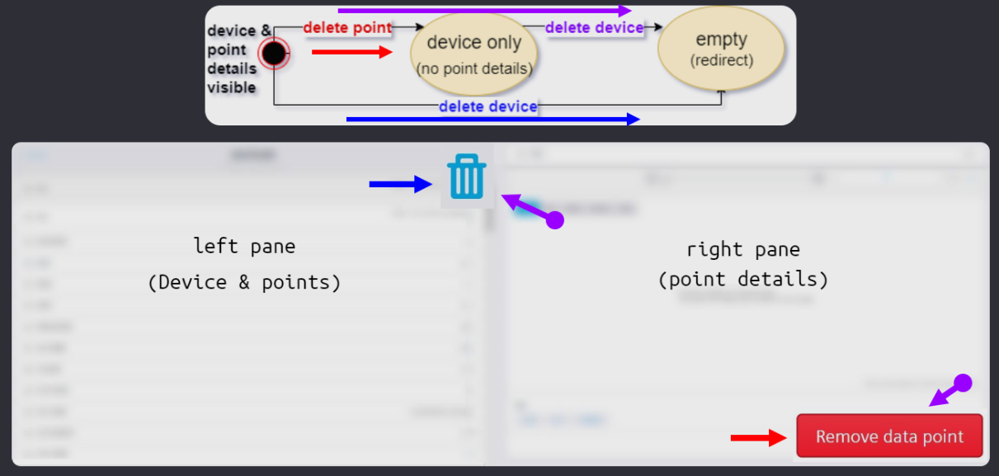

# 在测试中达到 UI 状态而无需使用 UI

<br/><br/>

## 一段简要说明

在 UI 场景中覆盖一次是有价值的，而在其他测试中复制其中任何部分提供的价值很小；这些测试可能需要系统的相关状态。假设在一个新测试中，你需要一种状态，而那种状态 - 部分或全部 - 与 UI 测试中的某些部分重复。在这种情况下，可以考虑以下几种技术：

* 直接导航
* 网络存根记录和播放
* 应用程序动作
* 数据库种子

> 免责声明：整个技术包的应用仅在 Cypress 中可能（据我们所知），因此以下代码示例是在 Cypress 上下文中。

<br/><br/>

## 直接导航

这是最简单的技术，适用于任何框架。假设测试的意图与你的应用程序中的某个页面有关。与其进行点击导航，直接访问 URL。一旦到达，你可以等待 UI 元素（任何测试框架）或网络调用（一些测试框架），或两者兼而有之。

```javascript
// Test A covers click-navigation to a certain page.
// This is Test B, and navigating to that page is the prerequisite step.

// assuming baseUrl is set in cypress.json or config file
// directly navigate to the page.
cy.visit('/endpoint');

// to ensure stability, wait for network (preferred), ui elements, or both

// note: checking the endpoint you are at is entirely optional, only for sanity that you are at the right page
cy.url().should('contain', 'endpoint');
// cy.url().should('match', /endpoint/); // there are many, some more complex, ways of doing it


// network wait: this is in addition to the sanity url check, and it is more important
// because you want the page to "settle" before you start running assertions on it

// usually a GET request. Is aliased so we can wait for it.
cy.intercept('some-xhr-call-that-happens-upon-landing').as('crutcXHR');
// The default Cypress timeout is 4 seconds. 15 seconds here is arbitrary.
// Most pages load faster, but if you need more time then increase the timeout.
// The only caveat to increasing timeout is that the tests will take longer to fail, but still run as fast as possible when things work.
cy.wait('@crutchXHR', {timeout: 15000});

// ui-element wait is straightforward, and may be optional, as well as less stable)
cy.get('element-on-page').should('exist').and('be.visible');

```

### 直接导航的优缺点

优点：不进行点击导航可以节省测试时间，并减少测试维护的工作量。

缺点：这种技术忽略了用户通过应用程序的端到端点击方式。确保在其他测试中至少有一个工作流程覆盖与点击导航相同的工作流程，以确保点击导航功能不会出现回归问题。通常，点击导航可以成为一个独立的测试；在设置其他测试的状态时，不要重复已经在其他地方覆盖的 UI 测试。思考模式类似于登录；如果在一个测试中进行 UI 登录，在其他测试中可以实现程序化登录，这既快速又经济。

<br/><br/>

## 应用程序操作

Cypress 为你提供了对应用程序的完全控制权。你可以绕过页面对象的抽象层（与你的应用程序分离），通过 `cy.get()` 直接访问 UI，还可以访问 API、数据库，甚至可以访问源代码。

应用程序操作是一种快捷方式，允许你访问内部工具以节省时间。一个简单的例子可以是一个 `cy.signup()` 自定义命令，该命令进入注册表单并调用注册表单的回调，而不是填写表单并点击注册按钮。

以下是一个快速示例，演示了在 Angular 应用程序中如何允许 Cypress 访问源代码。

```javascript
// Angular Component file example
/* setup:
 1. Identify the component in the DOM;
  inspect and find the corresponding <app.. tag,

 2. Right in the constructor of your component, insert conditional */
constructor(
  /* ... */
) {
  /* if running inside Cypress tests, set the component
  may need // @ts-ignore initially */
  if (window.Cypress) {
    window.yourComponent = this;
  }
}

// at ../../support/app-actions.ts helper file:

/** yields  window.yourComponent */
export const yourComponent = () =>
  cy.window().should('have.property', 'yourComponent');

/** yields the data property on your component */
export const getSomeListData = () =>
 yourComponent().should('have.property', 'data');
```

在这之后，在 DevTools 中查看该组件允许的属性，或者在组件代码中查看你可以使用 `.invoke()` 进行的函数。

可以查看 [演示幻灯片](https://cypress.slides.com/cypress-io/siemens-case-study#/12/3/4) 获取一个使用应用程序操作进行视觉测试的代码示例。

### 另一个应用程序操作的示例，利用状态，使用 Siemens 的 [Building Operator](https://new.siemens.com/us/en/products/buildingtechnologies/automation/talon/software/building-operator.html?stc=ussi100451&sp_source=ussi100451&&s_kwcid=AL!464!3!435315652461!b!!g!!%2Bbuilding%20%2Boperator&ef_id=CjwKCAjw8df2BRA3EiwAvfZWaAsQmgot5Ph-nGBB8rW1QLLr870q2HW-qzMKhqtQb1QvlPBVJxho5BoCmtMQAvD_BwE:G:s) Siemens 的建筑控制产品

在下面的状态图中有 3 个状态。我们从左右两个窗格都存在的地方开始。如果删除右窗格（删除点/红色流），则只剩下左窗格。如果删除左窗格（删除设备 - 蓝色流），两个窗格都消失，并且 UI 被重定向。



在测试 UI 时，你可能选择删除右窗格（红色流），然后在另一个测试中，你可能选择删除左窗格（蓝色流）。这遗漏了通过状态图的最后一条路径，其中右窗格和左窗格被逐一删除。

我们已经在一个 UI 测试中涵盖了删除右窗格（红色路径）。为什么不避免重复进行此测试，利用应用程序操作，获取源代码中的删除函数，并使用 `cy.invoke()` 调用它呢？

```javascript
it('Component test: delete right pane and then left', () => {
  /* tests a SEQUENCE not covered with UI tests
   * tests a COMBINATION of components */
  appAction.deleteRightPane();
  cy.window().should('not.have.property', 'rightPaneComponent');
  cy.window().should('have.property', 'leftPaneComponent');

  appAction.deleteLeftPane();
  cy.window().should('not.have.property', 'leftPaneComponent');
  cy.window().should('not.have.property', 'rightPaneComponent');
  cy.url().should('match', redirectRoute);
});
```

### 应用程序操作的优缺点

使用应用程序操作/拥有组件访问速度很快！测试不太容易受到变化的影响。一般来说，这是在较低级别进行测试的好处。然而，对于工程师而言，这可能会变得让人上瘾，开始忽视对用户界面的测试；优势可能变成劣势。

有一些反对应用程序的论点。开发人员可能认为 Cypress 对源代码的访问不理想。在 Cypress 具有官方组件测试支持之前，这没有反驳的理由。

应用程序操作的真正威力在于将应用程序操作与其他技术结合使用时显现出来；不重复 UI 工作流程来设置状态，将组件测试与视觉测试结合使用，将组件测试与网络操作结合使用，这些都是这种方法的亮点所在。

<br/><br/>

## 网络存根记录和回放

这是一种与 UI 集成测试密切相关的高级技术。回顾 UI 集成参考 [1](../testing-strategy/component-vs-integration-vs-e2e-testing.zh.md), [2](../real-life-examples/test-front-end-with-integration-back-end-with-e2e.zh.md)。

Cypress 允许你对所有网络流量进行存根。我们可以记录来自一个端点的网络数据，并在 UI 每次调用任意服务器时存根该响应。

首先，从开发者工具复制网络数据到一个 json 文件中。将其放置在 `cypress/fixtures` 文件夹中。这个文件夹专为此目的而创建，对它的任何引用都将默认指向文件夹的根目录。


```javascript
// prerequisite: the data has been copied to a file `cypress/fixtures/agents.json`

// this is a shorthand for cy.fixture(). More at https://docs.cypress.io/api/commands/fixture.html#Accessing-Fixture-Data
cy.intercept('some-xhr-call-that-happens-upon-landing', { fixture: 'agents.json'} ).as('crutcXHR');
// all calls to the network route will be stubbed by the data in agents.json file
```

### 如果有很多网络请求发生怎么办？

我们从哪里获取所有的模拟数据？我们不想手动复制和保存它们。我们希望在测试运行时记录它们，以便与真实的 API 进行比对。

至少有两个 Cypress 插件可以用于这个目的 [1](https://github.com/Nanciee/cypress-autorecord) 和 [2](https://github.com/scottschafer/cypressautomocker)。

如果这些插件不适用于您，您可以轻松使用以下三个函数创建自己的记录和回放工具。

```javascript
function stubRecorder(pathToJson) {
  const xhrData = []; // an empty array to hold the data
  cy.server({ // if recording, save the response data in the array
    onResponse: (response) => {
      const url = response.url;
      const method = response.method;
      const data = response.response.body;
      // We push a new entry into the xhrData array
      xhrData.push({ url, method, data });
    }
  });

  // cy.intercept() specification below is used as a selector for the data you want to record.
  // In this example, all GET requests from any url will be selected
  // You can specify the methods and routes that are recorded
  cy.log('recording!');
  cy.intercept({
    method: 'GET',
    url: '*',
  });

  // if recording, after the test runs, create a fixture file with the recorded data
  after(function () {
    cy.writeFile(`./cypress/fixtures/${pathToJson}.json`, xhrData);
    cy.log(`Wrote ${xhrData.length} XHR responses to local file ${pathToJson}.json`);
  });
}

/** Plays recorded fixture with all required network data as json*/
function playStubbedFixture(stateFixture) {
  cy.log(`playing fixture from ${stateFixture}`);
  cy.fixture(stateFixture, { timeout: 15000 }) // the fixture file may be large and take time in CI
    .each(({method, url, data}) => {
      cy.intercept(method, url, data);
    }).as(`stateFixture_stub`);
}

/** Visits the stubbed state */
function visitStubbedState(stubFile, url, wait: boolean = true) {
  playStubbedFixture(stubFile);
  cy.visit(url);
  if (wait) { // sometimes you do not want to wait for network, this gives you the option
    cy.wait('@stateFixture_stub', { timeout: 15000 });
  }
}

//////////
// usage

// recording network
it('should run your test', function () {
  stubrecorder('jsonfileNameForNetworkData');

  // your original test

  cy.wait(5000); // one-time wait so that the after() step records all the network without missing anything

  // the rest of your original test
});

// playing the stubbed network
it('should run your test', function () {
  // every time we visit this endpoint, all network will be stubbed
  // double check this by observing (XHR stubbed) network responses in the test runner
  visitStubbedState('jsonfileNameForNetworkData', '/endpoint');

  // the rest of your original test
});
```

### 网络存根记录和回放的优缺点

UI 集成测试是 UI 测试的核心。它们在真实浏览器中运行整个应用程序，而不连接真实服务器。它们运行速度极快，对网络中的随机故障或错误负面影响较小。

工程师们必须认识到，这种优势如果被滥用可能成为一种诅咒。UI 应用程序是隔离的，但如果有网络故障，它们会被忽略。这对于功能分支测试非常有用，但在进一步的部署中，应确保后端也正常运行。请参阅 [使用集成测试前端，同时使用 E2E 测试后端](../real-life-examples/test-front-end-with-integration-back-end-with-e2e.zh.md) 了解何时使用哪种技术。

<br/><br/>

## 填充数据库

Cypress [`cy.task()`](https://docs.cypress.io/api/commands/task.html#Requirements) 功能非常强大。实际上，它允许您在 Cypress 上下文中使用 Node.js。这可以是任何内容，从 Node.js 代码到使用 npm 包来操纵数据库。如果您的应用程序使用 Node.js，您可以重用应用程序代码来帮助设置和操纵测试数据。

关于这个主题有一个 [Cypress 示例](https://github.com/cypress-io/cypress-example-recipes/tree/master/examples/server-communication__seeding-database-in-node)，我们将以此作为参考结束。

<br/><br/>
