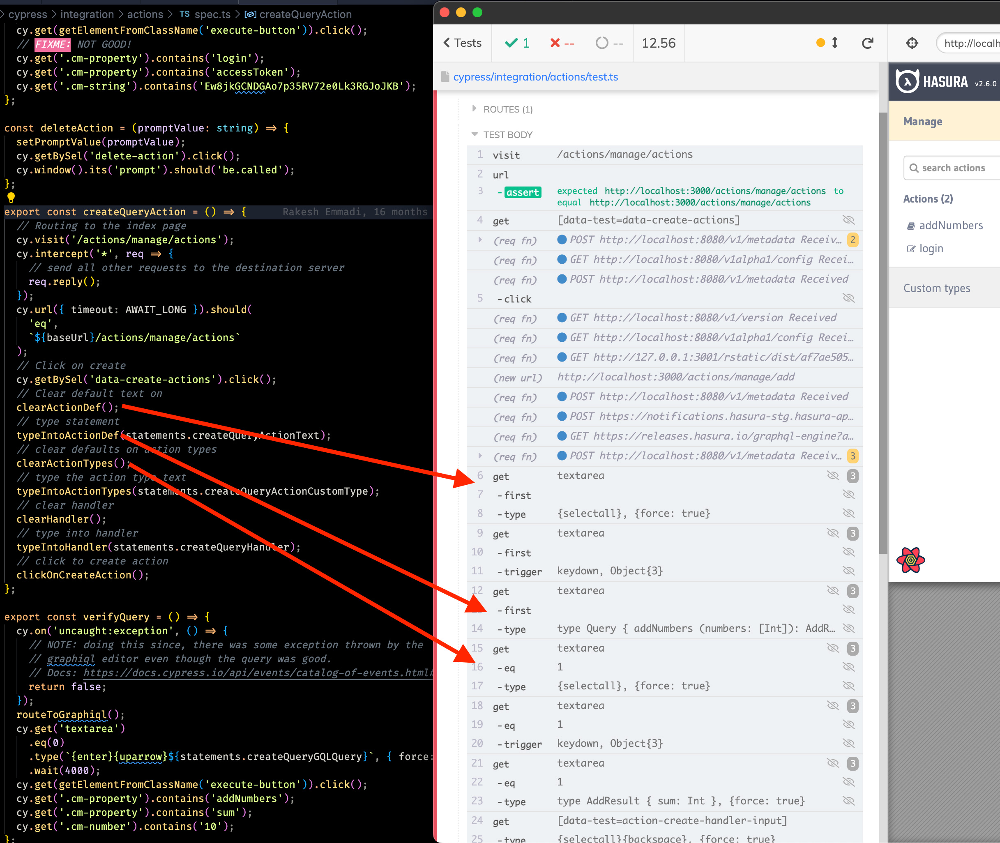
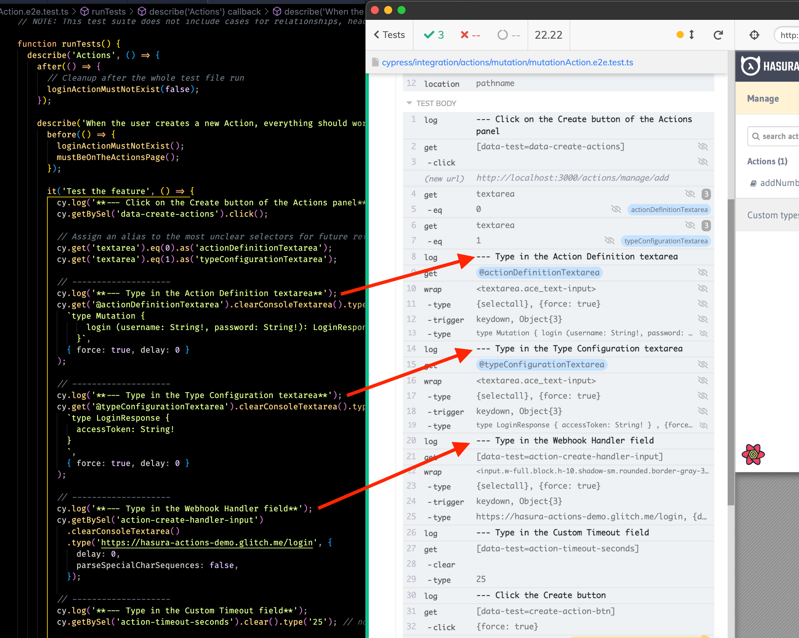
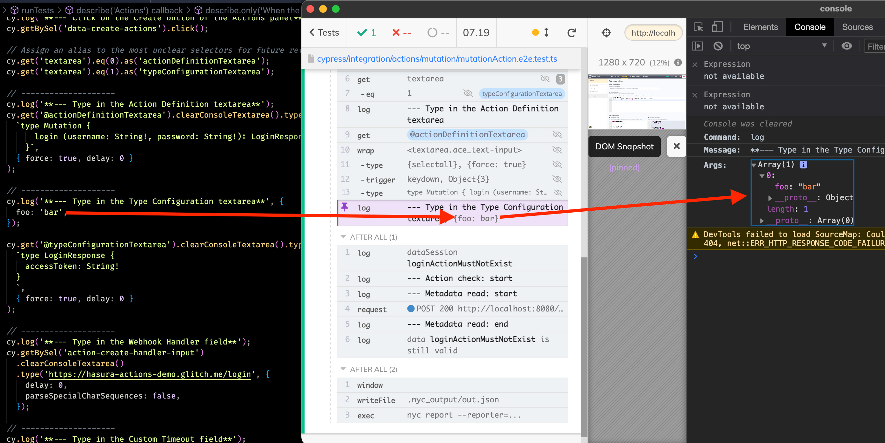
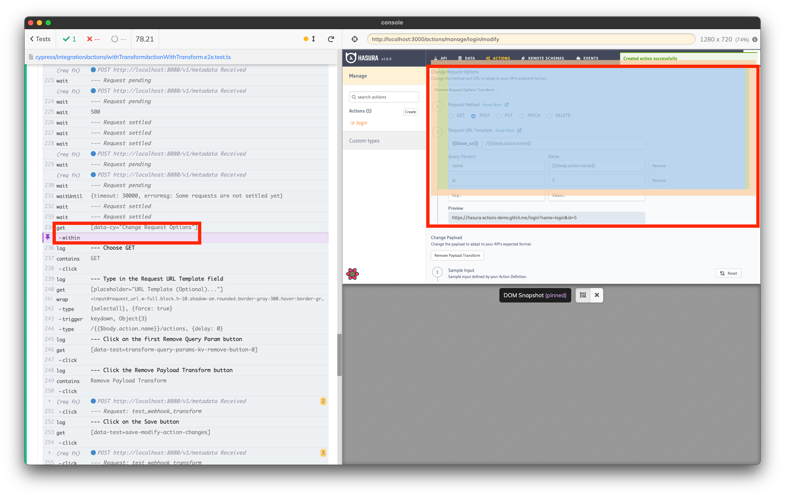

# Keep abstraction low to ease debugging the tests

<br/><br/>

### One Paragraph Explainer

UI tests are made up of a lot of steps and should accomplish three main things, but two of them are somewhat underestimated:

1.  To test a feature _(the obvious one)_
2.  To help the reader to understand what the code does _(usually underestimate)_
3.  To ease debuggability _(underestimate, and also requires experience)_

Let's go through some simple yet effective tips to keep in mind when writing UI tests.

<br/><br/>

## Readability

One arguable topic (Page-Object Model's fans will get hurt) is my view about abstraction in tests.

Let's look at a real-life example of a test I had to fix.

```ts
// spec.ts file
it('Create Query Action', createQueryAction);

// test.ts file (simplified version)
export const createMutationAction = () => {
  // ...
  clearActionDef();
  typeIntoActionDef(statements.createMutationActionText);
  clearActionTypes();
  // ...
};

// test.ts file contains the clearActionDef, typeIntoActionDef, etc.
const clearActionDef = () => {
  cy.get('textarea').first().type('{selectall}', { force: true });
  cy.get('textarea').first().trigger('keydown', {
    keyCode: 46,
    which: 46,
    force: true,
  });
};

// test.ts file contains also the statements
const statements = {
  createMutationActionText: `type Mutation {
    login (username: String!, password: String!): LoginResponse
  }`,
  createMutationCustomType: `type LoginResponse {
    accessToken: String!
  }
  `,
  createMutationHandler: 'https://hasura-actions-demo.glitch.me/login',
  // ...
}
```

The rationale behind the short functions is creating small, reusable pieces of code to help other tests that must do similar things on the page.

I think it is not good: because **it is hard to build a mental model of what the test does**! All the test parts are split into small functions and utilities, while the test's code must be as straightforward as possible.

Can you recall the two underrated points at the top of the chapter? The idea is that the test should accomplish three main things:

- To help the reader to understand what code does
- To allow debugging itself with ease

The former requires the test's code to be as dumb as possible, and there is no advantage in having abstraction in the test's code because it leads to spending more time debugging and maintaining the tests instead of the application.

The latter relates to the wrong part of tests: debugging/fixing them. Debugging a UI test is hard because you work with

- You front-end application
- The browser
- A tool that controls the browser
- The instructions you provide to the tool that controls the browser

Each of the above elements can fail, and even the more experienced developers can struggle with understanding the source of a failing test.

Hence, E2E testing is complicated. Cypress improves the developers' life (find more in [Some UI testing problems and the Cypress way](../tools/ui-testing-problems-cypress.md) chapter), but a straightforward code dramatically helps.

### No abstraction at all

I recommend having no abstraction at all (later, I will talk about the exceptions and which abstraction it's good)! I rewrote the above example to something like

```ts
it('Test the feature', () => {
  cy.get('textarea').eq(0).as('actionDefinitionTextarea');
  cy.get('textarea').eq(1).as('typeConfigurationTextarea');

  cy.get('@actionDefinitionTextarea').clearConsoleTextarea().type(
    `type Mutation {
        login (username: String!, password: String!): LoginResponse
      }`,
    { force: true, delay: 0 }
  );

  cy.get('@typeConfigurationTextarea').clearConsoleTextarea().type(
    `type LoginResponse {
      accessToken: String!
    }
    `,
    { force: true, delay: 0 }
  );

  // ...
})
```

The rewritten test does the same as the original one, but when you jump on the test's code, the overhead of jumping back and forth to connect the dots mentally is not needed.

- Do you want to know that is typed in the textarea? No hassle, it's there!
- Do you want to know what is the textareas used by the text? No hassle, it's there!

### When is abstraction good in tests?

In my opinion:

- When I want to hide some test oddities that could distract the readers for no value
- When they are soft, almost parameters-free, only one-level deep
- When there is a considerable amount of duplication (the precise amount is subjective, though)

An example of a test oddity is the following

```ts
/**
 * Clear a Console's textarea.
 * Work around cy.clear sometimes not working in the Console's textareas.
 */
Cypress.Commands.add('clearConsoleTextarea', { prevSubject: 'element' }, el => {
  cy.wrap(el).type('{selectall}', { force: true }).trigger('keydown', {
    keyCode: 46,
    which: 46,
    force: true,
  });
});
```

I created the central `cy.clearConsoleTextarea` because

1.  It's a workaround 😊
2.  For a newcomer, it is odds reading `trigger('keydown')` instead of using the more idiomatic `cy.clear`, and I do not want to leave a comment explaining it everywhere.
3.  The command is made up of 5 lines of code that would get the test's code too long for no reason.

An example of a soft abstraction is the following

```ts
function expectSuccessNotification = (title: string) {
  cy.get('.notification-success')
    .should('be.visible')
    .should('contain', title)
}
```

I like it because

1.  It does not use other abstracted code: if my tests fails at `expectSuccessNotification('Table created!')` I do not have to go crazy down the rabbit-hole to understand what happens behind `expectSuccessNotification`.
2.  It accepts only one variable, not a lot of options; neither includes conditions that would get hard in the way of understanding what the code finally does.
3.  **It's vertical for a specific use case**. It does not try to cover all the notification types, contents, etc., at once. Other vertical functions will do.
4.  If you refactor the notification system, you have a central point to refactor to adapt the tests to the new notification system.

At the opposite, this is what I do not want to have (while speaking about notification utilities)

```ts
export const expectNotification = (
  {
    type,
    title,
    message,
  }: {
    type: 'success' | 'error';
    title: string;
    message?: string;
  },

  timeout = 10000
) => {
  const el = cy.get(
    type === 'success' ? '.notification-success' : '.notification-error',
    { timeout }
  );

  el.should('be.visible');
  el.should('contain', title);

  if (message) el.should('contain', message);
};
```

I'm not too fond of the above example because

1.  It tries to cover too many use cases at a time.
2.  If it fails, you have to deal with conditions that make the whole experience a nightmare.

You can find more best practices we follow internally in the [Hasura Console UI coding patterns: Testing](https://dev.to/noriste/hasura-console-ui-coding-patterns-testing-281d) article.

### Matching the test's code and test runner's commands





The Cypress Test Runner helps understand what is happening in the application and which commands are executed, but when you debug a test, it is hard to have an immediate correlation between the Test Runner and the code. More, the logs do not help in understanding what the test is doing in feature terms (ex., the logs say "types in the textarea" but do not say "Type in the Type Configuration textarea"). So, detecting the root of a failure is hard. Cypress records videos for the failing tests, but it is useless if the reader/debugger does not have an immediate correlation between the logs and what the test is doing in plain English.

#### Look at something like this





I add a log reporting what the test is doing, allowing a direct correlation between the test's code and the Test Runner (`cy.log('**--- Type in the Webhook Handler field**');`).

Please note that you can pass more arguments to 'cy.log', and they are logged right in the devtools' console when you click on the logged command.





Storybook and Playwright already have the concept of `step` utilities that allow explaining in English what is happening in the test. Cypress does not have the same option, so the `cy.log` I propose is valuable, in my opinion.

Side note here: do not chain `cy.log` because it is not a query command; does not retry the chain.

`cy.log` doesn’t retry at function level, as of Cypress V12.

Ex:
```js
cy.log('foo').get('bar').should('baz') // does not retry
cy.get('bar').should('baz') // retries the whole chain until the assertion passes (you have 10 sec timeout set)
```

### Use clear selectors

Look at this code

```ts
cy.get('textarea')
  .eq(0)
  .type(`{enter}{uparrow}${statements.createMutationGQLQuery}`, {
    force: true,
  });
```

What is `cy.get('textarea').eq(0)`? In the absence of better selectors, I suggest hiding them under Cypress aliases, such as

```ts
// Assign an alias to the most unclear selectors for future references
cy.get('textarea').eq(0).as('actionDefinitionTextarea');
cy.get('textarea').eq(1).as('typeConfigurationTextarea');
```

and then referring to them this way

```ts
cy.get('@actionDefinitionTextarea').clearConsoleTextarea().type(/* ... */);
```

to improve the readers' life.

### Reducing data-testid attributes

I do not want to speak about the value for the tests themselves and for their confidence, but only about the effect of data-testid attributes over the debugging phase.

If an element with a data-tesid cannot be retrieved from the page, the possible problems are

1.  The element is not there.
2.  The element is there, but it does not have the attribute.
3.  The element is there, and it has the attribute but not the expected value.

All the above problems **cause the developer to re-launch the tests, inspect the elements**, look for the test-related attributes, etc. Instead, if the tests are based on the textual contents, a screenshot is enough to understand if the text searched by the test is not there or if it is wrong.

Also, some more cons for the engineers that have to deal with data-testid's

1.  Test-related attributes must be maintained during refactors, but it is not easy when you have hundreds of them.
2.  Test-related attributes are helpful if they are unique on the page. Another thing that is not easy to guarantee when you have hundreds of them

My suggestion is to use data-testid attributes only for:

-  Sections, not elements (ex. the Header, the Footer, , etc.) that allows reducing the scope of text-based searches. Here is an example

```ts
cy.get('[data-test="Actions list"]').within(() => { // <-- reduce the scope
  cy.contains('login') // <-- the "login" text could exist more times in the page
})
```

-  Non-text-based elements: icons, images, etc.

Last but not least: I suggest valuing them with user-like values, not programmer-like ones (ex. "Actions List", not "actionsList"), especially when the section shows that exact text. This allows a direct connection between the code of the test, the Cypress' Test Runner, and the page's text content.

### Grouping related actions

Reading a flat list of interactions generally does not help comprehend the page's structure the test is running against.

For instance

- get 1 and click
- get 2 and click
- get 3 and click
- get 4 and click
- get 5 and click
- get 6 and click
- get 7 and click
- get 8 and click

Instead, un-flattening the list could help the readers to create a mental model of where the involved parts reside

- within block 1
  - get 1 and click
  - get 2 and click
  - get 3 and click
- within block 2
  - get 4 and click
  - get 5 and click
  - get 6 and click
- get 7 and click
- get 8 and click





Again: Storybook and Playwright already have the concept of `step` utilities that allow grouping actions, the above suggestion is handy with Cypress.


## Related chapters

- 🔗 [From unreadable React Component Tests to simple, stupid ones](/sections//real-life-examples/from-unreadable-react-component-tests-to-simple-ones.md)

<br/><br/>


*Crossposted by [NoriSte](https://github.com/NoriSte) on [dev.to](https://dev.to/noriste/improving-ui-testss-code-to-ease-debugging-them-later-2478j).*
