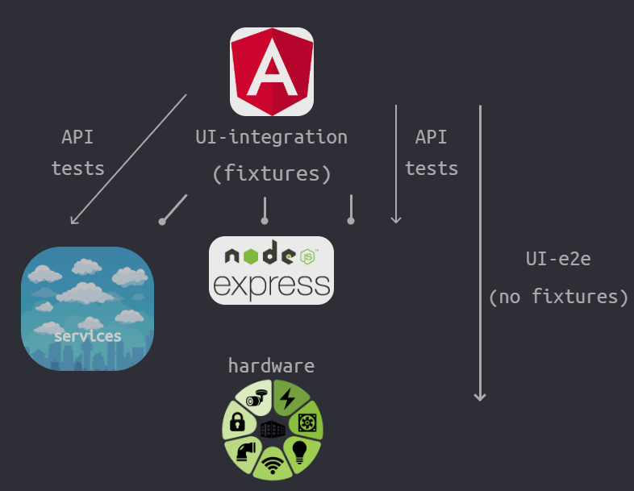

# Real life example: *Test the front-end with the integration tests, the back-end with the E2E ones* - in reference to  [Component vs Integration vs E2e Testing](..//testing-strategy/component-vs-integration-vs-e2e-testing.md):

<br/><br/>

### One Paragraph Explainer

UI tests with a stubbed server are [highly reliable and faster](../testing-strategy/component-vs-integration-vs-e2e-testing.md#ui-integration-tests)<!--TODO: check that the deeplinkl works--> in comparison to full E2E tests.

Full E2E tests still provide the highest possible confidence, but at a high cost: being brittle, potentially unreliable, and slow.

We can still achieve high confidence for the front-end by using lower-cost UI integration tests and saving higher cost E2E tests for the back-end.


<br/><br/>

### Sample Test Architecture Diagram

A high-level architectural view from a real-world [Building Controls Cloud application](https://new.siemens.com/global/en/products/buildings/digitalization/building-operator.html).

* Angular front-end
* Node-Express API (back-end)
* Services (Go lambdas) (back-end)
* Hardware (back-end)

> Depending on needs, UI-E2E tests can be supplemented with pure API tests. Some popular tools for API testing are [Postman](https://www.getpostman.com/), [Rest Client for VS COde](https://marketplace.visualstudio.com/items?itemName=humao.rest-client), as well as Cypress.



<br/>

*Please note: all the following examples are for Cypress, it has the best XHR testing support at the moment. [Full XHR request waiting and inspection is not so common](../generic-best-practices/await-dont-sleep.md#xhr-request-waitings) in the existing testing tools, Cypress provides the most complete inspection support at the moment.*

<br/>

### Code Example: Login testing

The following example has 2 tests for covering Login functionality. The first test covers the front-end application with a UI integration trest, the second test covers the back-end with an E2E test.

```javascript
/** function to fill username, password and Login*/
const fillFormAndClick = ({ username, password }) => { .. };

// This is an UI integration test with server stubbing.
// Remember to write a few E2E tests and a lot of integration ones
// @see https://github.com/NoriSte/ui-testing-best-practices/blob/master/sections/testing-strategy/component-vs-integration-vs-e2e-testing.md#ui-integration-tests
it("Login: front-end integration tests", () => {

  // A route that intercepts / sniffs every POST request that goes to the authentication URL.
  // Stubs the response with authentication-success.json fixture. This is called server stubbing
  cy.intercept({
    method: "POST",
    fixture: "authentication/authentication-success.json", // Stubs the response
    url: `**${AUTHENTICATE_API_URL}`
  }).as("auth-xhr");

  fillFormAndClick(USERNAME_PLACEHOLDER, PASSWORD_PLACEHOLDER);

  // wait for the POST XHR
  cy.wait("@auth-xhr").then(interception => {
    // assert the payload body that the front end is sending to the back-end
    expect(interception.request.body).to.have.property("username", username);
    expect(interception.request.body).to.have.property("password", password);
    // assert the request headers in the payload
    expect(interception.request.headers).to.have.property('Content-Type', 'application/json;charset=utf-8');
  });

  // finally, the user must see the feedback
  cy.getByText(SUCCESS_FEEDBACK).should("be.visible");
});

// this is a copy of the integration test but without server stubbing.
it("Login: back-end E2E tests", () => {

  // A route that intercepts / sniffs every POST request that goes to the authentication URL.
  // Distinction: this is NOT stubbed!
  cy.intercept({
    method: "POST",
    url: `**${AUTHENTICATE_API_URL}`
  }).as("auth-xhr");

  fillFormAndClick(USERNAME_PLACEHOLDER, PASSWORD_PLACEHOLDER);

  cy.wait("@auth-xhr").then(interception => {
    // since the integration tests already tested the front-end app, we use E2E tests to check the
    // back-end app. It needs to ensure that the back-end app works and gets the correct response data

    // response body assertions and status should be in the E2E tests since they rely on the server
    expect(interception.status).to.equal(200);
    expect(interception.response.body).to.have.property("token");
  });

  // finally, the user must see the feedback
  cy.getByText(SUCCESS_FEEDBACK).should("be.visible");
});
```

<br/><br/>

### Code Example 2: switching UI integration tests to UI-E2E tests

Sometimes, you may want to switch UI integration tests to E2E tests.

At lower-level test layers - for example when isolating tests to only the UI code - you may prefer to use cost-effective UI integration tests.

At higher level test layers - for example, when you integrate with intermediate level services - you may need higher confidence and target the tests to the back-end.

You can switch focus between UI integration and E2E tests by using a conditional stub.

```javascript
// stub-services.js : a file that only includes a function to stub the back-end services
export default function() {
  // all routes to the specified endpoint will respond with pre-packaged Json data
  cy.intercept('/api/../me', {fixture:'services/me.json'});
  cy.intercept('/api/../permissions', {fixture:'services/permissions.json'});
  // Lots of other fixtures ...
}

// spec file:
import stubServices from '../../support/stub-services';

/** isLocalhost is a function that checks the configuration environment*/
const isLocalHost = () => Cypress.env('ENVIRONMENT') === "localhost";

// ... in your tests, or in before / beforeEach blocks,
// stub the services if you are testing front-end (UI integration tests)
// do not stub if you are testing the back-end (UI-E2E tests)
if (isLocalHost()) {
  stubServices();
}

```


### References

[Mastering UI Testing - conference video](https://www.youtube.com/watch?v=RwWz4hllDtg)
<!-- TODO: in the end, decide if you want to move all the resources to a common chapter too -->
