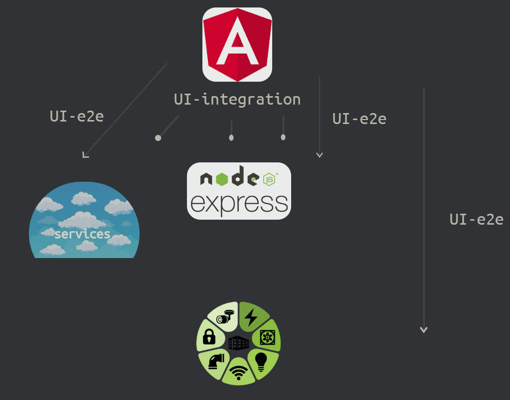

# Test the front-end with the integration tests, the back-end with the E2E ones

<br/><br/>

### One Paragraph Explainer

UI-tests with a stubbed server are highly reliable and faster in comparison to full e2e tests - [reference](https://slides.com/noriste/working-software-2019-mastering-ui-testing#/6/1).

Full e2e tests still provide high confidence, but at high cost; being brittle, unreliable and slow.

We can still achieve high confidence for the front-end by using lower cost UI-Integration tests, and saving higher cost e2e tests for the back-end.


<br/><br/>

### Sample Test Architecture Diagram

A high level architectural view from a real world Building Controls Cloud application.

* Angular front-end
* Node-Express API (back-end)
* Services (Go lambdas) (back-end)
* Hardware (back-end)

> Depending on needs, UI-e2e tests can be supplemented with pure API tests. Some popular tools for API testing are Postman, Rest Client (vs-code ext), as well as Cypress.



<br/>

*Please note: all the following examples are for Cypress, it has the best XHR testing support at the moment. Full XHR request waiting and inspection is not so common in the existing testing tools, Cypress provides the most complete inspection support at the moment.*

<br/>

### Code Example: testing Login  

Example with 2 tests for covering Login functionality. The first test covers the front-end with ui-integration, the second test covers the back-end with e2e.

```javascript
/** function to fill username, password and Login*/
const fillFormAndClick = ({ username, password }) => { .. };

// This is an ui-integration test with server stubbing.
// Remember to write a few E2E tests and a lot of integration ones
// @see https://slides.com/noriste/working-software-2019-mastering-ui-testing#ui-integration-tests
it("Login: front-end integration tests", () => {

  // A route that intercepts / sniffs every POST request that goes to the authentication URL
  // STUBS the response with authentication-success.json fixture. This is called server stubbing
  cy.route({
    method: "POST",
    response: "fixture:authentication/authentication-success.json", // STUBs the response
    url: `**${AUTHENTICATE_API_URL}`
  }).as("auth-xhr");

  fillFormAndClick(USERNAME_PLACEHOLDER, PASSWORD_PLACEHOLDER);

  // wait for the POST XHR
  cy.wait("@auth-xhr").then(xhr => {
    // assert the payload body that the front end is sending to the back-end
    expect(xhr.request.body).to.have.property("username", username);
    expect(xhr.request.body).to.have.property("password", password);
    // assert the request headers in the payload
    expect(xhr.request.headers).to.have.property('Content-Type', 'application/json;charset=utf-8');
  });

  // finally, the user must see the feedback
  cy.getByText(SUCCESS_FEEDBACK).should("be.visible");
});

// this is a copy of the integration test but without server stubbing.
it("Login: back-end e2e tests", () => {

  // A route that intercepts / sniffs every POST request that goes to the authentication URL.
  // Distinction: not Stubbed!
  cy.route({
    method: "POST",
    url: `**${AUTHENTICATE_API_URL}`
  }).as("auth-xhr");

  fillFormAndClick(USERNAME_PLACEHOLDER, PASSWORD_PLACEHOLDER);

  cy.wait("@auth-xhr").then(xhr => {
    // since the integration tests already tested the front-end app, we use E2E tests to check the
    // back-end app. It needs to ensure that the back-end app works and gets the correct response data

    // response body assertions and status should be in the e2e tests since these rely on the server
    expect(xhr.status).to.equal(200);
    expect(xhr.response.body).to.have.property("token");
  });

  // finally, the user must see the feedback
  cy.getByText(SUCCESS_FEEDBACK).should("be.visible");
});
```

<br/><br/>

### Code Example 2: switching UI-Integration tests to UI-e2e tests

Sometimes, you may want to switch UI-integration tests to e2e tests. 

At lower level test layers - for example when isolating tests to only the UI code - you may prefer to use cost effective UI-integration tests. 

At higher level test layers -for example when you integrate with intermediate level services- you may need higher confidence and target the tests to the back-end.

You can switch focus between UI-Integration and UI-e2e by using a conditional stub.

```javascript
// stub-services.js : a file that only includes a function to stub the back-end services
export default function() {
  cy.server();
  // all routes to the specified endpoint will respond with pre-packaged Json data
  cy.route('/api/../me', 'fx:services/me.json');
  cy.route('/api/../permissions', 'fx:services/permissions.json')
  // Lots of other fixtures ...
}

// spec file:
import stubServices from '../../support/stub-services';

/** isLocalhost is a function that checks the configuration environment*/
const isLocalHost = () => Cypress.env('ENVIRONMENT') === "localhost";

// ... in your tests, or in before / beforeEach blocks,
// stub the services if you are testing front-end (UI-integration tests)
// do not stub if you are testing the back-end (UI-e2e tests)
if (isLocalHost()) {
  stubServices();
}

```

### References

[Mastering UI Testing - slides](https://slides.com/noriste/working-software-2019-mastering-ui-testing#/0/1)

[Mastering UI Testing - conference video](https://www.youtube.com/watch?v=RwWz4hllDtg)

[Mastering UI Testing - github repo](https://github.com/NoriSte/working-software-mastering-ui-testing)
