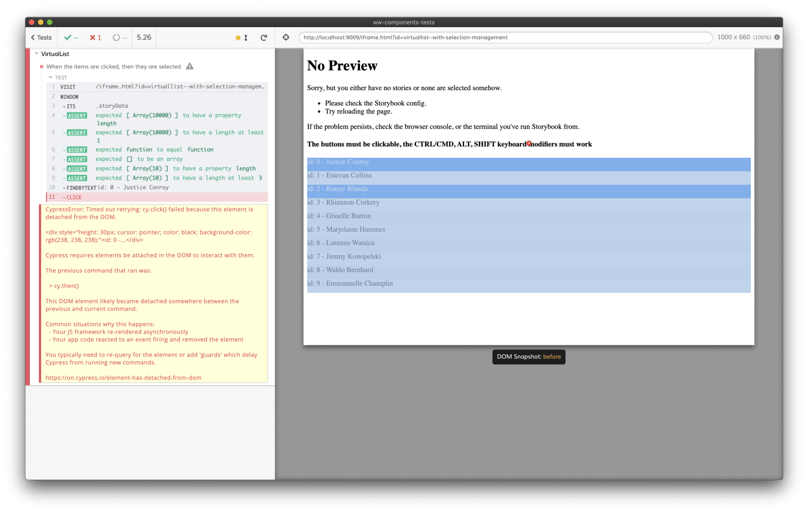

# Testing a component with Cypress and Storybook

_**UPDATE**: After this experimental approach, take a look at the “[Unit Testing React components with Cypress](./cypress-react-component-test.md)” chapter, things got simplified and more effective with Cypress 4.5.0 release!_

_**UPDATE 2**: [Cypress 7 is out with a brand-new Component Test](https://docs.cypress.io/guides/component-testing/introduction#What-is-Component-Testing) support, check it out! And other exciting news is on the way thanks to [Storybook 6.2 release](https://twitter.com/NoriSte/status/1378204109841571840)!_

### Why testing components in isolation?

Components are the building blocks of your app, Storybook allows you to build them in isolation, **checking** that they work properly and that they are aligned with the graphic layouts, sharing with the rest of the team, etc. There are essentially two kinds of component checks performed with Storybook:

- visual tests: run with [Percy](https://percy.io/) or [Applitools](https://applitools.com/), both easily integrable with Storybook to automate this checks

- functional tests: performed manually on the component stories, why do not automate them too? This chapter speaks about that

### The components testing tools

The current front-end testing trends have two winners: **[DOM Testing Library](https://testing-library.com)** and **[Cypress](https://www.cypress.io/)**. They are two completely different tools but **they overlap** in some terms. DOM Testing Library bornt explicitly to test components (through a third-party test runner like [Jest](https://jestjs.io/)) the right and the fast way and it is great for that. Cypress is made to automate the browser in an easy and reliable way.

Why do they overlap? Well because technically, you could test a whole app through DOM Testing Library or you could test a single component with Cypress.

Using **DOM Testing Library** to test an entire app:

- pro: it is blazing **fast**

- con: it renders the HTML but the HTML is not rendered by a real browser so **the CSS part does not work**

- con: reading a giant HTML instead of consuming the result in the browser is cumbersome

- con: third-party components could not fully be fully compatible with the [jsdom](https://github.com/jsdom/jsdom) environment or could not work as expected while rendered by DOM Testing Library

Using **Cypress** to test components:

- pro: it automates a **real browser**, the components are tested in the same environment they will be used

- pro: you can test the component the same way the users are going to see/consume it

- pro: you can check that your **Storybook works well** too. The code of your stories could be bugged, so having some working components does not guarantee you a having a working Storybook. And the rest of the team could count on Storybook as the component library of the team/company.

- con: **it needs a running host**/website that allows you to interact with the components themselves (like Storybook)

- con: it could be slow to test hundreds of components

Please note: for Cypress, there is the [Cypress Testing Library](https://testing-library.com/docs/cypress-testing-library/intro) plugin that allows you to leverage the same _findByText_, _findByPlaceholderText_, _findByTestId_, etc. APIs of DOM Testing Library. I love it and I always use it but they work inside Cypress, not in other test runners

## A real example: a Virtual List

Recently, I developed a VirtualList component and I used it to check how Storybook and Cypress could work together. A VirtualList is a list that renders only the visible items to guarantee the highest possible performance. Take a look at [React Virtualized](https://bvaughn.github.io/react-virtualized/#/components/List) to understand how it works. Apart from virtualizing, my VirtualList manages items clicks and items multi-selection.

Apart from a lot of unit tests, I would like to run some Component Tests but, as said above, third-party libraries (like the one we use: [React Smooth Scrollbar](https://www.npmjs.com/package/react-smooth-scrollbar)) could not work well with [React Testing Library](https://testing-library.com/docs/react-testing-library/intro) (the React version of DOM Testing Library) so Cypress is the only tool of choice.

## Testing challenges

What are the biggest challenges of using Cypress to test a component in Storybook instead of running a standard E2E test? And what are the challenges compared to a standard Component Test with [React Testing Library](https://testing-library.com/docs/react-testing-library/intro) (the React version of DOM Testing Library)?

### Data source control

With Cypress, we are used to loading an entire application, controlling the data through static fixtures (in case of [UI Integration Tests](../testing-strategy/component-vs-integration-vs-e2e-testing.md)) or reading/intercepting the back-end data (in case of [E2E Tests](../testing-strategy/component-vs-integration-vs-e2e-testing.md)) and using this data to assert that the UI is working properly. So we can control, or at least know, the data the UI is going to consume. **Not knowing data would mean no assertions**.
But in a (stateless) component story, the data is passed directly to the component by the component that represents the story and renders the component. In order to know the data and do the proper assertions about the contents shown by the component of the story, **the data needs to be exposed by the story and read by Cypress**.

Please note: if the Cypress tests are in the same repository of the components of the stories, you can import the data from the story file, but the examples shown below come from tests that are not in the same repository of the stories.

### Hidden contents

**A Virtual List removes the invisible components** from the DOM. What does it mean for the tests? That we cannot count on the fact that all the elements exist in the HTML. Neither React Testing Library nor Cypress could be fully leveraged to understand how the Virtual List is working because, as soon as you need to assert about the existence of an item outside the visible area, you cannot leverage the usual _cy.contains_ / _findByText, etc._ utilities: because the items do not exist at all.

The VirtualList is a controlled component so it notifies the parent component about which are the rendered items and which are the selected ones. In a standard [Component Test](../testing-strategy/component-vs-integration-vs-e2e-testing.md) we could assert about the props passed up and down to the VirtualList component, the Story has direct control of these props but, again, Cypress needs to read this data and so the story must expose it.

### Are we testing the story or the component?

The difference could be subtle. Since the VirtualList is a controlled component, the story’ component controls it. The controlling logic inside the story’ component is part of the things to be tested? Are the controlling component and the controlled one separable? Probably not.

A standard test has two actors—the test runner and the controlled component—while using Cypress with Storybook has **three actors—the test runner, the story, and the controlled component**—. So, if a Component Test controls the component and has direct access to the callback data, Cypress needs the story’ component to work properly.

### Scroll and rendered items control

The VirtualList component leverages an inertial scroll and, since the story adds thousands of items to be rendered to fully show the VirtualList potential, has a very little scrollbar handle. Scrolling the VirtualList could result in slightly different rendered items between a test and the next one. So I take for granted that we cannot know in advance which items are going to be rendered once the list is scrolled (ex. from the 100th to the 110th or from the 101st to the 111th).

Why? Because **I hate to have brittle tests based on fragile assumptions**. Tests should not be designed to resist every possible change but they must be enough robust to survive little changes. For the VirtualList tests, it means that once scrolled, the rendered items will be retrieved directly from the HTML ones. We are going to deepen it later.

## Code, please

The first test we are going to write needs to check that if the list received 10000 items, only a bunch of them are rendered. This is the base feature of a Virtual List.

First of all, the RenderItem component, it just alternates the color to visually identify the rows

```js
// every `item` is an { id: string, name: string}
const getItemText = (item) => `id: ${item.id} - ${item.name}`

const RenderItem = ({ item }) => {
  return (
    <div
      style={{
        height: '30px',
        backgroundColor: parseInt(item.id) % 2 ? '#FAFAFA' : '#EEE',
      }}
    >
      {getItemText(item)}
    </div>
  )
}
```

the original story we are going to work on is the following

```js
// `getStoryItems` allows to create a high amount of items, it's used by every story
export const With10000Items = () => {
  return (
    <>
      <h4>The scroll must be fluid</h4>
      <VirtualList
        items={getStoryItems({ amount: 10000 })}
        getItemHeights={() => 30}
        RenderItem={RenderItem}
        listHeight={300}
      />
    </>
  )
}
With10000Items.story = {
  name: 'With 10000 items',
}
```

We need to adapt the story to globally expose:

- the `items` array: the Cypress test needs to know the data used to fill the list

- the `getItemText` function: so the Cypress test avoids caring about how to get the rendered text from an item. Cypress needs the convert an item to text to retrieve the rendered items from their text, avoiding to use `data-test` attributes

- the number of visible items: the Cypress test needs to assert about which items are rendered and which not

Here is the story updated to expose the variables through a global `storyData` variable that will be collected and consumed by the Cypress test:

```js
export const With10000Items = () => {
  const itemHeight = 30
  const listHeight = 300
  const items = React.useMemo(() => getStoryItems({ amount: 10000 }), [])

  // exposing data for Cypress
  React.useEffect(() => {
    // global is `window`
    global.storyData = {
      items,
      visibleItemsAmount: Math.ceil(listHeight / itemHeight),
      getItemText,
    }
  }, [items])

  return (
    <>
      <h4>The scroll must be fluid</h4>
      <VirtualList
        items={items}
        getItemHeights={() => itemHeight}
        RenderItem={RenderItem}
        listHeight={listHeight}
      />
    </>
  )
}
With10000Items.story = {
  name: 'With 10000 items',
}
```

### The Cypress test

The test is going to:

- visit the Storybook page

- collect the exposed data

- check the rendered items

The code for the first two points

```js
it('When the component receives 10000 items, then only the minimum number of items are rendered', () => {
  cy.visit('/iframe.html?id=virtuallist--with-10000-items')

  cy.window()
    .its('storyData')
    .should((storyData) => {
      // the story must expose some variables
      expect(storyData.items).to.be.to.have.length(10000)
      expect(storyData.visibleItemsAmount).to.be.greaterThan(0)
      expect(storyData.getItemText).to.be.a('function')
    })
    .then(() => {
      // the test code
    })
})
```

Why asserting about the exposed `storyData`? Because a wrong `storyData` will make the test fail, and if a test fails it must drive us directly to the problem. If component rendering will fail because of a wrong `storyData`, our test should not run at all. This could be considered **a data-related smoke test**.

Now, the missing part of the test: checking which items are rendered and which are not

```js
it('When the component receives 10000 items, then only the minimum number of items are rendered', () => {
  cy.visit('/iframe.html?id=virtuallist--with-10000-items')

  cy.window()
    .its('storyData')
    .should((storyData) => {
      // the story must expose some variables
      expect(storyData.items).to.be.to.have.length(10000)
      expect(storyData.visibleItemsAmount).to.be.greaterThan(0)
      expect(storyData.getItemText).to.be.a('function')
    })
    .then(({ visibleItemsAmount, getItemText, items }) => {
      // items visibility check
      const visibleItems = items.slice(0, visibleItemsAmount - 1)
      visibleItems.forEach((item) => {
        cy.findByText(getItemText(item)).should('be.visible')
      })

      // first not-rendered item check
      cy.findByText(getItemText(items[visibleItemsAmount])).should('not.exist')
    })
})
```

- We use the exposed `visibleItemsAmount` variable to retrieve just the rendered items

  const visibleItems = items.slice(0, visibleItemsAmount - 1)

- We retrieve every item from the page using the exposed `getItemText` function

  cy.findByText(getItemText(item))

- We assert all the items expected to be visible

  cy.findByText(getItemText(item)).should('be.visible')

- We assert that the next item does not exist in the page

```js
cy.findByText(getItemText(items[visibleItemsAmount])).should('not.exist')
```

Please note that the `cy.findByText` Cypress command comes from… [Cypress Testing Library](https://testing-library.com/docs/cypress-testing-library/intro) 😊 and it is my favorite way to retrieve elements from the page because acts as the user would: reading/retrieving elements from their textual content. I use it instead of `cy.contains` but they do the same thing.

This is the result:

_The result of the first test: the loaded story and the result of all the assertions._

This test is enough to check that the Virtual List renders only the minimum number of items.

Initially, I tried to check that the browser runs at 60 FPS when the Virtual List was scrolling. Why? Because **a UI Test must check what the user sees, consuming the UI the same UI the user would**. And, from a user perspective, the sole Virtual List goal is that it must run fluidly, regardless of the number of items that are part of the list. But measuring reliably the FPS is hard because the measurement would be impacted by:

- the Cypress commands you use: every Cypress’ action slows down the browser

- the number of resources available to the machine (or Docker image) to run the tests

since having a reliable count is not possible—some initial values would be discarded, etc.—I moved to check the amount of rendered items and nothing more. If I am sure that just 10 of 10000 items are rendered, I am sure that the list runs fluidly. More in general: remember that **a brittle test is worse than a missing one**.

## Second test: scrolling

First of all: the VirtualList component leverages [Smooth Scrollbar](https://idiotwu.github.io/smooth-scrollbar/), Smooth Scrollbar has its own tests so we are going to check how our VirtualList component reacts to the scroll but we take for granted that Smooth Scrollbar works. When consuming **a third-party library**, you do not have to test that the library works. The library **should have its own tests**, if it has not, change the library! Never write tests for third-party libraries.

The scrolling test is going to:

- trigger the scroll

- wait until the scroll ends

- check the rendered items

So, the test code to trigger the scroll is the following

```js
// triggers the wheel event
cy.findByTestId('VirtualList').trigger('wheel', {
  deltaX: 0,
  deltaY: 1000,
})
```

note that the VirtusList component should render a DOM element with a `data-test="VirtualList"` attribute. The rest is managed by Cypress, trigger is a direct mapping for [jQuery trigger API](https://api.jquery.com/trigger/) (Cypress leverages jQuery to shorten as much as possible the test code). Again: the Cypress’ native equivalent ofcy.findByTestId('VirtualList') iscy.get('[data-testid=VirtualList]').

For the “wait until the scroll ends” part, we are going to leverage [Cypress waitUntil](https://github.com/NoriSte/cypress-wait-until) plugin. Why we should use the waitUntil plugin instead of waiting for a fixed amount of time is carefully explained in the [Await, do not make your E2E tests sleep](../generic-best-practices/await-dont-sleep.md) chapter.
The code of the custom waiting is

```js
// waits until the scrollbar handle stops
let scrollbarHandleY = Number.NEGATIVE_INFINITY
cy.get('.scrollbar-thumb-y').waitUntil(
  ($scrollbarHandle) => {
    const [newY, previousY] = [$scrollbarHandle.offset().top, scrollbarHandleY]
    scrollbarHandleY = newY
    return previousY === newY
  },
  {
    customMessage: 'The inertial scroll ends',
  }
)
```

So we are sure that the test waits the right amount of time.

### Checking the rendered items

What does it mean? It means:

- finding the first rendered item

- checking that the first rendered item is not the first one. The Virtual List started rendering the 0 to 10 items. Once scrolled, it must have rendered Xth to Xth+10 items. We do not know the value of X and we do not care about that, otherwise, we are going to tie the test to the exact items rendered. If the first rendered item is the 60th or the 61st one is not important. Checking the exact rendered items is out of the scope of this generic scrolling test. Test stability thanks us.

- Once retrieved the first rendered item, we check that the next ten are all rendered

We are going to go through every single step, the final code of the test is the following

```js
it('When the component is scrolled, then the rendered items are not the first ones', () => {
  cy.visit('/iframe.html?id=virtuallist--with-10000-items')

  cy.window()
    .its('storyData')
    .should((storyData) => {
      // the story must expose some variables
      expect(storyData.items).to.be.to.have.length(10000)
      expect(storyData.visibleItemsAmount).to.be.greaterThan(0)
      expect(storyData.getItemText).to.be.a('function')
    })
    .then(({ visibleItemsAmount, getItemText, items }) => {
      // triggers the wheel event
      cy.findByTestId('VirtualList').trigger('wheel', {
        deltaX: 0,
        deltaY: 1000,
      })

      // waits until the scrollbar handle stops
      let scrollbarHandleY = Number.NEGATIVE_INFINITY
      cy.get('.scrollbar-thumb-y')
        .waitUntil(
          ($scrollbarHandle) => {
            const [newY, previousY] = [$scrollbarHandle.offset().top, scrollbarHandleY]
            scrollbarHandleY = newY
            return previousY === newY
          },
          {
            customMessage: 'The inertial scroll ends',
          }
        )
        // (manually) looks for the first rendered element
        .then(() =>
          items.findIndex((item) => !!Cypress.$(`*:contains("${getItemText(item)}")`).length)
        )
        // checks that the rendered items are not the initially rendered ones
        .should('be.greaterThan', 10)
        // checks the rendered items
        .then((firstVisibleItemIndex) => {
          const visibleItems = items.slice(
            firstVisibleItemIndex,
            firstVisibleItemIndex + visibleItemsAmount - 1
          )
          visibleItems.forEach((item) => cy.findByText(getItemText(item)).should('be.visible'))
        })
    })
})
```

Step by step: the code to retrieve the first rendered item is

```js
items.findIndex((item) => !!Cypress.$(`*:contains("${getItemText(item)}")`).length)
```

Why not leveraging the `cy.findByText` command to retrieve it? Because in Cypress, every `cy.get` command (that is at the core of `cy.findByText` command) has built-in assertions, [check them](https://docs.cypress.io/api/commands/get.html#Assertions) in the official docs. Essentially, if the element does not exist on the page, `cy.get` makes the test fail. But since we need to go through over the non-rendered items until we find the first rendered one, we should go by hand. Cypress.\$ is a global instance of jQuery, a jQuery version of `cy.findByText("XXX")` is `Cypress.$(`\*:contains("XXX")`)` and, the jQuery version of

```js
cy.findByText('XXX').should('exist')
```

is

```js
!!Cypress.$(`*:contains("XXX")`).length
```

with the only difference that it does not fail if the element does not exist. As said before: I am used to leveraging `cy.getByText` but the native `cy.contains` does the same thing!

Once the index of the first rendered item is found, we only need to check the next rendered ones.

```js
.then(() =>
  items.findIndex(
    item => !!Cypress.$(`*:contains("${getItemText(item)}")`).length,
  )
)
// checks that the rendered items are not the initially rendered ones
.should('be.greaterThan', 10)
// checks the rendered items
.then(firstVisibleItemIndex => {
  const visibleItems = items.slice(
    firstVisibleItemIndex,
    firstVisibleItemIndex + visibleItemsAmount - 1,
  )
  visibleItems.forEach(item =>
    cy.findByText(getItemText(item)).should('be.visible'),
  )
})
```

[This is the recording of the test](https://www.youtube.com/watch?v=OEMkz_86bqY).

Please note that we do not care about the last half-visible item. The scope of the test is checking that the rendered items are not the first ones and that at least ten items are rendered, an 11th one does not need to be checked.

We can move the scrolling part of the test to a separated utility, something like

```js
const scrollVirtualList = ($list, deltaY = 1000) => {
  cy.wrap($list)
    .trigger('wheel', {
      deltaX: 0,
      deltaY,
    })
    .within(() => {
      // waits for the inertial scroll end
      let scrollbarY = Number.NEGATIVE_INFINITY
      getScrollbar().waitUntil(
        ($scrollbar) => {
          const newY = $scrollbar.offset().top
          const previousY = scrollbarY
          scrollbarY = newY
          return previousY === newY
        },
        {
          customMessage: 'The inertial scroll end',
        }
      )
    })
}
```

and we could do the same for finding the first rendered item

```js
const getFirstRenderedItemIndex = (items, getItemText) => {
  return items.findIndex((item) => !!Cypress.$(`*:contains("${getItemText(item)}")`).length)
}
```

The readability of the test benefits from this separation, take a look

```js
it('When the component is scrolled, then the rendered items are not the first ones', () => {
  cy.visit('/iframe.html?id=virtuallist--with-10000-items')

  cy.window()
    .its('storyData')
    .should((storyData) => {
      // the story must expose some variables
      expect(storyData.items).to.be.to.have.length(10000)
      expect(storyData.visibleItemsAmount).to.be.greaterThan(0)
      expect(storyData.getItemText).to.be.a('function')
    })
    .then(({ visibleItemsAmount, getItemText, items }) => {
      cy.findByTestId('VirtualList')
        // we leverage the new `scrollVirtualList` function
        .then(scrollVirtualList)
        .then(() => getFirstRenderedItemIndex(items, getItemText))
        .should('be.greaterThan', 10)
        .then((firstVisibleItemIndex) => {
          const visibleItems = items.slice(
            firstVisibleItemIndex,
            firstVisibleItemIndex + visibleItemsAmount - 1
          )
          visibleItems.forEach((item) => cy.findByText(getItemText(item)).should('be.visible'))
        })
    })
})
```

## Third test: selecting

The VirtualList component supports selection and **multi-item selection through key modifiers**. We only need to click items, click items with key modifiers, and check which are the selected items. What makes these operations hard?

- first of all: what “selected” means? From the user perspective, a selected item is a “highlighted” one but checking the style of an element is weak. We could add a `data-selected` attribute to the component…

- … But there is a structural problem: the items could not be rendered at all! If we click on the first item (seeing from the 1st to the 10th items), then we scroll about twenty items (seeing the from the 21st to the 30th items) and we click on items in the middle (the 25th one) pressing SHIFT, the items selected should be from the 1st to the 25th but the first twenty are not rendered, so we cannot retrieve the selected items by the rendered ones. Again, **we are going to use the variables exposed by the story**

This is the code of the story

```js
export const WithSelectionManagement = () => {
  const items = getStoryItems({ amount: 10000 })

  const [selectedItems, setSelectedItems] = React.useState([])

  const handleSelect = React.useCallback(({ newSelectedIds }) => setSelectedItems(newSelectedIds), [
    setSelectedItems,
  ])

  // exposing data for Cypress
  React.useEffect(() => {
    global.storyData = {
      items,
      getItemText,
      selectedItems,
    }
  }, [items, selectedItems])

  return (
    <>
      <h4>The buttons must be clickable, the CTRL/CMD, ALT, SHIFT keyboard modifiers must work</h4>
      <VirtualList
        items={items}
        selectedItemIds={selectedItems}
        getItemHeights={() => 30}
        RenderItem={createSelectableRenderItem({ height: 30 })}
        listHeight={300}
        onSelect={handleSelect}
      />
    </>
  )
}
```

Since the VirtualList component is controlled, it passes up the list of selected items—the `selectedItems` array—. The parent component—the story—exposes the array for Cypress to allow asserting about the selected items.
Please note: the component creation, with click management, has been moved to a dedicated higher-order function: `createSelectableRenderdItem`.

The test for selecting a single item is the following

```js
it('When the items are clicked, then they are selected', () => {
  cy.visit('/iframe.html?id=virtuallist--with-selection-management')

  cy.window()
    .its('storyData')
    .should((storyData) => {
      // the story must expose some variables
      expect(storyData.items).to.be.to.have.length.of.at.least(3)
      expect(storyData.getItemText).to.be.a('function')
      expect(storyData.selectedItems).to.be.an('array')
    })
    .then(({ getItemText, items }) => {
      cy.findByText(getItemText(items[0]))
        .click()
        .window()
        .its('storyData.selectedItems')
        .should('eql', [items[0].id])

      cy.findByText(getItemText(items[1]))
        .click()
        .window()
        .its('storyData.selectedItems')
        .should('eql', [items[1].id])
    })
})
```

All the assertions are on the exposed `selectedItems` array itself. We do not check if the rendered items are highlighted or not (highlighting the item is in charge of the component created by the story) but only that the VirtualList component manages correctly the items click.

The `selectedItems` array is not read at the beginning but it is read after every click because we need to check always the updated one, not the reference to the initial one (`selectedItems` is returned by `React.useState` so it is new after every selection update).

### Multi-selection assertions

The next step is checking that the VirtualList component manages correctly the usage of the Meta key. Clicking another item while the meta key is pressed should result in two selected items.

How could we keep the Meta key pressed with Cypress? It is just

```js
cy.get('body')
  // keeping pressed the meta (CMD) key
  .type('{meta}', { release: false })

// ...your test code...

cy.get('body')
  // releasing the meta (CMD) key
  .type('{meta}', { release: true })
```

Adding the item click would result in

```js
cy.get('body')
  // keeping pressed the meta (CMD) key
  .type('{meta}', { release: false })
  .findByText(getItemText(items[2]))
  .click()
  .window()
  .its('storyData.selectedItems')
  .should('eql', [items[1].id, items[2].id])
  .get('body')
  // releasing the meta (CMD) key
  .type('{meta}', { release: true })

  cy.get('body')
    .type('{shift}', { release: false })
    .findByText(getItemText(firstRenderedItem))
    .click()
    .window()
    .its('storyData.selectedItems')
    .should('eql', expectedSelectedItemIds)
    .get('body')
    .type('{shift}', { release: true })
  })
```

Here a screenshot of the result

_The first result of the test: the loaded story and the result of all the assertions._

### Scrolling and selecting

Scrolling the list is easy thanks to the `scrollVirtualList` utility, finding the first rendered item is done by the `getFirstRenderedItemIndex` one, we know how to keep a key pressed… So, testing the scrolling and clicking with the Shift modifier (which means selecting everything from the previous clicked element and the last one) should be just a matter of calculating all the (expected to be) selected items. The next code does only that, go on for the full code of the test

```js
cy.findAllByTestId('VirtualList')
  // scrolls the list
  .then(scrollVirtualList)
  .then(() => {
    // identifies the first rendered item (unknown in advance)
    const firstRenderedItemIndex = getFirstRenderedItemIndex(items, getItemText)
    const firstRenderedItem = items[firstRenderedItemIndex]

    // the tests is going to click on the first rendered item
    // keeping the SHIFT key pressed. All the items up to the first
    // rendered one should be selected
    const expectedSelectedItemIds = items
      .slice(0, firstRenderedItemIndex + 1)
      .map((item) => item.id)

    cy.get('body')
      .type('{shift}', { release: false })
      .findByText(getItemText(firstRenderedItem))
      .click()
      .window()
      .its('storyData.selectedItems')
      .should('eql', expectedSelectedItemIds)
      .get('body')
      .type('{shift}', { release: true })
  })
```

the full code of the test, checking for every key modifier, is long but quite repetitive

```js
it('When the items are clicked, then they are selected', () => {
  cy.visit('/iframe.html?id=virtuallist--with-selection-management')

  cy.window()
    .its('storyData')
    .should((storyData) => {
      // the story must expose some variables
      expect(storyData.items).to.be.to.have.length.of.at.least(3)
      expect(storyData.getItemText).to.be.a('function')
      expect(storyData.selectedItems).to.be.an('array')
    })
    .then(({ getItemText, items }) => {
      // first item click
      cy.findByText(getItemText(items[0]))
        .click()
        .window()
        .its('storyData.selectedItems')
        .should('eql', [items[0].id])

      // second item click
      cy.findByText(getItemText(items[1]))
        .click()
        .window()
        .its('storyData.selectedItems')
        .should('eql', [items[1].id])

      // third item click with Meta modifier
      cy.get('body')
        .type('{meta}', { release: false })
        .findByText(getItemText(items[2]))
        .click()
        .window()
        .its('storyData.selectedItems')
        .should('eql', [items[1].id, items[2].id])
        .get('body')
        .type('{meta}', { release: true })

      // first item click with Shift modifier
      cy.get('body')
        .type('{shift}', { release: false })
        .findByText(getItemText(items[0]))
        .click()
        .window()
        .its('storyData.selectedItems')
        .should('eql', [items[2].id, items[1].id, items[0].id])
        .get('body')
        .type('{shift}', { release: true })

      // second item click with Alt modifier
      cy.get('body')
        .type('{alt}', { release: false })
        .findByText(getItemText(items[1]))
        .click()
        .window()
        .its('storyData.selectedItems')
        .should('eql', [items[2].id, items[0].id])
        .get('body')
        .type('{alt}', { release: true })

      // scrolling
      cy.findAllByTestId('VirtualList')
        .then(scrollVirtualList)
        .then(() => {
          const firstRenderedItemIndex = getFirstRenderedItemIndex(items, getItemText)
          const firstRenderedItem = items[firstRenderedItemIndex]
          const expectedSelectedItemIds = items
            .slice(0, firstRenderedItemIndex + 1)
            .map((item) => item.id)

          // x-th item click with Shift modifier
          cy.get('body')
            .type('{shift}', { release: false })
            .findByText(getItemText(firstRenderedItem))
            .click()
            .window()
            .its('storyData.selectedItems')
            .should('eql', expectedSelectedItemIds)
            .get('body')
            .type('{shift}', { release: true })
        })
    })
})
```

[The test result is the following](https://www.youtube.com/watch?v=0DGHRJnWbHw).

As you can see, the Command Log on the left does not tell clearly what is happening. We could improve the speaking level of the test by adding some cy.log calls or, better, leveraging [Filip’s solution](https://medium.com/slido-dev-blog/cypress-tips-3-improve-your-error-screenshots-in-cypress-b3675968a190) to get the best out of Cypress logging.

## Optimizations

The faster the tests are, the better. My original test suite took almost 16 seconds to completely run. [Here is the recording](https://www.youtube.com/watch?v=EwBz844FuxE) (please note that it was the first test suite, with the 60 FPS test).

There are two main improvements areas:

- switching faster between stories (instead of reloading the page between the tests)

- speeding up the scrolling forcing the browser clock with Cypress

### Switching faster between stories

Kudos to Nicholas Boll and his [cypress-storybook](https://github.com/NicholasBoll/cypress-storybook) plugin that leverages the storybook APIs to load the desired story without reloading the whole page.

At the time of writing, all we need to do is:

- adding `import 'cypress-storybook/react'` to the Storybook configuration

- adding import `'cypress-storybook/cypress'` to the Cypress’ support/index.js file

- adding a `before` hook to the test file

```js
before(() => {
  // Visit the storybook iframe page once per file
  cy.visitStorybook()
})
```

- loading stories through `cy.loadStory('VirtualList', 'With 10000 items')` instead of using `cy.visit`

- updating the exposed variables, explained after the video

Doing so, the page is not reloaded for every test and the whole suite saves 3 seconds, take a look at [this video](https://www.youtube.com/watch?v=UJhPTJhDEFM).

Why do we need to update the variables by the stories? Well, if the page is not reloaded, we cannot be sure that the exposed variables are the desired ones, especially because almost every story exposes an `items` variable but the contents of the variable vary.

How could we distinguish the variables exposed by the stories? Well, exposing the name of the story too!

```js
React.useEffect(() => {
  global.storyData = {
    // the name of the story is exposed too
    storyName: 'With 10000 items',
    items,
    visibleItemsAmount: Math.ceil(listHeight / itemHeight),
    getItemText,
  }
}, [items])
```

Doing so, every test could check for the awaited name

```js
it('When the component receives 10000 items, then only the minimum number of items are rendered', () => {
  const story = 'With 10000 items'
  cy.loadStory('VirtualList', story)

  cy.window()
    .its('storyData')
    .should((storyData) => {
      // caring about the story name
      expect(storyData.storyName).to.eq(story)

      expect(storyData.items).to.be.to.have.length(10000)
      expect(storyData.visibleItemsAmount).to.be.greaterThan(0)
      expect(storyData.getItemText).to.be.a('function')
    })
    .then(({ visibleItemsAmount, getItemText, items }) => {
      // ... test code...
    })
})
```

leveraging the [Cypress retry-ability](https://docs.cypress.io/guides/core-concepts/retry-ability.html) to wait until all the assertions pass. This way we are sure the exposed variables are the correct ones.

13 seconds compared to the initial 16 seconds could not sound like a huge improvement… But it is! Because if we were testing a component without the inertial scroll (a form, for example) the gain would not have been from 16" to 13" but probably from 9" to 6" seconds! Trust me, **never underestimate test speed**…

### Speeding up the scroll by controlling the clock

The videos highlight that most of the test duration is spent waiting for the inertial scroll completion. There is nothing wrong about that but some test runners allow you to control time ticking, Cypress is one of those. Pushing time forward is fundamental when you need to test `setTimeout` or `setInterval` related stuff or animations like the inertial scroll.

The [official documentation](https://docs.cypress.io/api/commands/clock.html) has a lot of examples, but basic usage is enough for our needs. We need to call `cy.clock()` and then ticking time with `cy.tick(<milliseconds>`).

The first test commented with the new clock control

```js
it('When the component is scrolled, then the rendered items are not the first ones', () => {
  const story = 'With 10000 items'
  cy.loadStory('VirtualList', story)

  // take control of the browser clock
  cy.clock()

  cy.window()
    .its('storyData')
    .should((storyData) => {
      expect(storyData.storyName).to.eq(story)
      expect(storyData.items).to.be.to.have.length(10000)
      expect(storyData.visibleItemsAmount).to.be.greaterThan(0)
      expect(storyData.getItemText).to.be.a('function')
    })
    .then(({ visibleItemsAmount, getItemText, items }) => {
      // this test does not need the `scrollVirtualList` utility anymore
      cy.findByTestId('VirtualList')
        .trigger('wheel', {
          deltaX: 0,
          deltaY: 1000,
        })

        // ticking the clock by one second.
        // It jumps to the inertial scroll end.
        .tick(1000)

        .then(() => getFirstRenderedItemIndex(items, getItemText))
        .should('be.greaterThan', 10)
        .then((firstVisibleItemIndex) => {
          const visibleItems = items.slice(
            firstVisibleItemIndex,
            firstVisibleItemIndex + visibleItemsAmount - 1
          )
          visibleItems.forEach((item) => cy.findByText(getItemText(item)).should('be.visible'))
        })
    })
})
```

[That’s the result](https://www.youtube.com/watch?v=m6u0H8_jQuc).

As you can see, we jump at the end of the inertial scroll without waiting for its completion. Please note: the whole test duration is falsified by the screen recording, the test run without recording takes less time.

Remember that, if you use `cy.clock`, using `cy.tick` is not optional! If you do not tick the time manually, the list does not scroll at all because the clock is frozen! Take a look at what happens if you do not tick the clock

_The list is stuck at the initial scroll level, it did not scroll because we did not tick the clock._

The `.should('be.greaterThan', 10)` assertion is not satisfied because the list does not scroll at all.

Clock control applied to almost all the tests dropped their duration 9 seconds. The final result in the next video

https://www.youtube.com/watch?v=Otf3J7qFAtI

The end result: **from the initial 16 seconds to 9 seconds**, great! The faster the tests are the more you are going to leverage them!

### “No preview” error

If you encounter this error



relaunching Cypress should be enough. Otherwise, relaunch Storybook. It happened to me just twice in some hours, so I have not deepened it too much yet.

## Conclusions

As a recap, the solutions listed above are:

- Leverage [cypress-storybook](https://github.com/NicholasBoll/cypress-storybook) to allow Cypress switching between stories quickly

- The stories should expose some global variables allowing Cypress to assert about data

- Speed up the test as much as you can, the inertial scroll in the example will not be awaited thanks to Cypress’ clock control

- Think if you want to test the rendered component, the story code, or both

- The tools are going to be more integrated, Component Testing is a hot topic currently

<!-- TODO: in the end, decide if you want to move all the resources to a common chapter too -->

<br /><br />

_Crossposted by [NoriSte](https://github.com/NoriSte) on [dev.to](https://dev.to/noriste/testing-a-virtual-list-component-with-cypress-and-storybook-3lam) and [Medium](https://medium.com/@NoriSte/testing-a-virtual-list-component-with-cypress-and-storybook-494dc2d1d26b)._
