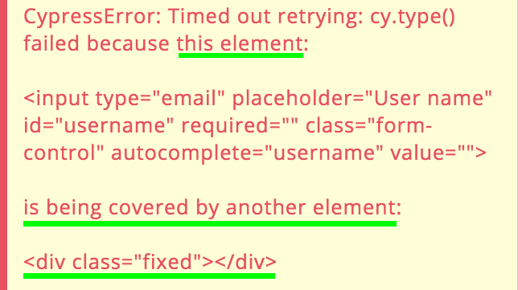

# Some UI testing problems and the Cypress way

_Call for contributors: are you a TestCafé expert? I would like to split the "problems" section from the "how Cypress solves them" one, and add a section dedicated to how TestCafé solves them!_

Testing a front-end application brings some challenges that the “classic” tests have not: you need to **orchestrate a real browser**. Browsers are heavy applications by definition, and you need to launch them, manage them through a made on purpose library, leverage some APIs to automate the same kind of interactions the user would do, and then check if the state of front-end application (essentially what it shows) is the same you expect it to have.

This process and the involved steps are what make UI testing hard. The main problems are:

- **Everything** is asynchronous: the user-simulated interactions are asynchronous, the UI reacts asynchronously, the browser reacts asynchronously, the tool you use to orchestrate and communicate with the browser is asynchronous

```js
await page.goto(url);
await page.click('[data-test="contact-us-button"]');
await expect(page).toMatch("Contact Us");
```

And, as soon as you need something more complicated, await-ing everything leads you to deeply manage promises and recursive promises.

- **You automate user flows**: so you need to reproduce user flows, inspect automatic user flows, debug failing (and automatic, and super fast) user flows.
  Imagine being side by side with a colleague of yours that has a problem, you ask him to make something so you can inspect the issue directly with his browser DevTools but he **does not stop to click/type when you need to inspect the problem**. This is the kind of situation you need to face when something does not go as expected with a UI test. Pausing/stopping a running flow is hard and you need to relaunch the same tests a lot of times

- There are a lot of cases, in a web application, that can interfere with an element’ interactivity: its internal state, its markup properties, its visual appearance, the appearance of other elements, etc. Some of them are easy to be discovered (a “disabled” attribute for example) but some are not (another element with a higher z-index value). More in general, **it is hard to debug the causes**, because you need to double-check the element itself, the whole page, the tool that automates the interactions, etc.

Automating and testing a front-end application is hard but there are some tools that do not alleviate the pain and some other that give you superpowers, go on!

### Common tools

To automate and test a front-end application you need two different tools:

- A test runner: the one that takes care of executing the test itself

- A browser automation tool: something that exposes some APIs to interact with a launched on purpose browser

The tools are independent and while the test runner of your choice (Jest, for example) runs in the terminal (and gives you all the test feedback), the second one (Selenium or Puppeteer) opens a browser, executes the commands written in the test, and gives back the result.

_There is two-way communication between the terminal-based test runner and the browser automation tool._

**The two tools are detached** and this complicates a lot of things! The actions that run in the browser are really fast! You can slow down them but you cannot pause or stop them! Or, better, I mean not interactively… Because you obviously can **jump back and forth** from the code editor, change the test commenting everything after the step you want to inspect, re-launching the test and checking what happened. But this is not an ideal flow. And since the test is a little program, you know that you need to repeat this step a lot of times…

Another problem arises while running a test in an above-described way: you typically log in to the terminal (where the test runner works) while the actions happen in the browser. **How could you connect them?** Do you add timestamp logging both in the terminal and in the browser console? Do you add a fixed-div above your front-end application that shows you the name of the running test? Connecting what happens in the browser with what you do (or log) through the terminal is hard, too.

Last but not least: when you debug the test in the terminal, you are not debugging real DOM elements, but serialized/referenced ones. There is not any kind of two-way interactivity between the terminal and the browser and so you cannot leverage the browser DevTools the way you are used to doing.

Trust me, understanding why a test is failing or why the browser does not what you expect it to do is really hard this way. But you must face that in all the three different phases of the test-consuming process:

- 1: while you initially write the test

- 2: while the test fails and you cannot send anything to production

- 3: while you need to update them because the specifications changed

Step #1 and #3 are pretty similar, #3 could be faster but #1 could be exhausting. #2 will make you hate UI testing literally if the tools you are using do not help you…

## Test runner purposes

Stop for a moment and think about what the mentioned tools try to accomplish, starting from the test runners.

Test runners are made for managing unit tests. You can use/plug them the way you want, obviously, but they are made essentially for super-fast (and parallelized) small-function invocations. They do not have browser-like DevTools but **the main problem is test timeouts**. Every test has a timeout and it is completely reasonable. Thanks to the timeout, if a test takes too long, the test runner kills it.

But what happens when you combine the test timeout with the UI-testing needs? As you know, a user flow could last really long. For a lot of reasons:

- The interaction themselves could be really long and involve tens of clicking, typing, calculations, waitings, etc.

- There is a lot of stuff that **cannot be controlled (from a duration perspective)** at all: XHR requests above all! You cannot know how much the Docker container (or the staging server) could take to respond. And if the back-end is not dockerized you have to face network slowness too

These examples show you how unpredictable could be a UI test. The solution could seem handy: incrementing the test timeout! But this is the worst solution, it does not work because:

- Test timeouts are the guillotine that could save you a lot of time when something goes wrong. If you set the timeout to one minute you are going to **wait one more minute** (60 seconds!!!!) if a single test does not work as expected. Test excessive durations are one of the main reasons developers hate tests because pipelines last forever. Nonetheless: in some particular scenarios, you cannot be sure 60 seconds are enough… Think about AWS lambdas wake-up time in case of slow servers, mixed with network problems…

- What about the debugging process? Remember that when the test is killed because of the timeout, the automated browser is closed automatically...

Last but not least, remember that you need to have DOM-related assertions. In a UI test, you do not treat objects, arrays, and primitives, but you manage essentially DOM elements. Assertions like “I expect the element is equal to…” does not work, while it works for unit testing, obviously. This problem is usually solved with external plugins.

## Browser automation tool purposes

Selenium and Puppeteer aim for an easy, magics-free, UI automation experience. They are not meant to test the UI, but only to automate the user interactions. **Automating and testing overlap** in some ways but they are not the same. Both try to understand if a button is clickable and try to click it, but while the former fail, the latter tries to tell you why it failed. While the former tells you that an element is not on the page, the latter tells you that it is not on the page because the previous XHR request failed.

We were used to putting together a test runner with a browser automation tool and try to get the best of them, but suffering from what two non-integrated and different tools could not offer.

Speaking again about the test (and the app under test) debuggability: in order to slow down/debug/pause/stop/make-them-working, etc. you need to “sleep” the tests a lot of times. It is a common practice, both because it solves problems in the short term, and sometimes because you do not have alternatives (read the [Await, don't sleep](../generic-best-practices/await-dont-sleep.md) section). Unfortunately, add some **“sleep” steps makes the tests worse and worse**, slower and slower. As I wrote previously: test slowness is one of the most common flaws that brings developers to hate UI tests.

More: **what happens when a test fails?** What you can do to understand the problem before understanding how to fix the bug? If you are lucky enough to discover the broken test locally, your pains are limited. But if the test fails in a pipeline, how could you know what happened if you do not have a UI? Have you added some parachute automate screenshot? Is there anything that speaks better than a screenshot? Unfortunately not…

You need even to leverage third-party debugging tools (React DevTools, Vue DevTools, etc.) but their installation process onto the controlled browser is not the handiest in the world.

Last but not least: stubbing the server and asserting about the XHR requests could be considered testing implementation details… But I do not think so, for two reasons:

- While speaking about blackbox testing, we refer to the (good) practice of avoiding to test how something works, concentrating only on what it does. Applied to a front-end application, it means testing just the functionalities that the app exposes to the user, not how the app exposes it (it does not matter if it works with React or Vue.js, if it saves data into localStorage or sessionStorage). The same could be applied to the client/server communication but understanding that something did not happen because of a wrong XHR request could be hard (especially when you run the automated browser in headless mode). While the help you get from asserting about the request payload, the response payload, the response status, etc., is priceless (**always care about how much a test drives you to identify the problem in case of failures**).

- You do not need to do that if you test the client/server contract with Pact or a similar tool, but do you have these kinds of tests in your workflow?

- If you are a front-end developer, you know that you cannot always work after the back-enders completed their work. But if they provide you the whole JSON responses, stubbing the back-end allows you to complete all the front-end coding jobs, leaving the last mile of work to check that everything works as expected when you integrate the front-end with the back-end. It is a matter of productivity.

## Implicit testing challenges

The above considerations create another problem: **the test code should be as simple as possible**. Tests allow you to check that everything works as expected but they are little programs after all. And so, you need to maintain them, over time. And since you need to understand them in a while (it is unfeasible if you need hours to understand why and how a test works, tests must help you, not complicate your life like bad code could do), their code should not be complicated (read the [Software tests as a documentation tool](../testing-perks/tests-as-documentation.md) section).

But, tools that are not created for a difficult task like UI testing, do not help you writing simple tests code. And your testing life gets harder, again… Hence you are condemned to spend a lot of time debugging a failing test instead of understanding what did not work in your front-end application (assuming that something broke…). **The result is fewer test trustability**…

## Cypress to the rescue

Do not worry, I have not reported this dramatic situation for the sake of your sadness 😉 but just to get you aware that you do not need generic tools mixed together, you need something made on purpose! Two tools come to my mind: [Cypress](https://www.cypress.io/) and [TestCafé](https://devexpress.github.io/testcafe/). Both are super valid since they have just one goal in mind: reinventing (or fixing?) the UI testing world.

I concentrate on Cypress and I compare them later.
How does Cypress solve all the above problems? First of all…

## Cypress has a UI

Yes, you start Cypress through the terminal, but you consume it [through its UI](https://docs.cypress.io/guides/core-concepts/test-runner.html)! And the UI is side-by-side with your application! Take a look at this preview

 (on the left) runs alongside your front-end application (on the right).](../../assets/images/ui-testing-problems-cypress/cypress-preview.png)_The [Command Log UI](https://docs.cypress.io/guides/core-concepts/test-runner.html) (on the left) runs alongside your front-end application (on the right)._

What does it mean? What are the main [Command Log UI](https://docs.cypress.io/guides/core-concepts/test-runner.html) features?

- **You have direct feedback for what Cypress is doing**. Every time you ask Cypress to interact with the page through its commands (cy.click , cy.type, etc.), Cypress adds a log to the Test Runner. This verbose automatic logging is really helpful both while writing your test and while debugging it. It seriously improves your productivity, both because it is automatic and because it is side-by-side with your application.

But, as I told you, the lack of retroactive debuggability is a big missing while writing UI tests… Let me introduce you…

- **Interactive time-traveling**: not sure how the app reached a particular command or how the test failed? Would you take a look at the UI at a previous step? That is why the Command Log is interactive! You can hover the various logged steps and see how the app looks at a particular step! Or, obviously, you can pin a step and inspect the DOM, check how the app looks before/after the step, etc. This is another life-saver feature, both at the first approach (debugging a test when you do not know the testing tool could be a nightmare) and in the day-by-day testing work. It makes test inspection so handy that you completely forget how was testing without it. Watch it in action [in this video](https://www.youtube.com/watch?v=C62rYlmKLho&feature=youtu.be).

Others Command Log utilities are:

- Command’ rich log: clicking on command shows a more detailed log into the browser DevTools

- Assertion inspection: clicking on an assertion shows both the expected value and the result in the browser DevTools. You do not need to relaunch the test with more verbose logging

- If you spy XHR calls the Command Log shows a resume of the spied/stubbed calls and how many times they have been called

… and more, take a look at [its capabilities in the official Cypress docs](https://docs.cypress.io/guides/core-concepts/test-runner.html#Command-Log).

## Cypress commands

**Commands are asynchronous** by default, take a look at the next snippet

```js
cy.visit(url);
cy.click('[data-test="contact-us-button"]');
cy.contains("Contact Us").should("be.visible");
```

Do you notice any await? No and the reason is straightforward: why should you manage awaits while everything in the UI needs to be awaited? Cypress “waits” for you, which means that if a DOM element is not ready when you try to interact with it, no problem! Cypress retries (by default for 4 seconds) until it can interact with the element (the user way, so only if the element is visible, is not disabled, is not covered, etc.). So you can **avoid facing the front-end intrinsic asynchronicity** at all!

The above feature has one more effect: do you remember the not-so-good test timeout? Well, forget about it! In Cypress, **tests do not have timeouts**! You avoid to guess (and continuously adapt based on the needs) test duration, every command has its own timeout! If something goes wrong, the test fails soon! And if the test goes well, it does not risk to face the test timeout guillotine!

Last but not least: DOM-related commands report **DOM-related errors** the way you need. Take a look at the following example:

_Cypress reports clearly the problem from a user/DOM perspective._

It is pretty clear the reason why the user could not type into the input element. Cypress is not the only tool that has commands that act as the user would do, but its speaking errors are quite uncommon.

## Test quality

There are a lot of common mistakes that developers do while testing. Some mistakes are negligible but some are not. Cypress enforces you avoiding some mistakes, how?

- With **AAA-quality [documentation](https://docs.cypress.io/guides/overview/why-cypress.html)**: take a look at it, it contains a lot of [best practices and anti-patterns too](https://docs.cypress.io/guides/references/best-practices.html). Everyone agrees about the quality of the documentation

- **Resetting the state**: the tests do not share the state because cookies, localStorage, etc. are all reset before every test. You obviously can create smart commands that allow you to keep the tests independent (the real problem sharing the state is the independence of the tests, take a look at an [example from one of my courses](https://noriste.github.io/reactjsday-2019-testing-course/book/sharing-authentication-state.html)) but you cannot skip the reset. It is a pro, trust me 😉

- Removing the possibility of restoring a test, is an assertion fails, you cannot go ahead. You do need to make your test more stable, even if sometimes it could seem hard. This is a winning choice, otherwise, you would have been allowed to write bad tests

- **With a lot of awaiting helpers**: [retry-ability](https://docs.cypress.io/guides/core-concepts/retry-ability.html#Commands-vs-assertions) and [automatic waitings](https://docs.cypress.io/api/commands/wait.html#Syntax) are life-savers that allow you to care about your app and your test, not about waiting elements and stuff. Cypress allows you to wait for DOM elements, XHR requests, page loads, and it **adapts the timeout** based on the need (an XHR request or a page-load could last longer than an input element appearing) without the need for fixed-time sleep (again, read the [Await, don't sleep](../generic-best-practices/await-dont-sleep.md) section).
  And if you need to write a custom waiting, my [cy.waitUntil plugin](https://github.com/NoriSte/cypress-wait-until) is what you need 😉

## Productivity

Cypress wins on another, really important, topic: productivity. Read how in the dedicated section: [Use your testing tool as your primary development tool](../generic-best-practices/use-your-testing-tool-as-your-primary-development-tool.md).

## Debugging

I explained above why debugging a test could be a nightmare without some dedicated features. There are two kinds of failing test debugging:

- While you are writing the tests

- While the tests fail in a CI/CD pipeline

Cypress has two amazing solutions:

- [Play/pause](https://docs.cypress.io/api/commands/pause.html) functionality\*\*: both programmatically and through the UI, you can pause the test and resume it. And yes, it offers even step-by-step navigation, the same way you are used to placing a breakpoint in your code and process one step at a time. Use play/pause twice and you cannot write a test without it anymore 😊
  Play/pause and time-traveling offer an amazing experience and get you to forget at all about the common time-consuming debugging pains

- **Automatic screenshots and videos**: if a test fails, Cypress saves a screenshot of the last step of the test. Sometimes, the last step allows you to understand what happened (especially if you added a lot of speaking assertions, [here you can read](https://noriste.github.io/reactjsday-2019-testing-course/book/utility-in-case-of-failure.html) what you risk without good step-by-step assertions) but if a screenshot does not help you so much… Cypress records a video of the whole test, including the Test Runner UI. Sometimes, automatic recordings allowed me to discover CI-related issues in the easiest possible way.

## FAQ

I presented Cypress as a perfect tool, now I anticipate some common questions they ask me:

- Is Cypress free?
  Yes, free, open-source, MIT-licensed. You have to pay only if you want to leverage its [Dashboard service](https://www.cypress.io/dashboard/). In one sentence: do you want Cypress to host the videos of your tests? You have to pay, otherwise, everything is free

- Does Cypress support browser apart from Chrome-like ones?
  At the time of writing (Jan 21st, 2020), Firefox and Edge support are in beta.

- I cited TestCafé, what are the main differences?

* **TestCafé has not something like the Test Runner UI**, a big missing IMHO
* TestCafé waits until the DOM element timeouts expire while Cypress waits up to the same timeouts. So, with TestCafé, you have to manually calibrate waitings to avoid long-running tests, with Cypress you can forget about it
* TestCafé has not full XHR requests inspection, it is arguable but I think it is an important feature to have highly reliable tests and useful error reporting
* **TestCafé supports all the existing browsers**! This is a unique feature, Cypress does not support all the browsers and will not support mobile ones. Note that cross-browser needs are pretty overestimated but if you really need it, TestCafé is the perfect tool for you

- Has Cypress flaws? Obviously! It has a [historical issue with window.fetch](https://github.com/cypress-io/cypress/issues/95#issuecomment-343214638) that forces you to use Axios or to [add a workaround](https://dev.to/matsilva/fetch-api-gotcha-in-cypress-io-and-how-to-fix-it-7ah) and you could need some extra-step for managing OAuth since your app runs in an iframe. But it is nonetheless one of the most loved tools for UI Testing

- More in general: remember that we are speaking about UI testing and Cypress is particularly good at doing it. If you just need to automate a browser (for data scraping or whatever) do not use it!

## Conclusions

As a recap, the problems and the solutions listed above are:

- Everything is asynchronous in the front-end testing, Cypress manages it almost transparently

- Step-by-step debugging: Cypress’ time-traveling and play/pause functionalities are your best friends

- Cypress gives clear errors in case of failures

- Debug made handy, identifying flaws is not a nightmare thanks to the side-by-side test/app running

- Auto-screenshot and videos in case of failures

- Cypress tests have not timeouts, Cypress commands have

- Cypress allows you to work completely without a back-end the easiest possible way

- Cypress has a lot of features that improve your productivity

- Cypress is made wit one goal in mind: making UI testing easy

### References

[Mastering UI Testing - conference video](https://www.youtube.com/watch?v=RwWz4hllDtg)

<!-- TODO: in the end, decide if you want to move all the resources to a common chapter too -->
