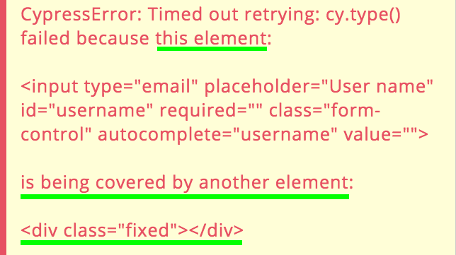

> [!NOTE]
> 所有现代前端测试工具（Playwright、Storybook、Cypress、TestCafé）都具有类似的功能和 UI 工具，因此相同的内容适用于所有工具，而不仅仅是 Cypress。

# 一些 UI 测试问题及 Cypress 的解决方案

_招募贡献者：你是否是 TestCafé 专家？我希望将“问题”部分与“Cypress 如何解决它们”部分分开，并添加一个专门介绍 TestCafé 如何解决问题的章节！_

在测试前端应用程序时会面临一些“传统”测试不具备的挑战：你需要**协调一个真实的浏览器**。浏览器本质上是庞大的应用程序，你需要启动它们，通过专门的库进行管理，利用一些 API 来模拟用户可能执行的相同类型的交互，然后检查前端应用程序的状态（基本上是显示的内容）是否符合你的期望。

这个过程及其涉及的步骤是使 UI 测试变得困难的原因。主要问题包括：

- **一切都是异步的**：用户模拟的交互是异步的，UI 异步响应，浏览器异步响应，你用于协调和与浏览器通信的工具也是异步的。

```js
await page.goto(url);
await page.click('[data-test="contact-us-button"]');
await expect(page).toMatch("Contact Us");
```

而一旦你需要处理更加复杂的情况，等待所有事情就会导致你深陷于管理承诺和递归承诺之中。

- **你要自动化用户流程**：因此，你需要复制用户流程，检查自动用户流程，调试失败的（还有自动的、超级快的）用户流程。
  想象一下，你与同事并排工作，他遇到了问题，你要求他执行某个操作，以便你可以直接使用他的浏览器 DevTools 检查问题，但是**当你需要检查问题时，他却不停地点击/输入**。这就是在 UI 测试中遇到问题时需要面对的情况。暂停/停止正在运行的流程很困难，你需要多次重新运行相同的测试。

- 在 Web 应用程序中，有很多情况可能会干扰元素的交互性：它的内部状态、标记属性、视觉外观、其他元素的外观等。其中一些很容易发现（例如，“禁用”属性），但有些则不是（具有更高 z-index 值的另一个元素）。总的来说，**很难调试问题的原因**，因为你需要仔细检查元素本身、整个页面、自动化交互的工具等。

自动化和测试前端应用程序确实很有挑战，但有一些工具不能减轻痛苦，还有一些工具能为你赋予超能力，继续前进吧！

## 常用工具

要自动化和测试前端应用程序，你需要两种不同的工具：

- 一个测试运行器：负责执行测试本身的工具

- 一个浏览器自动化工具：提供一些 API 与专门启动的浏览器进行交互的工具

这两个工具是独立的，你选择的测试运行器（例如 Jest）在终端中运行（并提供所有测试反馈），而第二个工具（如 Selenium 或 Puppeteer）则打开一个浏览器，执行测试中编写的命令，并返回结果。

_基于终端的测试运行程序和浏览器自动化工具之间可以进行双向通信。_

**这两个工具是相互独立的**，这使得很多事情变得复杂！在浏览器中执行的操作非常快速！你可以减缓它们的速度，但无法暂停或停止它们！或者更确切地说，至少不能通过交互方式实现... 因为你显然可以**在代码编辑器中来回跳转**，在你想要检查的步骤之后注释掉所有内容，重新运行测试并检查发生了什么。但这并不是一个理想的流程。而且由于测试是一个小程序，你知道你需要重复这个步骤很多次……

在以上描述的方式中运行测试时，另一个问题出现了：通常你在终端登录（测试运行器工作的地方），而操作则发生在浏览器中。**你如何将它们连接起来？**你是否在终端和浏览器控制台中都添加时间戳记录？是否在你的前端应用程序上方添加一个固定的 DIV，显示正在运行的测试名称？在终端中发生的事情与通过终端执行（或记录）的事情之间的连接也很困难。

最后但同样重要的是：在终端中调试测试时，你并不是在调试真实的 DOM 元素，而是在调试序列化/引用的元素。终端和浏览器之间没有任何双向交互性，因此你不能像你习惯的那样充分利用浏览器的 DevTools。

相信我，以这种方式理解为什么测试失败或为什么浏览器不如你期望的那样工作真的很困难。但你必须在测试消耗过程的所有三个不同阶段面对这个问题：

- 1：当你最初编写测试时

- 2：当测试失败时，你不能将任何东西发送到生产环境

- 3：当你需要更新它们因为规格发生了变化

步骤 #1 和 #3 相当相似，#3 可能更快，但 #1 可能会令人筋疲力尽。如果你使用的工具不帮助你，#2 将使你对 UI 测试产生厌恶…

## 测试运行器的用途

停下来，思考一下所提到的工具试图达到的目标，从测试运行器开始。

测试运行器用于管理单元测试。当然，你可以按照自己的方式使用/插入它们，但它们基本上是为了超快速（并行化）的小型功能调用而设计的。它们没有类似浏览器 DevTools 的功能，但**主要问题是测试超时**。每个测试都有一个超时，这是完全合理的。由于超时，如果一个测试运行时间太长，测试运行器会将其终止。

但是当你将测试超时与 UI 测试的需求结合在一起时，会发生什么呢？正如你所知，用户流程可能会非常漫长。有很多原因：

- 交互本身可能会非常漫长，并涉及大量的点击、输入、计算、等待等。

- 有很多东西**根本无法（从时间角度）受控制**，尤其是 XHR 请求！你无法知道 Docker 容器（或者暂存服务器）响应需要多长时间。如果后端没有使用 Docker，你还必须面对网络缓慢的问题。

这些例子展示了 UI 测试可能会有多么不可预测。解决方案似乎很方便：增加测试超时时间！但这是最糟糕的解决方案，因为：

- 测试超时是在出现问题时可以节省大量时间的“绞刑”。如果将超时设置为一分钟，如果单个测试未按预期工作，你将**等待一分钟**（60 秒！！！）。测试持续时间过长是开发人员讨厌测试的主要原因之一，因为流水线永远无法结束。尽管如此：在某些特定场景中，你无法确定 60 秒是否足够…… 想想 AWS Lambda 在慢服务器唤醒时所需的时间，再加上网络问题……

- 调试过程怎么办？请记住，当由于超时而终止测试时，自动化浏览器会被自动关闭……

最后但同样重要的是，记住你需要进行与 DOM 相关的断言。在 UI 测试中，你不处理对象、数组和基元，而是基本上处理 DOM 元素。像“我期望元素等于…”这样的断言是无效的，尽管对于单元测试而言是有效的，当然，这个问题通常通过外部插件来解决。

## 浏览器自动化工具的用途

Selenium 和 Puppeteer 旨在提供一种简单、不依赖于魔法的 UI 自动化体验。它们并不是用于测试 UI，而只是为了自动执行用户交互。**自动化和测试在某些方面有重叠，但它们并不相同**。两者都试图理解按钮是否可点击，并尝试点击它，但前者在失败时会失败，而后者会尝试告诉你为什么失败。前者告诉你一个元素不在页面上，而后者告诉你它不在页面上是因为先前的 XHR 请求失败了。

我们习惯于将测试运行器与浏览器自动化工具组合在一起，并尝试充分利用它们，但由于两个非集成且不同的工具无法提供的问题而感到困扰。

再谈论测试（和待测试的应用程序）的可调试性：为了减速/调试/暂停/停止/使它们工作等等，你需要经常“休眠”测试。这是一种常见的实践，既因为它在短期内解决了问题，有时因为你没有其他选择（请阅读 [等待，不要休眠](../generic-best-practices/await-dont-sleep.zh.md) 部分）。不幸的是，添加一些**“休眠”步骤会使测试变得越来越糟糕**，越来越慢。正如我之前所写的：测试的缓慢是导致开发人员讨厌 UI 测试的最常见缺陷之一。

此外：**测试失败时会发生什么？**在理解如何修复错误之前，你可以采取什么措施了解问题？如果你足够幸运地在本地发现了有问题的测试，那么你的痛苦是有限的。但如果测试在流水线中失败，如果你没有界面，你怎么知道发生了什么？你是否添加了一些自动截图的保险伞？有什么比截图更直观的吗？不幸的是……

你甚至需要利用第三方调试工具（React DevTools、Vue DevTools 等），但将它们安装到受控浏览器上的过程并不是世界上最方便的。

最后但同样重要的是：对服务器进行存根化并断言关于 XHR 请求的内容可能被视为测试实现细节… 但我不这么认为，有两个原因：

- 在谈到黑盒测试时，我们提到了（好的）实践，即避免测试某些东西的工作方式，只集中在它做了什么上。应用于前端应用程序时，意味着只测试应用程序向用户公开的功能，而不是它是如何公开的（它是否使用 React 或 Vue.js、是否将数据保存到 localStorage 或 sessionStorage 并不重要）。相同的原则也可以应用于客户端/服务器通信，但了解某事之所以没有发生是因为错误的 XHR 请求可能很困难（特别是当你以无头模式运行自动化浏览器时）。而通过断言请求负载、响应负载、响应状态等，你得到的帮助是无价的（**始终关注测试在失败情况下如何引导你识别问题**）。

- 如果你使用 Pact 或类似的工具测试客户端/服务器合同，那么你就不需要这样做，但在你的工作流中是否有这类测试？

- 如果你是前端开发人员，你知道你不能总是在后端工作完成后才开始工作。但如果他们为你提供了完整的 JSON 响应，存根化后端可以让你完成所有前端编码工作，只需在集成前端与后端时检查一切是否按预期工作。这涉及到生产力问题。

## 隐性测试挑战

上述考虑带来了另一个问题：**测试代码应该尽可能简单**。测试允许你检查一切是否按预期工作，但它们毕竟是小型程序。因此，你需要随着时间来维护它们。由于你需要在一段时间后理解它们（如果你需要花费数小时来理解为什么和如何测试工作，那是不可行的，测试应该帮助你，而不是像糟糕的代码那样使你的生活变得复杂），因此它们的代码不应该很复杂（请阅读 [将软件测试视为文档工具](../testing-perks/tests-as-documentation.zh.md) 部分）。

然而，并非为像 UI 测试这样困难的任务而创建的工具并不帮助你编写简单的测试代码。因此，你的测试生活再次变得更加困难…… 因此，你注定要花费大量时间调试失败的测试，而不是理解前端应用程序中到底发生了什么问题（假设确实出现了问题……）。**结果是测试的可信度降低**……

## Cypress 助力解决

别担心，我并不是为了让你感到悲伤而描述这种戏剧性的情况😉，而只是为了让你意识到你不需要混合使用通用工具，你需要一些专门设计的工具！我想到了两个工具：[Cypress](https://www.cypress.io/) 和 [TestCafé](https://devexpress.github.io/testcafe/)。两者都非常出色，因为它们只有一个目标：重新发明（或修复？）UI 测试领域。

我将专注于 Cypress，并稍后将它们进行比较。
Cypress 是如何解决上述所有问题的？首先…

## CCypress 拥有用户界面

是的，你通过终端启动 Cypress，但是你是通过它的用户界面 [来使用它的](https://docs.cypress.io/guides/core-concepts/test-runner.html)！而且该用户界面是与你的应用程序并排的！请看这个预览

](../../assets/images/ui-testing-problems-cypress/cypress-preview.png)_[命令日志用户界面](https://docs.cypress.io/guides/core-concepts/test-runner.html)（左侧）与你的前端应用程序（右侧）并排运行。_

这是什么意思？[命令日志用户界面](https://docs.cypress.io/guides/core-concepts/test-runner.html) 的主要特点有哪些？

- **你直接获得 Cypress 正在执行的反馈**。每次通过其命令（cy.click、cy.type 等）要求 Cypress 与页面交互时，Cypress 都会向测试运行器添加一个日志。这种冗长的自动日志记录在编写测试和调试测试时非常有帮助。它极大地提高了你的生产力，既因为它是自动的，又因为它与你的应用程序并排。

但是，正如我告诉过你的，当编写 UI 测试时，缺少追溯性的调试性是一个很大的缺陷…让我向你介绍…

- **交互式时间旅行**：不确定应用程序是如何达到特定命令或测试失败的？你想查看一下前一个步骤的 UI 吗？这就是命令日志是交互式的原因！你可以悬停在各个记录的步骤上，看看应用程序在特定步骤的外观！或者，显然，你可以固定一个步骤并检查 DOM，检查应用程序在该步骤之前/之后的外观等。这是另一个拯救生命的功能，无论是在初次接触时（在你不了解测试工具的情况下调试测试可能是一场噩梦）还是在日常测试工作中。它使测试检查变得如此方便，以至于你完全忘记了没有它是如何进行测试的。在 [此视频](https://www.youtube.com/watch?v=C62rYlmKLho&feature=youtu.be) 中查看其实际效果。

其他命令日志实用工具包括：

- 命令详细日志：单击命令会在浏览器 DevTools 中显示更详细的日志

- 断言检查：单击断言会在浏览器 DevTools 中显示预期值和结果。你无需以更详细的日志记录重新启动测试

- 如果你监视 XHR 调用，则命令日志会显示受监视/存根调用的摘要以及它们被调用的次数

… 还有更多，详见 [Cypress 官方文档中的其功能](https://docs.cypress.io/guides/core-concepts/test-runner.html#Command-Log)。

## Cypress 命令行

**默认情况下，命令是异步的**，请看下面的片段

```js
cy.visit(url);
cy.click('[data-test="contact-us-button"]');
cy.contains("Contact Us").should("be.visible");
```

你注意到有 await 吗？没有，原因很简单：在 UI 中的所有事物都需要等待，为什么你要管理 await 呢？Cypress 会为你“等待”，这意味着如果一个 DOM 元素在你尝试与之交互时还没有准备好，没问题！Cypress 会重试（默认为 4 秒），直到可以与元素交互（用户的方式，因此仅当元素可见时，不被禁用，没有被覆盖等）。因此，你可以**完全避免面对前端固有的异步性**！

上述功能还有一个效果：你还记得那个不太好的测试超时吗？好吧，把它忘掉吧！在 Cypress 中，**测试没有超时**！你无需猜测（并根据需要不断调整）测试的持续时间，每个命令都有自己的超时时间！如果出了什么问题，测试很快就会失败！而且如果测试顺利进行，就不会面临测试超时的问题！

最后但并非最不重要的：与 DOM 相关的命令报告**与 DOM 相关的错误**，你需要的方式。看下面的例子：

_Cypress 清晰地从用户/DOM 视角报告问题。_

很明显用户为什么无法在输入框中输入文字。Cypress 不是唯一一个具有像用户一样执行命令的工具，但其清晰的错误报告相当不同寻常。

## 测试质量

在测试中，开发人员可能会犯很多常见的错误。有些错误可能微不足道，但有些则相当严重。Cypress 强制你避免一些错误，具体如何呢？

- 通过 **AAA-质量的[文档](https://docs.cypress.io/guides/overview/why-cypress.html)**：快来看一下，它包含了很多[最佳实践和反模式](https://docs.cypress.io/guides/references/best-practices.html)。所有人都对文档的质量给予了高度评价。

- **重置状态**：测试不会共享状态，因为每个测试运行之前都会重置 cookies、localStorage 等。你当然可以创建智能命令，以保持测试的独立性（共享状态的真正问题在于测试的独立性，可以看一下[我课程中的一个例子](https://noriste.github.io/reactjsday-2019-testing-course/book/sharing-authentication-state.html)），但你无法跳过重置。这是个优势，相信我 😉

- 移除了在断言失败时恢复测试的可能性，如果测试失败，你就无法继续进行。确实需要使测试更加稳定，即使有时可能看起来有些困难。这是一个明智的选择，否则你可能会被允许编写糟糕的测试。

- 通过许多等待助手：[重试能力](https://docs.cypress.io/guides/core-concepts/retry-ability.html#Commands-vs-assertions) 和 [自动等待](https://docs.cypress.io/api/commands/wait.html#Syntax) 是救命稻草，它们让你关心你的应用程序和测试，而不是等待元素等。Cypress 允许你等待 DOM 元素、XHR 请求、页面加载，并且它**根据需要调整超时**（XHR 请求或页面加载可能需要的时间比输入元素出现要长），而无需使用固定时间的等待（再次强调，请阅读[等待，不要休眠](../generic-best-practices/await-dont-sleep.zh.md)部分

## 生产力

Cypress 在另一个非常重要的方面获胜：提高生产力。请在专门的章节中详细了解：[将你的测试工具用作主要的开发工具](../generic-best-practices/use-your-testing-tool-as-your-primary-development-tool.zh.md).

## 调试

如上所述，没有一些专门功能的情况下，调试测试可能会成为一场噩梦。调试失败的测试有两种情况：

- 在编写测试时

- 在 CI/CD 流水线中测试失败时

Cypress 提供了两个令人惊叹的解决方案：

- [播放/暂停](https://docs.cypress.io/api/commands/pause.html) 功能\*\*：通过编程或通过 UI，你都可以暂停测试然后恢复。是的，它甚至提供逐步导航，就像你习惯于在代码中设置断点并逐步进行一样。使用播放/暂停两次后，你就再也离不开它了 😊
  播放/暂停和时光旅行提供了令人惊叹的体验，让你完全忘记常见的费时调试困扰。

- **自动截图和视频**：如果测试失败，Cypress 会保存测试的最后一步的截图。有时，最后一步可以帮助你理解发生了什么（特别是如果你添加了很多表达明确意图的断言，[在这里你可以阅读](https://noriste.github.io/reactjsday-2019-testing-course/book/utility-in-case-of-failure.html)没有良好的逐步断言，你会面临什么风险），但如果截图不能帮助你太多... Cypress 还会录制整个测试的视频，包括测试运行器 UI。有时，自动记录帮助我以最简单的方式发现与 CI 相关的问题。

## 常见问题

我刚刚将 Cypress 介绍为一个完美的工具，现在我预先回答一些经常问我的常见问题：

- Cypress 是否免费？是的，它是免费、开源、采用 MIT 许可。只有当你想要利用其 [Dashboard 服务](https://www.cypress.io/dashboard/) 时，才需要付费。简单来说：你希望 Cypress 托管你测试的视频吗？那就需要付费，否则一切都是免费的。

- Cypress 是否支持除 Chrome 之外的其他浏览器？在我写作的时候（2020 年 1 月 21 日），Firefox 和 Edge 的支持正处于 beta 测试阶段。

- 我提到了 TestCafé，它们之间的主要区别是什么？

  - **TestCafé 没有类似于 Test Runner UI 的功能**，在我看来是一个很大的缺失。
  - TestCafé 在 DOM 元素超时到期时等待，而 Cypress 最多等待相同的超时时间。因此，使用 TestCafé 时，你必须手动校准等待时间，以避免测试运行时间过长，而使用 Cypress 则无需关心这个问题。
  - TestCafé 没有完整的 XHR 请求检查，这是一个有争议的问题，但我认为这是一个重要的功能，可以使测试更加可靠，并提供有用的错误报告。
  - **TestCafé 支持所有现有的浏览器**！这是一个独特的特点，而 Cypress 不支持所有浏览器，也不支持移动浏览器。请注意，跨浏览器的需求可能被高估，但如果你确实需要，TestCafé 是完美的工具。

- Cypress 有缺点吗？当然有！它存在一个 [与 window.fetch 相关的历史问题](https://github.com/cypress-io/cypress/issues/95#issuecomment-343214638)，这迫使你使用 Axios 或者 [添加一个变通方法](https://dev.to/matsilva/fetch-api-gotcha-in-cypress-io-and-how-to-fix-it-7ah)，而且你可能需要一些额外的步骤来处理 OAuth，因为你的应用运行在 iframe 中。但尽管如此，它仍然是最受欢迎的 UI 测试工具之一。

- 更一般地说：请记住，我们正在讨论 UI 测试，Cypress 在这方面表现得特别出色。如果你只是需要自动化浏览器（用于数据抓取或其他用途），请不要使用它！

## 结论

总的来说，上述问题和解决方案可以归纳如下：

- 前端测试中存在异步问题，Cypress 几乎可以完全透明地处理这些问题。

- 逐步调试：Cypress 的时光旅行和播放/暂停功能是你的得力助手。

- Cypress 在测试失败时提供清晰的错误信息。

- 调试变得非常方便，多亏了并排运行测试和应用程序。

- 在测试失败时，自动截图和录像功能为诊断问题提供了帮助。

- Cypress 测试本身没有超时限制，但 Cypress 命令有超时设置。

- Cypress 允许你在没有后端的情况下轻松进行工作。

- Cypress 具备许多提高生产力的功能。

- Cypress 设计的唯一目标是使 UI 测试变得简单易行。

### 参考资料

[掌握 UI 测试 - 会议视频](https://www.youtube.com/watch?v=RwWz4hllDtg)

<!-- TODO: 最后，请决定是否将所有资源整合到一个共同的章节中。-->
