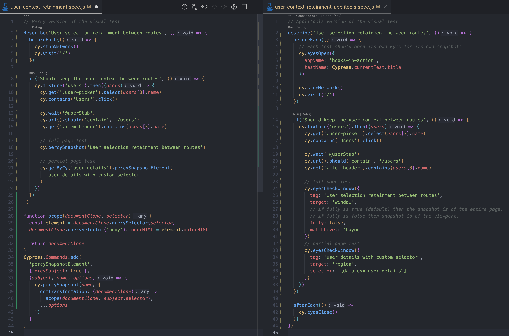

# Visual Regression Testing

<br/><br/>

### One Paragraph Explainer

A visual regression test checks what the user will see after any code changes have been executed by comparing screenshots taken before and after code changes. It is the primary way to validate regressions in CSS, but it is also useful for covering viewport & cross browser/device combinations, as well as localization. Think of Jest Snapshots, but instead of comparing the DOM as text, it is an actual screen shot comparison.

A visual regression process looks like the following:

1. Record the base snapshot (initial execution).
2. Execute the visual test again, compare to the base snapshot (subsequent executions).

   - If the new snapshot matches the base snapshot, accept.
   - Else, set the new base snapshot, or it is a visual regression defect.

The visual regression tools will find any and every pixel diffs. This may get hectic the bigger the snapshot, and as the number of snapshots increase. **The big selling point of visual snapshot services is the AI; the AI is trainable over time and we can train it to ignore petty snapshot diffs we might not care for**. Be mindful that given a snapshot name, we can train the AI to be really bad by accepting any diff. Therefore we need to take care not to thumbs up valid failures. We can reset the training by changing the snapshot name, viewport, or any part of the code.

Without the AI, we would have to manually accept or reject every petty false negative. Without built-in cross browser & cross viewport tests, our test suite would multiply combinatorially, whether local or CI. Check out the talk [Writing Tests for CSS](https://www.youtube.com/watch?v=Dl_XMd_1F6E) by Gil Tayar.

**The second selling point of services is how they can address cross viewport and browser concerns with a single test, so that we do not have to repeat the same test with different variants in CI**.

### Cypress examples with Percy and Applitools

> All the code samples can be found in [this repo](https://github.com/muratkeremozcan/react-hooks-in-action-with-cypress) where we have a ReactJS application with visual tests for Percy as well as their Applitool mirrors.

We will go through two popular services, Percy and Applitools, and showcase how services can save bandwidth with the maintenance of visual snapshots. We will also cover how they can be a force multiplier when we are concerned with cross browser and viewport combinations.

Visual regression testing with services has a common flow:

- Record a default snapshot and compare that default with the new, in subsequent test executions. We have to accept the initial snapshot once.
- From then on, new snapshots matching the default get auto-accepted.

- Non-matching new snapshots prompt a notification on the web interface; we either have to reject or accept this new baseline. If we reject, it is a defect. If we accept we have a new base line and the cycle continues.

Suppose we want to verify the user's avatar.


#### Percy flow:

- Here is [a simple test](https://github.com/muratkeremozcan/react-hooks-in-action-with-cypress/blob/main/cypress/e2e/ui-integration/user-context-retainment.spec.js) that verifies the avatar.

```javascript
// cypress/e2e/ui-integration/user-context-retainment.spec.js
describe("User selection retainment between routes", () => {
  before(() => {
    cy.stubNetwork();
    cy.visit("/");
  });

  it("Should keep the user context between routes - full snapshot", () => {
    cy.fixture("users").then((users) => {
      cy.get(".user-picker").select(users[3].name);
      cy.contains("Users").click();

      cy.wait("@userStub");
      cy.url().should("contain", "/users");
      cy.get(".item-header").contains(users[3].name);

      // the visual test - full snapshot
      cy.percySnapshot("User selection retainment between routes"); // <--
    });
  });

  it("Should keep the user context between routes - css-focused snapshot", () => {
    cy.fixture("users").then((users) => {
      cy.get(".user-picker").select(users[3].name);
      cy.contains("Users").click();

      cy.wait("@userStub");
      cy.url().should("contain", "/users");
      cy.get(".item-header").contains(users[3].name);

      // the visual test - using custom command for css selector focus // <--
      cy.get('[data-cy="user-details"]').percySnapshotElement(
        "user details with custom selector"
      );
    });
  });
});
```

In the first test we see the first one-liner taking a full screen shot. In the subsequent test we see a snapshot of the `user-details` selector. Selector focused snapshots are not natively supported in Percy, therefore [a custom command](https://github.com/muratkeremozcan/react-hooks-in-action-with-cypress/blob/main/cypress/support/commands.js#L112) `percySnapshotElement` is used.

> To actually run a visual diff, we need a Percy account and token. Visual testing only runs when hooked up to this account and executed via `cy run`. The focus is the CI. Take a look at the [Sign up section](https://dev.to/muratkeremozcan/painlessly-setup-cypress-percy-with-github-actions-in-minutes-1aki#sign-up) for elaborate details.

Once we execute the test, the initial snapshot looks like so in the Percy interface. **We introduced one-liner tests, and the test ran against 4 browsers and 2 viewports; 8 combinations we did not have to worry about in CI**. Mind that every resolution x browser consumes quota; if we were testing 2 viewports and 4 browsers, the one-liner would consume 8 credits.


In subsequent tests if there is a visual diff (for instance if we turn off the backend and cannot render the image) we will see a visual diff indicator in the Percy Interface. Here we can also verify the diff between browsers and viewports.


At this point we can train the AI to be not very good and auto-accept the broken avatar image in the future. However, you can imagine pesky pixel diffs that we do not care about. That is where **visual regression services save bandwidth; the maintenance of visual snapshots**.

> Percy has the perk of keeping things simple. However the CI setup is the extra we have to work with. Here is a GitHub Action CI [example](https://github.com/muratkeremozcan/react-hooks-in-action-with-cypress/blob/main/.github/workflows/main.yml#L113). For all details of setting up Percy, take a look at the [blog post guide](https://dev.to/muratkeremozcan/painlessly-setup-cypress-percy-with-github-actions-in-minutes-1aki#sign-up).

### Applitools flow

Here is [the same test written with Applitools](https://github.com/muratkeremozcan/react-hooks-in-action-with-cypress/blob/main/cypress/e2e/ui-integration/user-context-retainment-applitools.spec.js).

```javascript
// Applitools version of the visual test
// cypress/e2e/ui-integration/user-context-retainment-applitools.spec.js
describe("User selection retainment between routes", () => {
  before(() => {
    // Each test should open its own Eyes for its own snapshots
    cy.eyesOpen({
      appName: "hooks-in-action",
      testName: Cypress.currentTest.title,
    });

    cy.stubNetwork();
    cy.visit("/");
  });

  it("Should keep the user context between routes - full snapshot", () => {
    cy.fixture("users").then((users) => {
      cy.get(".user-picker").select(users[3].name);
      cy.contains("Users").click();

      cy.wait("@userStub");
      cy.url().should("contain", "/users");
      cy.get(".item-header").contains(users[3].name);

      // full page test // <--
      cy.eyesCheckWindow({
        tag: "User selection retainment between routes",
        target: "window",
        matchLevel: "Layout",
      });
    });
  });

  it("Should keep the user context between routes - css focused snapshot", () => {
    cy.fixture("users").then((users) => {
      cy.get(".user-picker").select(users[3].name);
      cy.contains("Users").click();

      cy.wait("@userStub");
      cy.url().should("contain", "/users");
      cy.get(".item-header").contains(users[3].name);

      // partial page test // <--
      cy.eyesCheckWindow({
        tag: "user details with custom selector",
        target: "region",
        selector: '[data-cy="user-details"]',

        // if fully is true (default) then the snapshot is of the entire page,
        // if fully is false then snapshot is of the viewport.
        fully: false,
      });
    });
  });

  afterEach(() => {
    cy.eyesClose();
  });
});
```

We realize the additional `cy.eyesOpen` and `cy.eyesClose` commands that need to execute in the beginning and end of the test. We also see ` cy.eyesCheckWindow` is very customizable, not needing a custom command as in Percy.

> For details about setting up Applitools, and comparisons to Percy, check out [this blog post](https://dev.to/muratkeremozcan/setup-cypress-applitools-with-github-actions-a-comparison-of-applitools-vs-percy-in-a-mid-size-app-43ij).

Similar to Percy, with Applitools our test executes cross browser & viewport, and records the base snapshot.


When / if there is a visual diff, there is a clear indicator in the web interface.


Here is a side by side comparison of the Percy vs Applitools code.



Overall Applitools is strong on configurability while Percy is strong on simplicity. The UX is leaner and easier to use on Percy side, while on Applitools the UX is busier in comparison, but it has improved much over the years. Percy certainly has less code, not having to "open" and "close" eyes and being able to fire off the main command is a big win. For local developer experience, Applitools is the winner; being able to execute the tests with Cypress open mode vs elaborate CLI commands is huge win. Failing an actual visual diff in the test runner, vs the visual failures being only on the web UI in Percy's case, is also a win for Applitools. For CI, not having to configure any yml makes Applitools the winner there as well. Another win is for being able to take snapshots of sub-sections of the UI via selectors; this feature is built-in to Applitools while with Percy it has to be custom command that is not sure to work everywhere in the real world.

|                           | Percy                                       | Applitools                        |
| ------------------------- | ------------------------------------------- | --------------------------------- |
| **Code**                  | Less code                                   | More configurable                 |
| **UX**                    | Lean                                        | Less lean, but got better         |
| **Local**                 | Only headless                               | Also works with Cypress Open Mode |
| **CI**                    | There is yml required                       | No yml                            |
| **Config**                | Mostly On web app, viewport config is local | Local file                        |
| **Sub-section-snapshots** | Custom Command, might not work everywhere   | Built-in                          |
| **Visual diff AI**        | need more time for an opinion               | need more time for an opinion     |

Visual testing does not come for free; performing it without a service consumes continuous engineer bandwidth. **With CI, services save us costs on viewport & browser combinations**, all services we testing fulfill this need equally. **The greatest distinction between visual services is how good the AI is in helping us not worry about visual test maintenance**. We believe that the most significant decision maker would be a long term trial (4-8 weeks) of both tools in an internal app, side by side. This would help evaluate which tool has the better AI allowing for less maintenance with visual testing, which is the biggest deterrent for technically savvy teams incorporating the test strategy into their portfolio.
