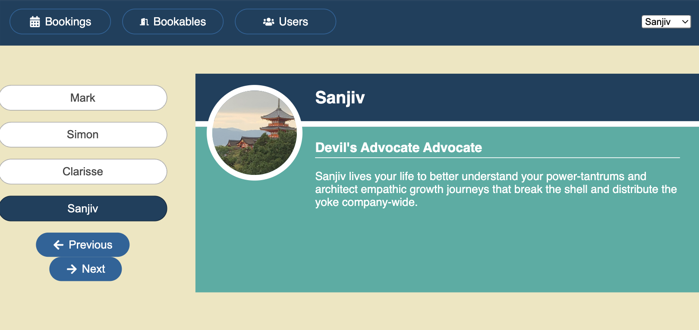
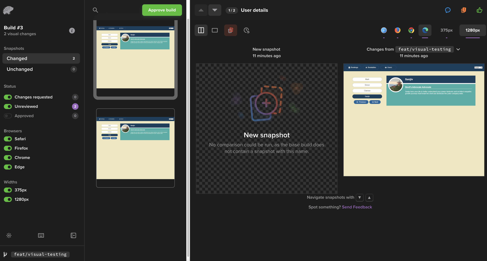
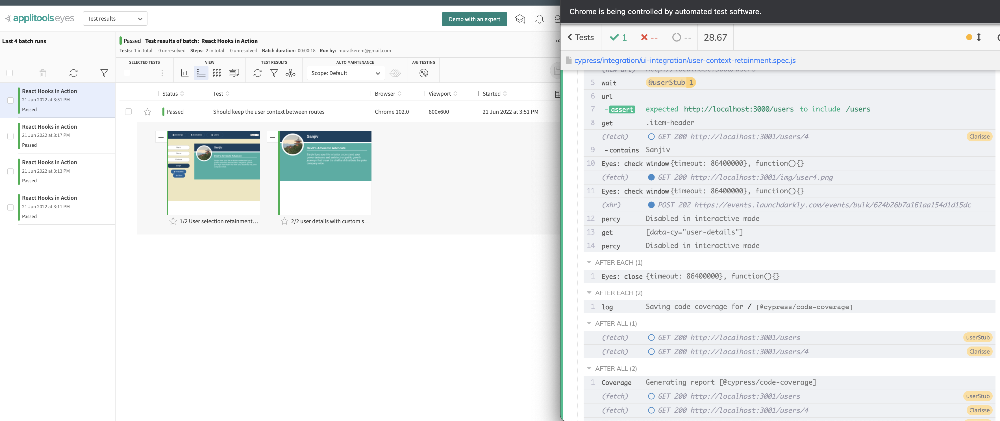

# 视觉回归测试

<br/><br/>

## 一段简要说明

视觉回归测试是通过比较代码更改后用户将看到的屏幕截图来验证 CSS 中的回归问题的一种方法。这主要用于覆盖 CSS 的回归问题，但也适用于涵盖窗口、跨浏览器/设备组合以及本地化问题。可以将其类比为 Jest 快照，但与将 DOM 作为文本进行比较不同，它实际上是通过实际屏幕截图的比较来实现的。

视觉回归测试的过程包括：

1. 记录基准快照（初始执行）。
2. 再次执行视觉测试，并将其与基准快照进行比较（后续执行）。

   - 如果新的快照与基准快照匹配，则接受。
   - 否则，设置新的基准快照，或者这是一个视觉回归缺陷。

视觉回归工具会找到任何像素差异。随着快照的增加和数量的增多，这可能变得复杂。**视觉快照服务的一个主要优势是其具有 AI 功能；AI 可以随着时间的推移进行训练，我们可以训练它忽略我们可能不关心的微小快照差异**。需要注意的是，通过给定快照名称，我们可以训练 AI 变得非常宽松，接受任何差异

。因此，我们需要谨慎处理，以免误将有效的失败结果标记为通过。我们可以通过更改快照名称、窗口或代码的任何部分来重置训练。

如果没有 AI，我们将不得不手动处理每一个微小的误差，接受或拒绝每一个不必要的负面结果。如果没有内置的跨浏览器和跨窗口测试，我们的测试套件将在本地或 CI 中呈指数增长。可以观看 Gil Tayar 的演讲[为 CSS 编写测试](https://www.youtube.com/watch?v=Dl_XMd_1F6E)以获取更多信息。

**服务的第二大优势在于它们可以通过单个测试解决跨窗口和浏览器的问题，因此我们无需在 CI 中重复执行相同的测试以涵盖不同的变体**。

## 使用 Percy 和 Applitools 的 Cypress 示例

> 所有的代码示例都可以在[这个仓库](https://github.com/muratkeremozcan/react-hooks-in-action-with-cypress)中找到，里面包含一个带有 Percy 以及 Applitools 镜像的 ReactJS 应用程序，用于视觉测试。

我们将深入了解两个流行的服务，Percy 和 Applitools，并演示这些服务如何通过维护视觉快照来节省带宽。我们还将讨论它们在涉及跨浏览器和窗口组合时如何成为一种增强力。

使用服务进行视觉回归测试有一个共同的流程：

- 记录默认快照并将其与后续测试执行中的新快照进行比较。我们必须首次接受初始快照。
- 从那时起，与默认匹配的新快照将自动被接受。

- 不匹配的新快照会在 Web 界面上触发通知；我们要么拒绝，要么接受这个新的基线。如果我们拒绝，那就是一个缺陷。如果我们接受，就有了一个新的基线，循环继续。

假设我们想要验证用户的头像。



### Percy 流程

- [一个简单的测试](https://github.com/muratkeremozcan/react-hooks-in-action-with-cypress/blob/main/cypress/e2e/ui-integration/user-context-retainment.spec.js)，用于验证用户的头像。

```javascript
// cypress/e2e/ui-integration/user-context-retainment.spec.js
describe("User selection retainment between routes", () => {
  before(() => {
    cy.stubNetwork();
    cy.visit("/");
  });

  it("Should keep the user context between routes - full snapshot", () => {
    cy.fixture("users").then((users) => {
      cy.get(".user-picker").select(users[3].name);
      cy.contains("Users").click();

      cy.wait("@userStub");
      cy.url().should("contain", "/users");
      cy.get(".item-header").contains(users[3].name);

      // the visual test - full snapshot
      cy.percySnapshot("User selection retainment between routes"); // <--
    });
  });

  it("Should keep the user context between routes - css-focused snapshot", () => {
    cy.fixture("users").then((users) => {
      cy.get(".user-picker").select(users[3].name);
      cy.contains("Users").click();

      cy.wait("@userStub");
      cy.url().should("contain", "/users");
      cy.get(".item-header").contains(users[3].name);

      // the visual test - using custom command for css selector focus // <--
      cy.get('[data-cy="user-details"]').percySnapshotElement(
        "user details with custom selector"
      );
    });
  });
});
```

在第一个测试中，我们看到了第一行代码，它截取了整个屏幕的截图。在后续的测试中，我们看到了 `user-details` 选择器的快照。由于 Percy 不支持直接的选择器快照，因此使用了[自定义命令](https://github.com/muratkeremozcan/react-hooks-in-action-with-cypress/blob/main/cypress/support/commands.js#L112) `percySnapshotElement`。

> 为了执行视觉差异测试，我们需要一个 Percy 账户和令牌。只有连接到该账户并通过 `cy run` 执行时，视觉测试才会运行。这主要用于 CI。详细信息请查看[注册部分](https://dev.to/muratkeremozcan/painlessly-setup-cypress-percy-with-github-actions-in-minutes-1aki#sign-up)。

一旦我们执行测试，Percy 界面中的初始快照如下。**我们引入了一行测试代码，它在 4 个浏览器和 2 个窗口上运行；这是 8 个组合，在 CI 中我们无需担心**。请注意，每个分辨率 x 浏览器都会消耗配额；如果我们测试了 2 个窗口和 4 个浏览器，这个一行测试代码将消耗 8 个配额。



在后续的测试中，如果存在视觉差异（例如，如果我们关闭后端并且无法渲染图像），我们将在 Percy 界面中看到视觉差异的指示器。在这里，我们还可以验证不同浏览器和窗口之间的差异。


到了这一步，我们可以训练 AI 不太聪明，自动接受将来可能出现的损坏的头像图像。然而，你可以想象到一些微不足道的像素差异，而我们并不关心这些。这就是**视觉回归服务节省带宽的地方；维护视觉快照**。

> Percy 的优势在于保持事情简单。然而，CI 设置是我们必须处理的额外工作。请参考[博文指南](https://dev.to/muratkeremozcan/painlessly-setup-cypress-percy-with-github-actions-in-minutes-1aki#sign-up)获取有关设置 Percy 的所有详细信息。

### Applitools 流程

这是 [使用 Applitools 编写的相同测试](https://github.com/muratkeremozcan/react-hooks-in-action-with-cypress/blob/main/cypress/e2e/ui-integration/user-context-retainment-applitools.spec.js).

```javascript
// Applitools version of the visual test
// cypress/e2e/ui-integration/user-context-retainment-applitools.spec.js
describe("User selection retainment between routes", () => {
  before(() => {
    // Each test should open its own Eyes for its own snapshots
    cy.eyesOpen({
      appName: "hooks-in-action",
      testName: Cypress.currentTest.title,
    });

    cy.stubNetwork();
    cy.visit("/");
  });

  it("Should keep the user context between routes - full snapshot", () => {
    cy.fixture("users").then((users) => {
      cy.get(".user-picker").select(users[3].name);
      cy.contains("Users").click();

      cy.wait("@userStub");
      cy.url().should("contain", "/users");
      cy.get(".item-header").contains(users[3].name);

      // full page test // <--
      cy.eyesCheckWindow({
        tag: "User selection retainment between routes",
        target: "window",
        matchLevel: "Layout",
      });
    });
  });

  it("Should keep the user context between routes - css focused snapshot", () => {
    cy.fixture("users").then((users) => {
      cy.get(".user-picker").select(users[3].name);
      cy.contains("Users").click();

      cy.wait("@userStub");
      cy.url().should("contain", "/users");
      cy.get(".item-header").contains(users[3].name);

      // partial page test // <--
      cy.eyesCheckWindow({
        tag: "user details with custom selector",
        target: "region",
        selector: '[data-cy="user-details"]',

        // if fully is true (default) then the snapshot is of the entire page,
        // if fully is false then snapshot is of the viewport.
        fully: false,
      });
    });
  });

  afterEach(() => {
    cy.eyesClose();
  });
});
```

我们注意到在测试开始和结束时需要执行的额外命令 `cy.eyesOpen` 和 `cy.eyesClose`。此外，我们还看到 `cy.eyesCheckWindow` 是非常可定制的，不像 Percy 中那样需要自定义命令。

> 有关设置 Applitools 的详细信息以及与 Percy 的比较，请查看[这篇博客文章](https://dev.to/muratkeremozcan/setup-cypress-applitools-with-github-actions-a-comparison-of-applitools-vs-percy-in-a-mid-size-app-43ij)。

与 Percy 类似，使用 Applitools，我们的测试在不同的浏览器和窗口中执行，并记录基准快照。



如果存在视觉差异，Web 界面上会有清晰的指示器。


下面是 Percy 与 Applitools 代码的对比。


总的来说，Applitools 在可配置性方面更强大，而 Percy 更注重简单性。Percy 的用户界面更为精简，更易于使用，而 Applitools 的用户界面相对较为繁忙，但经过多年的改进已经有了很大的提升。从代码数量的角度来看，Percy 显然更为简洁，因为它不需要执行 "打开" 和 "关闭" 操作，而是可以直接执行主要命令。对于本地开发体验而言，Applitools 更胜一筹；能够在 Cypress 的开放模式下执行测试，而不是通过繁琐的命令行命令，是一个很大的优势。在测试运行器中直接显示实际的视觉差异，相对于 Percy 的情况，Percy 中的视觉失败只在 Web 用户界面上显示，这也是 Applitools 的一个优势。在 CI 环境中，不需要配置任何 yml 文件，这也使 Applitools 更具竞争力。另一个优势是能够通过选择器拍摄 UI 的子部分的快照；这个功能在 Applitools 中是内置的，而在 Percy 中则需要使用自定义命令，而且不能确保在实际环境中的普适性。

|                           | Percy                                       | Applitools                        |
| ------------------------- | ------------------------------------------- | --------------------------------- |
| **代码**                   | 代码量较少                                   | 更具配置性                        |
| **用户体验**                | 精简易用                                   | 较为繁琐，但有较大改善              |
| **本地开发**              | 仅支持无头模式                               | 同时支持 Cypress 开放模式           |
| **CI**                   | 需要 yml 文件                               | 无需 yml 文件                     |
| **配置**                 | 主要在 Web 应用上，视口配置为本地文件        | 本地文件                           |
| **子部分快照**            | 需要使用自定义命令，可能不适用于所有场景    | 内置支持                           |
| **视觉差异 AI**          | 需要更多时间形成观点                       | 需要更多时间形成观点              |

视觉测试并非无成本；在没有服务的情况下，执行视觉测试需要持续的工程师资源。**在 CI 中，服务为我们在不同视口和浏览器组合上节省了成本**，我们测试的所有服务在这方面都表现得很一致。**视觉服务之间的最大区别在于 AI 在多大程度上帮助我们省去视觉测试的维护成本**。我们认为最关键的决策因素是在内部应用中长期使用这两个工具（4-8 周），并进行并行比较。这将有助于评估哪个工具的 AI 更好，能够降低视觉测试的维护工作，而这正是对技术娴熟的团队将该测试策略纳入其组合中的最大挑战。
